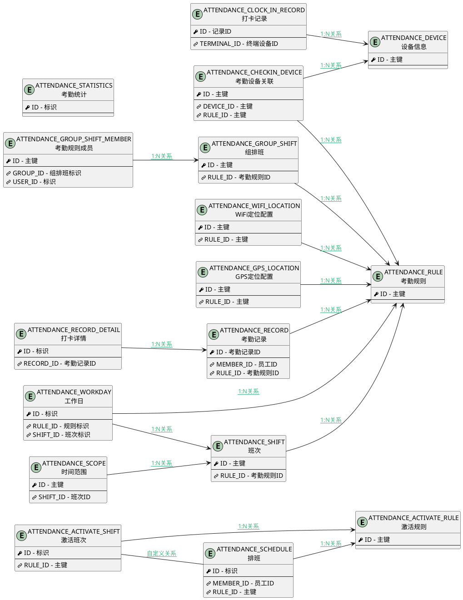

# 考勤规则 <!-- {docsify-ignore-all} -->

```plantuml
@startuml
skinparam svgLinkTarget _blank
<style>
root {
  HyperlinkColor #42b983
}
</style>
left to right direction

entity "ATTENDANCE_ACTIVATE_RULE\n激活规则" as ATTENDANCE_ACTIVATE_RULE [[$../module/attendance/attendance_activate_rule {激活规则}]] {
        <&key> ID - 主键
        --
}
entity "ATTENDANCE_ACTIVATE_SHIFT\n激活班次" as ATTENDANCE_ACTIVATE_SHIFT [[$../module/attendance/attendance_activate_shift {激活班次}]] {
        <&key> ID - 标识
        --
        <&link-intact> RULE_ID - 主键
}
entity "ATTENDANCE_CHECKIN_DEVICE\n考勤设备关联" as ATTENDANCE_CHECKIN_DEVICE [[$../module/attendance/attendance_checkin_device {考勤设备关联}]] {
        <&key> ID - 主键
        --
        <&link-intact> DEVICE_ID - 主键
        <&link-intact> RULE_ID - 主键
}
entity "ATTENDANCE_CLOCK_IN_RECORD\n打卡记录" as ATTENDANCE_CLOCK_IN_RECORD [[$../module/attendance/attendance_clock_in_record {打卡记录}]] {
        <&key> ID - 记录ID
        --
        <&link-intact> TERMINAL_ID - 终端设备ID
}
entity "ATTENDANCE_DEVICE\n设备信息" as ATTENDANCE_DEVICE [[$../module/attendance/attendance_device {设备信息}]] {
        <&key> ID - 主键
        --
}
entity "ATTENDANCE_GPS_LOCATION\nGPS定位配置" as ATTENDANCE_GPS_LOCATION [[$../module/attendance/attendance_gps_location {GPS定位配置}]] {
        <&key> ID - 主键
        --
        <&link-intact> RULE_ID - 主键
}
entity "ATTENDANCE_GROUP_SHIFT\n组排班" as ATTENDANCE_GROUP_SHIFT [[$../module/attendance/attendance_group_shift {组排班}]] {
        <&key> ID - 主键
        --
        <&link-intact> RULE_ID - 考勤规则ID
}
entity "ATTENDANCE_GROUP_SHIFT_MEMBER\n考勤规则成员" as ATTENDANCE_GROUP_SHIFT_MEMBER [[$../module/attendance/attendance_group_shift_member {考勤规则成员}]] {
        <&key> ID - 主键
        --
        <&link-intact> GROUP_ID - 组排班标识
        <&link-intact> USER_ID - 标识
}
entity "ATTENDANCE_RECORD\n考勤记录" as ATTENDANCE_RECORD [[$../module/attendance/attendance_record {考勤记录}]] {
        <&key> ID - 考勤记录ID
        --
        <&link-intact> MEMBER_ID - 员工ID
        <&link-intact> RULE_ID - 考勤规则ID
}
entity "ATTENDANCE_RECORD_DETAIL\n打卡详情" as ATTENDANCE_RECORD_DETAIL [[$../module/attendance/attendance_record_detail {打卡详情}]] {
        <&key> ID - 标识
        --
        <&link-intact> RECORD_ID - 考勤记录ID
}
entity "ATTENDANCE_RULE\n考勤规则" as ATTENDANCE_RULE [[$../module/attendance/attendance_rule {考勤规则}]] {
        <&key> ID - 主键
        --
}
entity "ATTENDANCE_SCHEDULE\n排班" as ATTENDANCE_SCHEDULE [[$../module/attendance/attendance_schedule {排班}]] {
        <&key> ID - 标识
        --
        <&link-intact> MEMBER_ID - 员工ID
        <&link-intact> RULE_ID - 主键
}
entity "ATTENDANCE_SCOPE\n时间范围" as ATTENDANCE_SCOPE [[$../module/attendance/attendance_scope {时间范围}]] {
        <&key> ID - 主键
        --
        <&link-intact> SHIFT_ID - 班次ID
}
entity "ATTENDANCE_SHIFT\n班次" as ATTENDANCE_SHIFT [[$../module/attendance/attendance_shift {班次}]] {
        <&key> ID - 主键
        --
        <&link-intact> RULE_ID - 考勤规则ID
}
entity "ATTENDANCE_STATISTICS\n考勤统计" as ATTENDANCE_STATISTICS [[$../module/attendance/attendance_statistics {考勤统计}]] {
        <&key> ID - 标识
        --
}
entity "ATTENDANCE_WIFI_LOCATION\nWiFi定位配置" as ATTENDANCE_WIFI_LOCATION [[$../module/attendance/attendance_wifi_location {WiFi定位配置}]] {
        <&key> ID - 主键
        --
        <&link-intact> RULE_ID - 主键
}
entity "ATTENDANCE_WORKDAY\n工作日" as ATTENDANCE_WORKDAY [[$../module/attendance/attendance_workday {工作日}]] {
        <&key> ID - 标识
        --
        <&link-intact> RULE_ID - 规则标识
        <&link-intact> SHIFT_ID - 班次标识
}

ATTENDANCE_ACTIVATE_SHIFT--> ATTENDANCE_ACTIVATE_RULE : [[$../der/DER1N_ATTENDANCE_ACTIVATE_SHIFT_ATTENDANCE_ACTIVATE_RULE_RULE_ID{DER1N_ATTENDANCE_ACTIVATE_SHIFT_ATTENDANCE_ACTIVATE_RULE_RULE_ID} 1:N关系]]
ATTENDANCE_SCHEDULE--> ATTENDANCE_ACTIVATE_RULE : [[$../der/DER1N_ATTENDANCE_SCHEDULE_ATTENDANCE_ACTIVATE_RULE_RULE_ID{DER1N_ATTENDANCE_SCHEDULE_ATTENDANCE_ACTIVATE_RULE_RULE_ID} 1:N关系]]
ATTENDANCE_CHECKIN_DEVICE--> ATTENDANCE_DEVICE : [[$../der/DER1N_ATTENDANCE_CHECKIN_DEVICE_ATTENDANCE_DEVICE_DEVICE_ID{DER1N_ATTENDANCE_CHECKIN_DEVICE_ATTENDANCE_DEVICE_DEVICE_ID} 1:N关系]]
ATTENDANCE_CLOCK_IN_RECORD--> ATTENDANCE_DEVICE : [[$../der/DER1N_ATTENDANCE_CLOCK_IN_RECORD_ATTENDANCE_DEVICE_TERMINAL_ID{DER1N_ATTENDANCE_CLOCK_IN_RECORD_ATTENDANCE_DEVICE_TERMINAL_ID} 1:N关系]]
ATTENDANCE_GROUP_SHIFT_MEMBER--> ATTENDANCE_GROUP_SHIFT : [[$../der/DER1N_ATTENDANCE_GROUP_SHIFT_MEMBER_ATTENDANCE_GROUP_SHIFT_GROUP_ID{DER1N_ATTENDANCE_GROUP_SHIFT_MEMBER_ATTENDANCE_GROUP_SHIFT_GROUP_ID} 1:N关系]]
ATTENDANCE_RECORD_DETAIL--> ATTENDANCE_RECORD : [[$../der/DER1N_ATTENDANCE_RECORD_DETAIL_ATTENDANCE_RECORD_RECORD_ID{DER1N_ATTENDANCE_RECORD_DETAIL_ATTENDANCE_RECORD_RECORD_ID} 1:N关系]]
ATTENDANCE_CHECKIN_DEVICE--> ATTENDANCE_RULE : [[$../der/DER1N_ATTENDANCE_CHECKIN_DEVICE_ATTENDANCE_RULE_RULE_ID{DER1N_ATTENDANCE_CHECKIN_DEVICE_ATTENDANCE_RULE_RULE_ID} 1:N关系]]
ATTENDANCE_GPS_LOCATION--> ATTENDANCE_RULE : [[$../der/DER1N_ATTENDANCE_GPS_LOCATION_ATTENDANCE_RULE_RULE_ID{DER1N_ATTENDANCE_GPS_LOCATION_ATTENDANCE_RULE_RULE_ID} 1:N关系]]
ATTENDANCE_GROUP_SHIFT--> ATTENDANCE_RULE : [[$../der/DER1N_ATTENDANCE_GROUP_SHIFT_ATTENDANCE_RULE_RULE_ID{DER1N_ATTENDANCE_GROUP_SHIFT_ATTENDANCE_RULE_RULE_ID} 1:N关系]]
ATTENDANCE_RECORD--> ATTENDANCE_RULE : [[$../der/DER1N_ATTENDANCE_RECORD_ATTENDANCE_RULE_RULE_ID{DER1N_ATTENDANCE_RECORD_ATTENDANCE_RULE_RULE_ID} 1:N关系]]
ATTENDANCE_SHIFT--> ATTENDANCE_RULE : [[$../der/DER1N_ATTENDANCE_SHIFT_ATTENDANCE_RULE_RULE_ID{DER1N_ATTENDANCE_SHIFT_ATTENDANCE_RULE_RULE_ID} 1:N关系]]
ATTENDANCE_WIFI_LOCATION--> ATTENDANCE_RULE : [[$../der/DER1N_ATTENDANCE_WIFI_LOCATION_ATTENDANCE_RULE_RULE_ID{DER1N_ATTENDANCE_WIFI_LOCATION_ATTENDANCE_RULE_RULE_ID} 1:N关系]]
ATTENDANCE_WORKDAY--> ATTENDANCE_RULE : [[$../der/DER1N_ATTENDANCE_WORKDAY_ATTENDANCE_RULE_RULE_ID{DER1N_ATTENDANCE_WORKDAY_ATTENDANCE_RULE_RULE_ID} 1:N关系]]
ATTENDANCE_ACTIVATE_SHIFT-- ATTENDANCE_SCHEDULE : [[$../der/DERCUSTOM_ATTENDANCE_ACTIVATE_SHIT_ATTENDANCE_SCHEDULE_RULE_ID{DERCUSTOM_ATTENDANCE_ACTIVATE_SHIT_ATTENDANCE_SCHEDULE_RULE_ID} 自定义关系]]
ATTENDANCE_SCOPE--> ATTENDANCE_SHIFT : [[$../der/DER1N_ATTENDANCE_SCOPE_ATTENDANCE_SHIFT_SHIFT_ID{DER1N_ATTENDANCE_SCOPE_ATTENDANCE_SHIFT_SHIFT_ID} 1:N关系]]
ATTENDANCE_WORKDAY--> ATTENDANCE_SHIFT : [[$../der/DER1N_ATTENDANCE_WORKDAY_ATTENDANCE_SHIFT_SHIFT_ID{DER1N_ATTENDANCE_WORKDAY_ATTENDANCE_SHIFT_SHIFT_ID} 1:N关系]]


hide methods
@enduml
```
