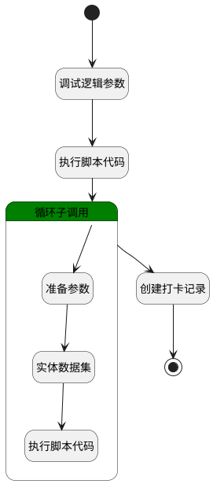

## 批量补卡 <!-- {docsify-ignore-all} -->

   

### 处理过程




### 处理步骤说明

#### 调试逻辑参数 :id=DEBUGPARAM_01<sup class="footnote-symbol"> <font color=gray size=1>[调试逻辑参数]</font></sup>


> [!NOTE|label:调试信息|icon:fa fa-bug]
> 调试输出参数`Default(传入变量)`的详细信息


#### 执行脚本代码 :id=RAWSFCODE_01<sup class="footnote-symbol"> <font color=gray size=1>[直接后台代码]</font></sup>


<p class="panel-title"><b>执行代码[Groovy]</b></p>

```groovy
def _default = logic.param('Default').getReal()
def depts = logic.param('depts').getReal()
def persons = logic.param('persons').getReal()
def member_name = _default.get("member_name")
if (member_name != null && member_name != "") {
    def jsonParser = new groovy.json.JsonSlurper()
    def person_range = jsonParser.parseText(member_name)
    person_range.each { item ->
        if (item.type == "dept") {
            def dept = sys.entity('user_object')
            dept.set("n_dept_id_eq", item.id)
            depts.add(dept)
        } else {
            def person = sys.entity('employee')
            person.set("id", item.id)
            person.set("name", item.name)
            persons.add(person)
        }
    }
}
```

#### 循环子调用 :id=LOOPSUBCALL_01<sup class="footnote-symbol"> <font color=gray size=1>[循环子调用]</font></sup>


循环参数`depts`，子循环参数使用`temp`
#### 创建打卡记录 :id=RAWSFCODE_03<sup class="footnote-symbol"> <font color=gray size=1>[直接后台代码]</font></sup>


<p class="panel-title"><b>执行代码[Groovy]</b></p>

```groovy
def persons = logic.param('persons').getReal()
def _default = logic.param('Default').getReal()

persons.each { emp ->
    def record = sys.entity('attendance_clock_in_record')
    record.set("id",net.ibizsys.runtime.util.KeyValueUtils.genUniqueId())
    record.set("member_id",emp.id)
    record.set("member_name",emp.name)
    record.set("dept_name",emp.dept_name)
    record.set("dept_id",emp.dept_id)
    record.set("checkin_type","reissue")
    record.set("checkin_time",_default.get("checkin_time"))
    def recordRuntime = sys.dataentity('attendance_clock_in_record')
    recordRuntime.create(record)
}
```

#### 结束 :id=END_01<sup class="footnote-symbol"> <font color=gray size=1>[结束]</font></sup>


*- N/A*

#### 开始 :id=Begin<sup class="footnote-symbol"> <font color=gray size=1>[开始]</font></sup>


*- N/A*
#### 准备参数 :id=PREPAREPARAM_01<sup class="footnote-symbol"> <font color=gray size=1>[准备参数]</font></sup>


1. 将`temp.n_dept_id_eq` 设置给  `filter.n_dept_id_eq`

#### 实体数据集 :id=DEDATASET_01<sup class="footnote-symbol"> <font color=gray size=1>[实体数据集]</font></sup>


调用实体 [员工信息(EMPLOYEE)](module/employee_management/employee.md) 数据集合 [部门人员(deptall)](module/employee_management/employee#数据集合) ，查询参数为`filter`

将执行结果返回给参数`employees`

#### 执行脚本代码 :id=RAWSFCODE_02<sup class="footnote-symbol"> <font color=gray size=1>[直接后台代码]</font></sup>


<p class="panel-title"><b>执行代码[Groovy]</b></p>

```groovy
def employees = logic.param('employees').getReal()
def persons = logic.param('persons').getReal()
def uniqueMemberIdMap = new HashMap()
// 先将原始 persons 放入Map
persons.each { emp ->
    uniqueMemberIdMap.put(emp.id, emp)
}
employees.each { emp ->
    uniqueMemberIdMap.put(emp.id, emp)
}
persons.clear()
persons.addAll(uniqueMemberIdMap.values())
```


### 实体逻辑参数

|    中文名   |    代码名    |  数据类型    |  实体   |备注 |
| --------| --------| -------- | -------- | --------   |
|传入变量(<i class="fa fa-check"/></i>)|Default|数据对象|[打卡记录(ATTENDANCE_CLOCK_IN_RECORD)](module/attendance/attendance_clock_in_record.md)||
|allMembers|allMembers|数据对象列表|[用户对象映射(USER_OBJECT)](module/employee_management/user_object.md)||
|depts|depts|数据对象列表|[用户对象映射(USER_OBJECT)](module/employee_management/user_object.md)||
|employees|employees|分页查询|||
|filter|filter|过滤器|||
|persons|persons|数据对象列表|[员工信息(EMPLOYEE)](module/employee_management/employee.md)||
|temp|temp|数据对象|[用户对象映射(USER_OBJECT)](module/employee_management/user_object.md)||
