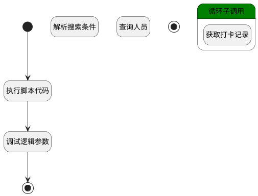

## 打卡记录 <!-- {docsify-ignore-all} -->

   

### 处理过程




### 处理步骤说明

#### 调试逻辑参数 :id=DEBUGPARAM_01<sup class="footnote-symbol"> <font color=gray size=1>[调试逻辑参数]</font></sup>


> [!NOTE|label:调试信息|icon:fa fa-bug]
> 调试输出参数`newRecords`的详细信息


#### 开始 :id=Begin<sup class="footnote-symbol"> <font color=gray size=1>[开始]</font></sup>


*- N/A*
#### 执行脚本代码 :id=RAWSFCODE_01<sup class="footnote-symbol"> <font color=gray size=1>[直接后台代码]</font></sup>


<p class="panel-title"><b>执行代码[Groovy]</b></p>

```groovy
def _default = logic.param('Default').getReal()
//获取`打卡记录`实体运行对象
def record_runtime = sys.dataentity('attendance_clock_in_record')
def record_filter = record_runtime.filter()
record_filter.all()

def person_range = _default.get("n_member_id_in")
if ( person_range != null && person_range != "") {
    def depts = []
    def persons = []
    person_range.each { item ->
        if (item.type == "dept") {
            depts.add(item.id)
        } else {
            persons.add(item.id)
        }
    }
    def deptStr = depts ? depts.join(",") : ""
    def personStr = persons ? persons.join(",") : ""
    if (deptStr != "" && personStr != "") {
        record_filter.and().or().in('dept_id', deptStr).in('id', personStr)
    } else if (deptStr != "" && personStr == "") {
        record_filter.in('dept_id', deptStr)
    } else {
        record_filter.in('member_id', personStr)
    }
}

def n_checkin_time_gtandeq = _default.get('n_checkin_time_gtandeq')
def n_checkin_time_ltandeq = _default.get('n_checkin_time_ltandeq')
if (n_checkin_time_gtandeq != null && n_checkin_time_ltandeq != null) {
    record_filter.custom(" DATE_FORMAT(t1.checkin_time, '%Y-%m-%d') >= '"+ n_checkin_time_gtandeq +"'")
    record_filter.custom(" DATE_FORMAT(t1.checkin_time, '%Y-%m-%d') <= '"+ n_checkin_time_ltandeq +"'")
}

def dataList = record_filter.select('');
if (dataList){
    def newRecords = logic.param('newRecords').getReal()
    dataList.groupBy { it.get("member_id") }.each { memberId, records ->
        println("输出memberId: " + memberId)
        println("输出records: " + records)
        if (!records) {
            return
        }

        def newRecord = sys.entity('attendance_clock_in_record')
        newRecord.set('id', records[0].get("member_id"))
        newRecord.set('member_id', records[0].get("member_id"))
        newRecord.set('dept_id', records[0].get("dept_id"))
        newRecord.set('dept_name', records[0].get("dept_name"))
        newRecord.set('member_name', records[0].get("member_name"))

        def map = new HashMap<String, List<String>>()
        def resultMap = new HashMap()

        // 遍历数据列表，根据日期分组
        records.each { item ->
            def dateKey = item.get("checkin_time").toString().substring(0, 10)
            // 按照年月日分组
            if (!map.containsKey(dateKey)) {
                map[dateKey] = []
            }
            map[dateKey].add(item)
        }

        // 处理分组后的数据
        map.each { entry ->
            def temp = [details: entry.value]
            resultMap.put(entry.key, temp)
        }
        println("输出map: " + map)
        println("输出resultMap: " + resultMap)
        newRecord.set('attendance_data', resultMap)
        newRecords.add(newRecord)
    }
}
```

#### 结束 :id=END_01<sup class="footnote-symbol"> <font color=gray size=1>[结束]</font></sup>


返回 `newRecords`

#### 解析搜索条件 :id=RAWSFCODE2<sup class="footnote-symbol"> <font color=gray size=1>[直接后台代码]</font></sup>


<p class="panel-title"><b>执行代码[Groovy]</b></p>

```groovy
def _default = logic.param('Default').getReal()
def person_range = _default.get("n_member_id_in")
if ( person_range != null && person_range != "") {
    def depts = []
    def persons = []
    person_range.each { item ->
        if (item.type == "dept") {
            depts.add(item.id)
        } else {
            persons.add(item.id)
        }
    }
    def deptStr = depts ? depts.join(",") : ""
    def personStr = persons ? persons.join(",") : ""
    if (deptStr != "" && personStr != "") {
        _default.and().or().in('dept_id', deptStr).in('id', personStr)
    } else if (deptStr != "" && personStr == "") {
        _default.in('dept_id', deptStr)
    } else {
        _default.in('id', personStr)
    }
}

//获取`打卡记录`实体运行对象
def record_runtime = sys.dataentity('attendance_clock_in_record')
def record_filter = record_runtime.filter()
record_filter.all()
record_filter.eq('member_id', emp_temp.get("id"))

if (n_checkin_time_gtandeq != null && n_checkin_time_ltandeq != null) {
    record_filter.custom(" DATE_FORMAT(t1.checkin_time, '%Y-%m-%d') >= '"+ n_checkin_time_gtandeq +"'")
    record_filter.custom(" DATE_FORMAT(t1.checkin_time, '%Y-%m-%d') <= '"+ n_checkin_time_ltandeq +"'")
}
```

#### 查询人员 :id=DEDATASET1<sup class="footnote-symbol"> <font color=gray size=1>[实体数据集]</font></sup>


调用实体 [员工信息(EMPLOYEE)](module/employee_management/employee.md) 数据集合 [员工(user)](module/employee_management/employee#数据集合) ，查询参数为`Default(传入变量)`

将执行结果返回给参数`emp_page(人员查询分页)`

#### 循环子调用 :id=LOOPSUBCALL1<sup class="footnote-symbol"> <font color=gray size=1>[循环子调用]</font></sup>


循环参数`emp_page(人员查询分页)`，子循环参数使用`emp_temp(人员临时变量)`
#### 获取打卡记录 :id=RAWSFCODE1<sup class="footnote-symbol"> <font color=gray size=1>[直接后台代码]</font></sup>


<p class="panel-title"><b>执行代码[Groovy]</b></p>

```groovy
def _default = logic.param('Default').getReal()
def emp_temp = logic.param('emp_temp').getReal()

def n_checkin_time_gtandeq = _default.get('n_checkin_time_gtandeq')
def n_checkin_time_ltandeq = _default.get('n_checkin_time_ltandeq')

//获取`打卡记录`实体运行对象
def record_runtime = sys.dataentity('attendance_clock_in_record')
def record_filter = record_runtime.filter()
record_filter.all()
record_filter.eq('member_id', emp_temp.get("id"))

if (n_checkin_time_gtandeq != null && n_checkin_time_ltandeq != null) {
    record_filter.custom(" DATE_FORMAT(t1.checkin_time, '%Y-%m-%d') >= '"+ n_checkin_time_gtandeq +"'")
    record_filter.custom(" DATE_FORMAT(t1.checkin_time, '%Y-%m-%d') <= '"+ n_checkin_time_ltandeq +"'")
}
def dataList = record_filter.select('');

def map = new HashMap<String, List<String>>()
def resultMap = new HashMap()

// 遍历数据列表，根据日期分组
dataList.each { item ->
    def dateKey = item.get("checkin_time").toString().substring(0, 10)
    // 按照年月日分组
    if (!map.containsKey(dateKey)) {
        map[dateKey] = []
    }
    map[dateKey].add(item)
}

// 处理分组后的数据
map.each { entry ->
    // entry.value.each { it ->
    //     it.set("checkin_time", it.get("checkin_time") ? it.get("checkin_time").toString().substring(11, 19) : '')
    // }
    def temp = [details: entry.value]
    resultMap.put(entry.key, temp)
}

emp_temp.set('attendance_data', resultMap);
emp_temp.set('member_name', emp_temp.get("name"));
emp_temp.set('member_num',emp_temp.get("employee_num"));
```

#### 结束 :id=END1<sup class="footnote-symbol"> <font color=gray size=1>[结束]</font></sup>


返回 `emp_page(人员查询分页)`


### 实体逻辑参数

|    中文名   |    代码名    |  数据类型    |  实体   |备注 |
| --------| --------| -------- | -------- | --------   |
|传入变量(<i class="fa fa-check"/></i>)|Default|过滤器|||
|人员查询分页|emp_page|分页查询|||
|人员临时变量|emp_temp|数据对象|[员工信息(EMPLOYEE)](module/employee_management/employee.md)||
|newRecords|newRecords|数据对象列表|[打卡记录(ATTENDANCE_CLOCK_IN_RECORD)](module/attendance/attendance_clock_in_record.md)||
