## 列表视图 <!-- {docsify-ignore-all} -->

   

### 处理过程

```plantuml
@startuml
hide empty description
<style>
root {
  HyperlinkColor #42b983
}
</style>

hide empty description
state "开始" as Begin <<start>> [[$./record_list#begin {"开始"}]]
state "解析搜索条件" as RAWSFCODE1  [[$./record_list#rawsfcode1 {"解析搜索条件"}]]
state "获取打卡记录" as DEDATASET1  [[$./record_list#dedataset1 {"获取打卡记录"}]]
state "结束" as END1 <<end>> [[$./record_list#end1 {"结束"}]]


Begin --> RAWSFCODE1
RAWSFCODE1 --> DEDATASET1
DEDATASET1 --> END1


@enduml
```




### 处理步骤说明

#### 开始 :id=Begin<sup class="footnote-symbol"> <font color=gray size=1>[开始]</font></sup>


*- N/A*
#### 解析搜索条件 :id=RAWSFCODE1<sup class="footnote-symbol"> <font color=gray size=1>[直接后台代码]</font></sup>


<p class="panel-title"><b>执行代码[Groovy]</b></p>

```groovy
def _default = logic.param('Default').getReal()

def n_checkin_time_gtandeq = _default.get('n_checkin_time_gtandeq')
def n_checkin_time_ltandeq = _default.get('n_checkin_time_ltandeq')

_default.ne("id", "next_id")
if (n_checkin_time_gtandeq != null && n_checkin_time_ltandeq != null) {
    _default.custom(" DATE_FORMAT(t1.checkin_time, '%Y-%m-%d') >= '"+ n_checkin_time_gtandeq +"'")
    _default.custom(" DATE_FORMAT(t1.checkin_time, '%Y-%m-%d') <= '"+ n_checkin_time_ltandeq +"'")
}

if (_default.get("n_member_id_in") != null && _default.get("n_member_id_in") != "") {
    def jsonParser = new groovy.json.JsonSlurper()
    def person_range = jsonParser.parseText(_default.get("n_member_id_in"))
    def depts = []
    def persons = []
    person_range.each { item ->
        if (item.type == "dept") {
            depts.add(item.id)
        } else {
            persons.add(item.id)
        }
    }
    def deptStr = depts ? depts.join(",") : ""
    def personStr = persons ? persons.join(",") : ""
    if (deptStr != "" && personStr != "") {
        _default.and().or().in('dept_id', deptStr).in('member_id', personStr)
    } else if (deptStr != "" && personStr == "") {
        _default.in('dept_id', deptStr)
    } else {
        _default.in('member_id', personStr)
    }
}
```

#### 获取打卡记录 :id=DEDATASET1<sup class="footnote-symbol"> <font color=gray size=1>[实体数据集]</font></sup>


调用实体 [打卡记录(ATTENDANCE_CLOCK_IN_RECORD)](module/attendance/attendance_clock_in_record.md) 数据集合 [DEFAULT](module/attendance/attendance_clock_in_record#数据集合) ，查询参数为`Default(传入变量)`

将执行结果返回给参数`page(分页查询结果)`

#### 结束 :id=END1<sup class="footnote-symbol"> <font color=gray size=1>[结束]</font></sup>


返回 `page(分页查询结果)`


### 实体逻辑参数

|    中文名   |    代码名    |  数据类型    |  实体   |备注 |
| --------| --------| -------- | -------- | --------   |
|传入变量(<i class="fa fa-check"/></i>)|Default|过滤器|||
|分页查询结果|page|分页查询|||
