## 同步补卡至Odoo <!-- {docsify-ignore-all} -->

   

### 处理过程

```plantuml
@startuml
hide empty description
<style>
root {
  HyperlinkColor #42b983
}
</style>

hide empty description
state "开始" as Begin <<start>> [[$./sync_clock#begin {"开始"}]]
state "查询当天出勤记录" as RAWSQLCALL_01  [[$./sync_clock#rawsqlcall_01 {"查询当天出勤记录"}]]
state "调试逻辑参数" as DEBUGPARAM_01  [[$./sync_clock#debugparam_01 {"调试逻辑参数"}]]
state "执行脚本代码" as RAWSFCODE_01  [[$./sync_clock#rawsfcode_01 {"执行脚本代码"}]]


Begin --> RAWSQLCALL_01
RAWSQLCALL_01 --> DEBUGPARAM_01
DEBUGPARAM_01 --> RAWSFCODE_01


@enduml
```




### 处理步骤说明

#### 查询当天出勤记录 :id=RAWSQLCALL_01<sup class="footnote-symbol"> <font color=gray size=1>[直接SQL调用]</font></sup>


<p class="panel-title"><b>执行sql语句</b></p>

```sql
select
	*
from
	hr_attendance ha
where
	EMPLOYEE_ID = ?
	and DATE(CHECK_IN) = DATE(?)
	and CHECK_IN < ?
	and CHECK_OUT is null
```

<p class="panel-title"><b>执行sql参数</b></p>

1. `Default(传入变量).MEMBER_ID(员工ID)`
2. `Default(传入变量).CHECKIN_TIME(打卡时间)`
3. `Default(传入变量).CHECKIN_TIME(打卡时间)`

将执行sql结果赋值给参数`attendances(出勤记录)`

#### 调试逻辑参数 :id=DEBUGPARAM_01<sup class="footnote-symbol"> <font color=gray size=1>[调试逻辑参数]</font></sup>


> [!NOTE|label:调试信息|icon:fa fa-bug]
> 调试输出参数`attendances(出勤记录)`的详细信息


#### 开始 :id=Begin<sup class="footnote-symbol"> <font color=gray size=1>[开始]</font></sup>


*- N/A*
#### 执行脚本代码 :id=RAWSFCODE_01<sup class="footnote-symbol"> <font color=gray size=1>[直接后台代码]</font></sup>


<p class="panel-title"><b>执行代码[Groovy]</b></p>

```groovy
def attendances = logic.param('attendances').getReal()
def _default = logic.param('Default').getReal()
def hr_attendanceRuntime = sys.dataentity('hr_attendance')
if(!attendances.isEmpty()){
    //取第一项进行更新
    def hr_attendance = attendances[0]
    hr_attendance.set('check_out',_default.get('checkin_time'))
    hr_attendanceRuntime.update(hr_attendance)

}else{
    def hr_attendance = sys.entity('hr_attendance')
    hr_attendance.set("id",net.ibizsys.runtime.util.KeyValueUtils.genUniqueId())
    hr_attendance.set('check_in',_default.get('checkin_time'))
    hr_attendance.set('employee_id',_default.get('member_id'))
    hr_attendanceRuntime.create(hr_attendance)
}
```


### 实体逻辑参数

|    中文名   |    代码名    |  数据类型    |  实体   |备注 |
| --------| --------| -------- | -------- | --------   |
|传入变量(<i class="fa fa-check"/></i>)|Default|数据对象|[打卡记录(ATTENDANCE_CLOCK_IN_RECORD)](module/attendance/attendance_clock_in_record.md)||
|出勤记录|attendances|数据对象列表|[出勤(HR_ATTENDANCE)](module/hr/hr_attendance.md)||
|hr_attendance|hr_attendance|数据对象|[出勤(HR_ATTENDANCE)](module/hr/hr_attendance.md)||
