## 部门统计 <!-- {docsify-ignore-all} -->

   

### 处理过程

```plantuml
@startuml
hide empty description
<style>
root {
  HyperlinkColor #42b983
}
</style>

hide empty description
state "开始" as Begin <<start>> [[$./department_statistics#begin {"开始"}]]
state "解析搜索条件" as RAWSFCODE2  [[$./department_statistics#rawsfcode2 {"解析搜索条件"}]]
state "查询部门" as DEDATASET1  [[$./department_statistics#dedataset1 {"查询部门"}]]
state "结束" as END1 <<end>> [[$./department_statistics#end1 {"结束"}]]
state "循环子调用" as LOOPSUBCALL1  [[$./department_statistics#loopsubcall1 {"循环子调用"}]] #green {
state "统计考勤" as RAWSFCODE1  [[$./department_statistics#rawsfcode1 {"统计考勤"}]]
}


Begin --> RAWSFCODE2
RAWSFCODE2 --> DEDATASET1
DEDATASET1 --> LOOPSUBCALL1
LOOPSUBCALL1 --> END1
LOOPSUBCALL1 --> RAWSFCODE1


@enduml
```




### 处理步骤说明

#### 开始 :id=Begin<sup class="footnote-symbol"> <font color=gray size=1>[开始]</font></sup>


*- N/A*
#### 解析搜索条件 :id=RAWSFCODE2<sup class="footnote-symbol"> <font color=gray size=1>[直接后台代码]</font></sup>


<p class="panel-title"><b>执行代码[Groovy]</b></p>

```groovy
def _default = logic.param('Default').getReal()
def depts = []
def deptStr = ""
def  dept_range = _default.get("n_dept_id_in")
if (dept_range != null && dept_range != "") {
    depts.clear()
    dept_range.each { item ->
        depts.add(item.id)
    }
    deptStr = depts ? depts.join(",") : ""
    if (deptStr != "") {
        _default.in('id', deptStr)
    }
}
```

#### 查询部门 :id=DEDATASET1<sup class="footnote-symbol"> <font color=gray size=1>[实体数据集]</font></sup>


调用实体 [部门信息(DEPARTMENT)](module/employee_management/department.md) 数据集合 [部门(dept)](module/employee_management/department#数据集合) ，查询参数为`Default(传入变量)`

将执行结果返回给参数`dept_page(部门分页查询)`

#### 循环子调用 :id=LOOPSUBCALL1<sup class="footnote-symbol"> <font color=gray size=1>[循环子调用]</font></sup>


循环参数`dept_page(部门分页查询)`，子循环参数使用`dept_temp(部门临时变量)`
#### 统计考勤 :id=RAWSFCODE1<sup class="footnote-symbol"> <font color=gray size=1>[直接后台代码]</font></sup>


<p class="panel-title"><b>执行代码[Groovy]</b></p>

```groovy
def _default = logic.param('Default').getReal();
def dept_temp = logic.param('dept_temp').getReal();

def n_checkin_date_gtandeq = _default.get('n_checkin_date_gtandeq')
def n_checkin_date_ltandeq = _default.get('n_checkin_date_ltandeq')
def dept_id = dept_temp.get("id")

def dbschema = sys.dbschema('Default')
def sql = 'select\n' +
    '\tard.*\n' +
    'from\n' +
    '\tattendance_record_detail ard\n' +
    'where\n' +
    '\texists (\n' +
    '\tselect\n' +
    '\t\t1\n' +
    '\tfrom\n' +
    '\t\tattendance_record ar\n' +
    '\twhere\n' +
    '\t\tard.RECORD_ID = ar.ID\n' +
    '\t\tand ar.CHECKIN_DATE >= ?\n' +
    '\t\tand ar.CHECKIN_DATE <= ?\n' +
    '\t\tand ar.DEPT_ID = ?)'
def sqlParam = []
sqlParam.add(n_checkin_date_gtandeq)
sqlParam.add(n_checkin_date_ltandeq)
sqlParam.add(dept_id)
def record_details = dbschema.executeSelectSQL(sql,sqlParam)


// 正常出勤次数 
def normal_attendance_days = 0;
// 迟到次数 
def late_times = 0;
// 缺卡次数
def checkin_missing_times = 0;
// 早退次数
def leave_early_times = 0;
// 加班时长(小时)
def overtime_hours = 0;

if(record_details != null){
    //循环汇总
    record_details.each { item ->
        if (item.get("CHECKIN_RESULT") == "LATE") {
            late_times ++;
        }
        if (item.get("CHECKIN_RESULT") == "ABSENT" || item.get("CHECKIN_RESULT") == "MISSING" || item.get("CHECKIN_RESULT") == "ON_MISSING" || item.get("CHECKIN_RESULT") == "OFF_MISSING" ) {
            checkin_missing_times ++;
        }
        if (item.get("CHECKIN_RESULT") == "LEAVE_EARLY") {
            leave_early_times ++;
        }
        if (item.get("CHECKIN_RESULT") == "NORMAL") {
            normal_attendance_days ++;
        }
        overtime_hours += item.get("overtime_time")?:0;
    }
}

//获取`排班`实体运行对象
def attendance_schedule_runtime = sys.dataentity('attendance_schedule');
def attendance_schedule_filter = attendance_schedule_runtime.filter();
attendance_schedule_filter.all();
attendance_schedule_filter.gte('checkin_date', n_checkin_date_gtandeq)
attendance_schedule_filter.lte('checkin_date', n_checkin_date_ltandeq)
attendance_schedule_filter.eq('dept_id', dept_id)
def attendance_schedule_list = attendance_schedule_filter.select('').collect { it.member_id }.unique();

//获取`申请`实体运行对象
def attendance_checkin_application_runtime = sys.dataentity('attendance_checkin_application');
def attendance_checkin_application_filter = attendance_checkin_application_runtime.filter();
attendance_checkin_application_filter.all();
attendance_checkin_application_filter.gte('start_time', n_checkin_date_gtandeq)
attendance_checkin_application_filter.lte('start_time', n_checkin_date_ltandeq)
attendance_checkin_application_filter.eq('dept_id', dept_id)
attendance_checkin_application_filter.eq('status', "APPROVED")
def attendance_checkin_application_list = attendance_checkin_application_filter.select('');

// 请假次数
def leave_times = 0;
// 出差次数
def out_work_times = 0;
// 外出次数
def go_out_times = 0;

if(attendance_checkin_application_list != null){
    //循环汇总
    attendance_checkin_application_list.each { item ->
        if (item.get("apply_type") == "LEAVE") {
            leave_times ++;
        }
        if (item.get("apply_type") == "GO_OUT") {
            go_out_times ++;
        }
        if (item.get("apply_type") == "BUSINESS_TRIP") {
            out_work_times ++;
        }
    }
}

dept_temp.set('should_attendance_people_num', attendance_schedule_list.size());
dept_temp.set('leave_times', leave_times);
dept_temp.set('normal_attendance_days', normal_attendance_days);
dept_temp.set('go_out_times', go_out_times);
dept_temp.set('dept_name', dept_temp.get("name"));
dept_temp.set('dept_id', dept_temp.get("id"));
dept_temp.set('late_times', late_times);
dept_temp.set('out_work_times', out_work_times);
dept_temp.set('checkin_missing_times', checkin_missing_times);
dept_temp.set('leave_early_times', leave_early_times);
dept_temp.set('overtime_hours', overtime_hours);
```

#### 结束 :id=END1<sup class="footnote-symbol"> <font color=gray size=1>[结束]</font></sup>


返回 `dept_page(部门分页查询)`


### 实体逻辑参数

|    中文名   |    代码名    |  数据类型    |  实体   |备注 |
| --------| --------| -------- | -------- | --------   |
|传入变量(<i class="fa fa-check"/></i>)|Default|过滤器|||
|部门信息过滤器|dept_filter|过滤器|||
|部门分页查询|dept_page|分页查询|||
|部门临时变量|dept_temp|数据对象|[部门信息(DEPARTMENT)](module/employee_management/department.md)||
|record_details|record_details|数据对象列表|[打卡详情(ATTENDANCE_RECORD_DETAIL)](module/attendance/attendance_record_detail.md)||
