## 月底汇总_我的出勤统计 <!-- {docsify-ignore-all} -->

   

### 处理过程

```plantuml
@startuml
hide empty description
<style>
root {
  HyperlinkColor #42b983
}
</style>

hide empty description
state "开始" as Begin <<start>> [[$./MyAttendanceSummary#begin {"开始"}]]
state "初始化" as PREPAREPARAM_01  [[$./MyAttendanceSummary#prepareparam_01 {"初始化"}]]
state "结束" as END_01 <<end>> [[$./MyAttendanceSummary#end_01 {"结束"}]]
state "出勤统计" as RAWSQLCALL_01  [[$./MyAttendanceSummary#rawsqlcall_01 {"出勤统计"}]]


Begin --> RAWSQLCALL_01
RAWSQLCALL_01 --> END_01


@enduml
```




### 处理步骤说明

#### 初始化 :id=PREPAREPARAM_01<sup class="footnote-symbol"> <font color=gray size=1>[准备参数]</font></sup>


1. 将`0` 设置给  `result.should_attendance_days`
2. 将`0` 设置给  `result.actual_attendance_days`
3. 将`0` 设置给  `result.should_working_hours`
4. 将`0` 设置给  `result.working_hours`
5. 将`0` 设置给  `result.billable_hours`
6. 将`0` 设置给  `result.pay_overtime_time`
7. 将`0` 设置给  `result.rest_overtime_time`
8. 将`0` 设置给  `result.late_times`
9. 将`0` 设置给  `result.late_hours`
10. 将`0` 设置给  `result.leave_early_times`
11. 将`0` 设置给  `result.leave_early_hours`
12. 将`0` 设置给  `result.in_missings`
13. 将`0` 设置给  `result.out_missings`
14. 将`0` 设置给  `result.absents_days`
15. 将`0` 设置给  `result.business_trips`
16. 将`0` 设置给  `result.outs`
17. 将`0` 设置给  `result.make_card_times`
18. 将`0` 设置给  `result.out_work_times`
19. 将`0` 设置给  `result.leaves`
20. 将`0` 设置给  `result.annual_leaves`
21. 将`0` 设置给  `result.compassionate_leaves`
22. 将`0` 设置给  `result.funeral_leaves`
23. 将`0` 设置给  `result.marriage_holidays`
24. 将`0` 设置给  `result.maternity_leaves`
25. 将`0` 设置给  `result.parental_leaves`
26. 将`0` 设置给  `result.paternity_leaves`
27. 将`0` 设置给  `result.sick_leaves`
28. 将`0` 设置给  `result.vacation_leaves`

#### 开始 :id=Begin<sup class="footnote-symbol"> <font color=gray size=1>[开始]</font></sup>


*- N/A*
#### 结束 :id=END_01<sup class="footnote-symbol"> <font color=gray size=1>[结束]</font></sup>


返回 `result`

#### 出勤统计 :id=RAWSQLCALL_01<sup class="footnote-symbol"> <font color=gray size=1>[直接SQL调用]</font></sup>


<p class="panel-title"><b>执行sql语句</b></p>

```sql
SELECT
  0 AS should_attendance_days,
  COALESCE(sum((select count(1) from attendance_record tt where tt.CHECKIN_RESULT ='NORMAL'  and t.id=tt.id )),0) AS actual_attendance_days, 
  0 AS should_working_hours,
  COALESCE(SUM(t.WORKING_HOURS), 0) AS working_hours,
  COALESCE(SUM(t.BILLABLE_HOURS), 0) AS billable_hours,
  0 AS pay_overtime_time,
  0 AS rest_overtime_time 
FROM
  attendance_record t 
WHERE
  CHECKIN_DATE >= DATE_FORMAT(CURRENT_DATE(), '%Y-%m-01') 
  AND CHECKIN_DATE <= LAST_DAY(CURRENT_DATE()) 
  AND t.MEMBER_ID = ?
```

<p class="panel-title"><b>执行sql参数</b></p>

1. `用户全局对象.srfpersonid`

重置参数`result(result)`，并将执行sql结果赋值给参数`result(result)`


### 实体逻辑参数

|    中文名   |    代码名    |  数据类型    |  实体   |备注 |
| --------| --------| -------- | -------- | --------   |
|传入变量(<i class="fa fa-check"/></i>)|Default|数据对象|[考勤记录(ATTENDANCE_RECORD)](module/attendance/attendance_record.md)||
|result|result|数据对象|||
