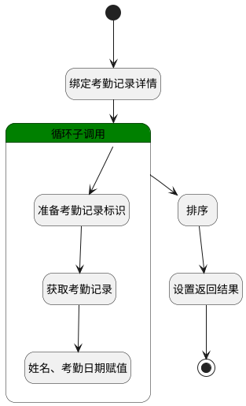

## 考勤记录反查 <!-- {docsify-ignore-all} -->

   

### 处理过程




### 处理步骤说明

#### 开始 :id=Begin<sup class="footnote-symbol"> <font color=gray size=1>[开始]</font></sup>


*- N/A*
#### 绑定考勤记录详情 :id=BINDPARAM1<sup class="footnote-symbol"> <font color=gray size=1>[绑定参数]</font></sup>


绑定参数`Default(传入变量)` 到 `details(考勤记录明细)`
#### 循环子调用 :id=LOOPSUBCALL1<sup class="footnote-symbol"> <font color=gray size=1>[循环子调用]</font></sup>


循环参数`details(考勤记录明细)`，子循环参数使用`temp(临时变量)`
#### 准备考勤记录标识 :id=PREPAREPARAM1<sup class="footnote-symbol"> <font color=gray size=1>[准备参数]</font></sup>


1. 将`temp(临时变量).RECORD_ID(考勤记录ID)` 设置给  `Default(传入变量).ID(考勤记录ID)`

#### 获取考勤记录 :id=DEACTION1<sup class="footnote-symbol"> <font color=gray size=1>[实体行为]</font></sup>


调用实体 [考勤记录(ATTENDANCE_RECORD)](module/attendance/attendance_record.md) 行为 [Get](module/attendance/attendance_record#行为) ，行为参数为`Default(传入变量)`

将执行结果返回给参数`Default(传入变量)`

#### 姓名、考勤日期赋值 :id=PREPAREPARAM2<sup class="footnote-symbol"> <font color=gray size=1>[准备参数]</font></sup>


1. 将`Default(传入变量).MEMBER_NAME(员工姓名)` 设置给  `result(结果).NAME`
2. 将`Default(传入变量).CHECKIN_DATE(考勤日期)` 设置给  `result(结果).checkin_date`

#### 排序 :id=RAWSFCODE1<sup class="footnote-symbol"> <font color=gray size=1>[直接后台代码]</font></sup>


<p class="panel-title"><b>执行代码[Groovy]</b></p>

```groovy
def details = logic.param('details').getReal()

def sdf = new java.text.SimpleDateFormat("HH:mm:ss")

details.sort { a, b ->
    def timeA = java.time.LocalTime.parse(sdf.format(a.get('should_checkin_time')))
    def timeB = java.time.LocalTime.parse(sdf.format(b.get('should_checkin_time')))
    timeA <=> timeB
}
```

#### 设置返回结果 :id=PREPAREPARAM3<sup class="footnote-symbol"> <font color=gray size=1>[准备参数]</font></sup>


1. 将`details(考勤记录明细)` 设置给  `result(结果).details`

#### 结束 :id=END1<sup class="footnote-symbol"> <font color=gray size=1>[结束]</font></sup>


返回 `result(结果)`


### 实体逻辑参数

|    中文名   |    代码名    |  数据类型    |  实体   |备注 |
| --------| --------| -------- | -------- | --------   |
|传入变量(<i class="fa fa-check"/></i>)|Default|数据对象|[考勤记录(ATTENDANCE_RECORD)](module/attendance/attendance_record.md)||
|考勤记录明细|details|数据对象列表|[打卡详情(ATTENDANCE_RECORD_DETAIL)](module/attendance/attendance_record_detail.md)||
|结果|result|数据对象|||
|临时变量|temp|数据对象|[打卡详情(ATTENDANCE_RECORD_DETAIL)](module/attendance/attendance_record_detail.md)||
