## 激活规则 <!-- {docsify-ignore-all} -->

   

### 处理过程

```plantuml
@startuml
hide empty description
<style>
root {
  HyperlinkColor #42b983
}
</style>

hide empty description
state "开始" as Begin <<start>> [[$./activeRule#begin {"开始"}]]
state "删除当前旧激活班次" as RAWSQLCALL8  [[$./activeRule#rawsqlcall8 {"删除当前旧激活班次"}]]
state "删除当前规则旧排班" as RAWSQLCALL_01  [[$./activeRule#rawsqlcall_01 {"删除当前规则旧排班"}]]
state "删除当前规则区间旧排班" as RAWSQLCALL_06  [[$./activeRule#rawsqlcall_06 {"删除当前规则区间旧排班"}]]
state "衔接" as PREPAREPARAM9  [[$./activeRule#prepareparam9 {"衔接"}]]
state "激活班次" as DEACTION_03  [[$./activeRule#deaction_03 {"激活班次"}]]
state "设置日历参数" as RAWSFCODE_013  [[$./activeRule#rawsfcode_013 {"设置日历参数"}]]
state "准备参数" as PREPAREPARAM_07  [[$./activeRule#prepareparam_07 {"准备参数"}]]
state "获取节假日配置" as DEDATASET_03  [[$./activeRule#dedataset_03 {"获取节假日配置"}]]
state "构造节假日" as RAWSFCODE_018  [[$./activeRule#rawsfcode_018 {"构造节假日"}]]
state "调试逻辑参数" as DEBUGPARAM_05  [[$./activeRule#debugparam_05 {"调试逻辑参数"}]]
state "生效日期转换" as RAWSFCODE_017  [[$./activeRule#rawsfcode_017 {"生效日期转换"}]]
state "大小周构造新排班" as RAWSFCODE_08  [[$./activeRule#rawsfcode_08 {"大小周构造新排班"}]]
state "自由班构造新排班" as RAWSFCODE_01  [[$./activeRule#rawsfcode_01 {"自由班构造新排班"}]]
state "准备参数" as PREPAREPARAM_04  [[$./activeRule#prepareparam_04 {"准备参数"}]]
state "激活规则" as DEACTION_02  [[$./activeRule#deaction_02 {"激活规则"}]]
state "结束" as END_01 <<end>> [[$./activeRule#end_01 {"结束"}]]
state "准备参数" as PREPAREPARAM_02  [[$./activeRule#prepareparam_02 {"准备参数"}]]
state "免考勤" as RAWSFCODE_016  [[$./activeRule#rawsfcode_016 {"免考勤"}]]
state "固定排班/灵活打卡构造新排班" as RAWSFCODE_02  [[$./activeRule#rawsfcode_02 {"固定排班/灵活打卡构造新排班"}]]
state "手动排班构造新排班" as RAWSFCODE_06  [[$./activeRule#rawsfcode_06 {"手动排班构造新排班"}]]
state "判断节假日" as RAWSFCODE_015  [[$./activeRule#rawsfcode_015 {"判断节假日"}]]
state "生成后的新排班" as DEBUGPARAM_01  [[$./activeRule#debugparam_01 {"生成后的新排班"}]]
state "获取所有人员" as DEDATASET_02  [[$./activeRule#dedataset_02 {"获取所有人员"}]]
state "为规则人员生成新排班" as RAWSFCODE_07  [[$./activeRule#rawsfcode_07 {"为规则人员生成新排班"}]]
state "保存排班" as DEACTION_04  [[$./activeRule#deaction_04 {"保存排班"}]]
state "重置参数" as RESETPARAM_01  [[$./activeRule#resetparam_01 {"重置参数"}]]
state "人员转换" as RAWSFCODE_012  [[$./activeRule#rawsfcode_012 {"人员转换"}]]
state "查找需更新的activeRule" as RAWSFCODE18  [[$./activeRule#rawsfcode18 {"查找需更新的activeRule"}]]
state "遍历班次" as LOOPSUBCALL_01  [[$./activeRule#loopsubcall_01 {"遍历班次"}]] #green {
state "重新建立参数" as RENEWPARAM_01  [[$./activeRule#renewparam_01 {"重新建立参数"}]]
state "准备参数" as PREPAREPARAM_03  [[$./activeRule#prepareparam_03 {"准备参数"}]]
state "计算工时" as RAWSFCODE_03  [[$./activeRule#rawsfcode_03 {"计算工时"}]]
state "附加到数组参数" as APPENDPARAM_01  [[$./activeRule#appendparam_01 {"附加到数组参数"}]]
}
state "循环子调用" as LOOPSUBCALL_02  [[$./activeRule#loopsubcall_02 {"循环子调用"}]] #green {
state "准备参数" as PREPAREPARAM_01  [[$./activeRule#prepareparam_01 {"准备参数"}]]
state "查询部门下所有人员" as DEDATASET_01  [[$./activeRule#dedataset_01 {"查询部门下所有人员"}]]
state "过滤出不在其他生效规则内的人员" as RAWSFCODE_09  [[$./activeRule#rawsfcode_09 {"过滤出不在其他生效规则内的人员"}]]
state "将该部门在其他生效规则内移除" as RAWSQLCALL_04  [[$./activeRule#rawsqlcall_04 {"将该部门在其他生效规则内移除"}]]
}
state "循环子调用" as LOOPSUBCALL_03  [[$./activeRule#loopsubcall_03 {"循环子调用"}]] #green {
state "重新建立参数" as PREPAREPARAM_05  [[$./activeRule#prepareparam_05 {"重新建立参数"}]]
state "绑定参数" as BINDPARAM_01  [[$./activeRule#bindparam_01 {"绑定参数"}]]
state "N班倒构造新排班" as RAWSFCODE_011  [[$./activeRule#rawsfcode_011 {"N班倒构造新排班"}]]
state "N班倒构造新排班" as RAWSFCODE_010  [[$./activeRule#rawsfcode_010 {"N班倒构造新排班"}]]
state "上A休B构造新排班" as RAWSFCODE_05  [[$./activeRule#rawsfcode_05 {"上A休B构造新排班"}]]
state "判断节假日" as RAWSFCODE_014  [[$./activeRule#rawsfcode_014 {"判断节假日"}]]
state "计算规则成员" as RAWSFCODE_04  [[$./activeRule#rawsfcode_04 {"计算规则成员"}]]
state "查询当前生效规则成员" as RAWSQLCALL_05  [[$./activeRule#rawsqlcall_05 {"查询当前生效规则成员"}]]
state "准备参数" as PREPAREPARAM_08  [[$./activeRule#prepareparam_08 {"准备参数"}]]
}
state "遍历规则人员" as LOOPSUBCALL_04  [[$./activeRule#loopsubcall_04 {"遍历规则人员"}]] #green {
state "准备参数" as PREPAREPARAM_06  [[$./activeRule#prepareparam_06 {"准备参数"}]]
state "删除人员旧排班" as RAWSQLCALL_07  [[$./activeRule#rawsqlcall_07 {"删除人员旧排班"}]]
state "删除人员旧排班" as RAWSQLCALL_02  [[$./activeRule#rawsqlcall_02 {"删除人员旧排班"}]]
state "将该人员在其他生效规则内移除" as RAWSQLCALL_03  [[$./activeRule#rawsqlcall_03 {"将该人员在其他生效规则内移除"}]]
}
state "遍历需需更新规则" as LOOPSUBCALL5  [[$./activeRule#loopsubcall5 {"遍历需需更新规则"}]] #green {
state "准备参数" as PREPAREPARAM7  [[$./activeRule#prepareparam7 {"准备参数"}]]
state "实体行为" as DEACTION4  [[$./activeRule#deaction4 {"实体行为"}]]
state "准备参数" as PREPAREPARAM8  [[$./activeRule#prepareparam8 {"准备参数"}]]
state "更新rule_data" as DEACTION5  [[$./activeRule#deaction5 {"更新rule_data"}]]
}


Begin --> RAWSFCODE_017
RAWSFCODE_017 --> PREPAREPARAM_02
PREPAREPARAM_02 --> DEBUGPARAM_05 : [[$./activeRule#prepareparam_02-debugparam_05{立即激活} 立即激活]]
DEBUGPARAM_05 --> DEACTION_02 : [[$./activeRule#debugparam_05-deaction_02{无限制区间} 无限制区间]]
DEACTION_02 --> RAWSQLCALL8
RAWSQLCALL8 --> RAWSQLCALL_01
RAWSQLCALL_01 --> PREPAREPARAM9 : [[$./activeRule#rawsqlcall_01-prepareparam9{连接名称} 连接名称]]
PREPAREPARAM9 --> LOOPSUBCALL_01 : [[$./activeRule#prepareparam9-loopsubcall_01{非免考勤规则} 非免考勤规则]]
LOOPSUBCALL_01 --> RENEWPARAM_01
RENEWPARAM_01 --> PREPAREPARAM_03
PREPAREPARAM_03 --> RAWSFCODE_03
RAWSFCODE_03 --> APPENDPARAM_01
LOOPSUBCALL_01 --> DEACTION_03 : [[$./activeRule#loopsubcall_01-deaction_03{无限制区间} 无限制区间]]
DEACTION_03 --> RAWSFCODE_013
RAWSFCODE_013 --> PREPAREPARAM_07
PREPAREPARAM_07 --> DEDATASET_03
DEDATASET_03 --> RAWSFCODE_018
RAWSFCODE_018 --> RAWSFCODE_02 : [[$./activeRule#rawsfcode_018-rawsfcode_02{固定排班/灵活打卡} 固定排班/灵活打卡]]
RAWSFCODE_02 --> RAWSFCODE_015
RAWSFCODE_015 --> PREPAREPARAM_04
PREPAREPARAM_04 --> RAWSFCODE_04 : [[$./activeRule#prepareparam_04-rawsfcode_04{非全公司} 非全公司]]
RAWSFCODE_04 --> RAWSQLCALL_05
RAWSQLCALL_05 --> LOOPSUBCALL_02 : [[$./activeRule#rawsqlcall_05-loopsubcall_02{depts不为空} depts不为空]]
LOOPSUBCALL_02 --> PREPAREPARAM_01
PREPAREPARAM_01 --> DEDATASET_01
DEDATASET_01 --> RAWSFCODE_09
RAWSFCODE_09 --> RAWSQLCALL_04
RAWSQLCALL_05 --> PREPAREPARAM_08
PREPAREPARAM_08 --> LOOPSUBCALL_04
LOOPSUBCALL_04 --> RAWSFCODE_07
RAWSFCODE_07 --> DEBUGPARAM_01
DEBUGPARAM_01 --> DEACTION_04
DEACTION_04 --> RESETPARAM_01 : [[$./activeRule#deaction_04-resetparam_01{连接名称} 连接名称]]
RESETPARAM_01 --> RAWSFCODE18
RAWSFCODE18 --> LOOPSUBCALL5
LOOPSUBCALL5 --> PREPAREPARAM7
PREPAREPARAM7 --> DEACTION4
DEACTION4 --> PREPAREPARAM8 : [[$./activeRule#deaction4-prepareparam8{连接名称} 连接名称]]
PREPAREPARAM8 --> DEACTION5
LOOPSUBCALL_04 --> PREPAREPARAM_06
PREPAREPARAM_06 --> RAWSQLCALL_07 : [[$./activeRule#prepareparam_06-rawsqlcall_07{连接名称} 连接名称]]
RAWSQLCALL_07 --> RAWSQLCALL_03
PREPAREPARAM_06 --> RAWSQLCALL_02 : [[$./activeRule#prepareparam_06-rawsqlcall_02{连接名称} 连接名称]]
RAWSQLCALL_02 --> RAWSQLCALL_03
PREPAREPARAM_04 --> DEDATASET_02
DEDATASET_02 --> RAWSFCODE_012
RAWSFCODE_012 --> RAWSQLCALL_05
RAWSFCODE_018 --> RAWSFCODE_06 : [[$./activeRule#rawsfcode_018-rawsfcode_06{手动排班} 手动排班]]
RAWSFCODE_06 --> RAWSFCODE_015
RAWSFCODE_018 --> RAWSFCODE_01 : [[$./activeRule#rawsfcode_018-rawsfcode_01{自由班} 自由班]]
RAWSFCODE_01 --> RAWSFCODE_015
RAWSFCODE_018 --> RAWSFCODE_08 : [[$./activeRule#rawsfcode_018-rawsfcode_08{连接名称} 连接名称]]
RAWSFCODE_08 --> RAWSFCODE_015
RAWSFCODE_018 --> LOOPSUBCALL_03 : [[$./activeRule#rawsfcode_018-loopsubcall_03{N班倒/上A休B} N班倒/上A休B]]
LOOPSUBCALL_03 --> PREPAREPARAM_05
PREPAREPARAM_05 --> BINDPARAM_01
BINDPARAM_01 --> RAWSFCODE_011 : [[$./activeRule#bindparam_01-rawsfcode_011{休息日不同} 休息日不同]]
RAWSFCODE_011 --> RAWSFCODE_014
RAWSFCODE_014 --> RAWSFCODE_04
BINDPARAM_01 --> RAWSFCODE_010 : [[$./activeRule#bindparam_01-rawsfcode_010{休息日相同} 休息日相同]]
RAWSFCODE_010 --> RAWSFCODE_014
BINDPARAM_01 --> RAWSFCODE_05 : [[$./activeRule#bindparam_01-rawsfcode_05{连接名称} 连接名称]]
RAWSFCODE_05 --> RAWSFCODE_014
LOOPSUBCALL_01 --> RAWSFCODE_013 : [[$./activeRule#loopsubcall_01-rawsfcode_013{有限制区间} 有限制区间]]
PREPAREPARAM9 --> RAWSFCODE_016 : [[$./activeRule#prepareparam9-rawsfcode_016{免考勤规则} 免考勤规则]]
RAWSFCODE_016 --> RAWSFCODE_04
DEBUGPARAM_05 --> RAWSQLCALL_06 : [[$./activeRule#debugparam_05-rawsqlcall_06{有限制区间} 有限制区间]]
RAWSQLCALL_06 --> PREPAREPARAM9 : [[$./activeRule#rawsqlcall_06-prepareparam9{连接名称} 连接名称]]
PREPAREPARAM_02 --> END_01 : [[$./activeRule#prepareparam_02-end_01{未到生效时间} 未到生效时间]]


@enduml
```




### 处理步骤说明

#### 开始 :id=Begin<sup class="footnote-symbol"> <font color=gray size=1>[开始]</font></sup>


*- N/A*
#### 生效日期转换 :id=RAWSFCODE_017<sup class="footnote-symbol"> <font color=gray size=1>[直接后台代码]</font></sup>


<p class="panel-title"><b>执行代码[Groovy]</b></p>

```groovy
def _default = logic.param('Default').getReal()
def effect_time = _default.get("effect_time")
if (effect_time instanceof String) {
    def sdf = new java.text.SimpleDateFormat("yyyy-MM-dd 00:00:00")
    _default.set("effect_time", sdf.parse(effect_time))
}
```

#### 准备参数 :id=PREPAREPARAM_02<sup class="footnote-symbol"> <font color=gray size=1>[准备参数]</font></sup>


1. 将`Default(传入变量)` 设置给  `activeRule(激活规则).RULE_DATA(当前规则信息)`
2. 将`Default(传入变量).ID(主键)` 设置给  `activeRule(激活规则).ID(主键)`
3. 将`Default(传入变量).NAME(规则名称)` 设置给  `activeRule(激活规则).NAME(规则名称)`
4. 将`Default(传入变量).shifts` 绑定给  `shifts`
5. 将`Default(传入变量).SCHEDULE_TYPE(班次类型)` 设置给  `activeRule(激活规则).SCHEDULE_TYPE(班次类型)`
6. 将`Default(传入变量).group_shifts` 绑定给  `group_shifts(组排班)`

#### 结束 :id=END_01<sup class="footnote-symbol"> <font color=gray size=1>[结束]</font></sup>


返回 `Default(传入变量)`

#### 激活规则 :id=DEACTION_02<sup class="footnote-symbol"> <font color=gray size=1>[实体行为]</font></sup>


调用实体 [激活规则(ATTENDANCE_ACTIVATE_RULE)](module/attendance/attendance_activate_rule.md) 行为 [Save](module/attendance/attendance_activate_rule#行为) ，行为参数为`activeRule(激活规则)`

#### 调试逻辑参数 :id=DEBUGPARAM_05<sup class="footnote-symbol"> <font color=gray size=1>[调试逻辑参数]</font></sup>


> [!NOTE|label:调试信息|icon:fa fa-bug]
> 调试输出参数`activeRule(激活规则)`的详细信息


#### 删除当前旧激活班次 :id=RAWSQLCALL8<sup class="footnote-symbol"> <font color=gray size=1>[直接SQL调用]</font></sup>


<p class="panel-title"><b>执行sql语句</b></p>

```sql
DELETE FROM attendance_activate_shift WHERE rule_id = ?
```

<p class="panel-title"><b>执行sql参数</b></p>

1. `activeRule(激活规则).ID(主键)`


#### 删除当前规则旧排班 :id=RAWSQLCALL_01<sup class="footnote-symbol"> <font color=gray size=1>[直接SQL调用]</font></sup>


<p class="panel-title"><b>执行sql语句</b></p>

```sql
DELETE FROM attendance_schedule WHERE rule_id = ? AND checkin_date >= ?
```

<p class="panel-title"><b>执行sql参数</b></p>

1. `Default(传入变量).ID(主键)`
2. `Default(传入变量).EFFECT_TIME(生效时间)`


#### 删除当前规则区间旧排班 :id=RAWSQLCALL_06<sup class="footnote-symbol"> <font color=gray size=1>[直接SQL调用]</font></sup>


<p class="panel-title"><b>执行sql语句</b></p>

```sql
DELETE FROM attendance_schedule WHERE rule_id = ? AND checkin_date >= ?
```

<p class="panel-title"><b>执行sql参数</b></p>

1. `Default(传入变量).ID(主键)`
2. `Default(传入变量).limitTime`


#### 重新建立参数 :id=RENEWPARAM_01<sup class="footnote-symbol"> <font color=gray size=1>[重新建立参数]</font></sup>


重建参数```activeShift(activeShift)```
#### 遍历班次 :id=LOOPSUBCALL_01<sup class="footnote-symbol"> <font color=gray size=1>[循环子调用]</font></sup>


循环参数`shifts`，子循环参数使用`temp`
#### 衔接 :id=PREPAREPARAM9<sup class="footnote-symbol"> <font color=gray size=1>[准备参数]</font></sup>


    无

#### 激活班次 :id=DEACTION_03<sup class="footnote-symbol"> <font color=gray size=1>[实体行为]</font></sup>


调用实体 [激活班次(ATTENDANCE_ACTIVATE_SHIFT)](module/attendance/attendance_activate_shift.md) 行为 [Save](module/attendance/attendance_activate_shift#行为) ，行为参数为`activeShifts`

#### 准备参数 :id=PREPAREPARAM_03<sup class="footnote-symbol"> <font color=gray size=1>[准备参数]</font></sup>


1. 将`temp` 设置给  `activeShift.SHIFT_DATA(shift_data)`
2. 将`temp.RULE_ID` 设置给  `activeShift.RULE_ID(主键)`
3. 将`temp.ID` 设置给  `activeShift.ID(标识)`
4. 将`temp.NAME` 设置给  `activeShift.NAME(名称)`

#### 设置日历参数 :id=RAWSFCODE_013<sup class="footnote-symbol"> <font color=gray size=1>[直接后台代码]</font></sup>


<p class="panel-title"><b>执行代码[Groovy]</b></p>

```groovy
def _default = logic.param('Default').getReal()
Calendar cal = Calendar.getInstance()
int currentYear = cal.get(Calendar.YEAR)
def dateFormat = new java.text.SimpleDateFormat("yyyy-MM-dd")

// 设置开始日期为当年第一天
cal.set(currentYear, Calendar.JANUARY, 1, 0, 0, 0)
cal.set(Calendar.MILLISECOND, 0)
Date startOfYear = cal.getTime()

// 设置结束日期为当年最后一天
cal.set(currentYear, Calendar.DECEMBER, 31, 23, 59, 59)
cal.set(Calendar.MILLISECOND, 999)
Date endOfYear = cal.getTime()

// 设置过滤条件（格式化为yyyy-MM-dd）

_default.set("N_DATE_FROM_LTANDEQ", dateFormat.format(endOfYear))
_default.set("N_DATE_TO_GTANDEQ", dateFormat.format(startOfYear))
```

#### 循环子调用 :id=LOOPSUBCALL_03<sup class="footnote-symbol"> <font color=gray size=1>[循环子调用]</font></sup>


循环参数`group_shifts(组排班)`，子循环参数使用`group_shift`
#### 重新建立参数 :id=PREPAREPARAM_05<sup class="footnote-symbol"> <font color=gray size=1>[准备参数]</font></sup>


1. 将`null` 重新建立为  `members`
2. 将` ==> changes` 重新建立为  `changes`
3. 将`null` 重新建立为  `lastSchedules(新排班)`
4. 将`null` 重新建立为  `newSchedules`
5. 将`null` 重新建立为  `depts`
6. 将`null` 重新建立为  `group_members`

#### 附加到数组参数 :id=APPENDPARAM_01<sup class="footnote-symbol"> <font color=gray size=1>[附加到数组参数]</font></sup>


将参数`activeShift` 添加到数组参数`activeShifts`
#### 计算工时 :id=RAWSFCODE_03<sup class="footnote-symbol"> <font color=gray size=1>[直接后台代码]</font></sup>


<p class="panel-title"><b>执行代码[Groovy]</b></p>

```groovy
def activeShift = logic.param('activeShift').getReal()
def shift = activeShift.shift_data

// 计算总工时
int totalWorkLoad = 0
shift.scopes.each { workPeriod ->
    // 安全校验时间格式
    if (workPeriod?.start_base_time && workPeriod?.end_base_time) {
        def timeToMinutes = { time ->
        if (time instanceof java.sql.Timestamp) {
            String timeStr = time.toString().split(' ')[1]
            def parts = timeStr.split(':')[0..1]
            return (parts[0].toInteger() * 60) + parts[1].toInteger()
        }
        def parts = time.split(':')
        (parts[0].toInteger() * 60) + parts[1].toInteger()
    }
        def start = timeToMinutes(workPeriod.start_base_time)
        def end = timeToMinutes(workPeriod.end_base_time)
        if (start >= end) {
            totalWorkLoad += (24 * 60 - start + end);
        }else {
            totalWorkLoad += (end - start);
        }
    }
}

shift.work_load = totalWorkLoad
// shift.scopes = null
shift.set("work_times",shift.scopes)

```

#### 准备参数 :id=PREPAREPARAM_07<sup class="footnote-symbol"> <font color=gray size=1>[准备参数]</font></sup>


1. 将`Default(传入变量).N_DATE_FROM_LTANDEQ` 设置给  `calendarFilter.N_DATE_FROM_LTANDEQ`
2. 将`Default(传入变量).N_DATE_TO_GTANDEQ` 设置给  `calendarFilter.N_DATE_TO_GTANDEQ`
3. 将`1000` 设置给  `calendarFilter.size`

#### 绑定参数 :id=BINDPARAM_01<sup class="footnote-symbol"> <font color=gray size=1>[绑定参数]</font></sup>


绑定参数`group_shift` 到 `group_members`
#### 获取节假日配置 :id=DEDATASET_03<sup class="footnote-symbol"> <font color=gray size=1>[实体数据集]</font></sup>


调用实体 [休假详细信息(RESOURCE_CALENDAR_LEAVES)](module/resource/resource_calendar_leaves.md) 数据集合 [公共节假日(PUBLIC)](module/resource/resource_calendar_leaves#数据集合) ，查询参数为`calendarFilter`

将执行结果返回给参数`curRldata`

#### 构造节假日 :id=RAWSFCODE_018<sup class="footnote-symbol"> <font color=gray size=1>[直接后台代码]</font></sup>


<p class="panel-title"><b>执行代码[Groovy]</b></p>

```groovy
def curRldata = logic.param('curRldata').getReal()

def lastRldata = logic.param('lastRldata').getReal()

if(curRldata){
    // 添加日期格式化工具
    def sdf = new java.text.SimpleDateFormat("yyyy-MM-dd")

    // 获取当前年份的第一天和最后一天
    def currentYear = java.time.Year.now().value
    def firstDayOfYear = java.time.LocalDate.of(currentYear, 1, 1)
    def lastDayOfYear = java.time.LocalDate.of(currentYear, 12, 31)

    curRldata.each{ i ->
        // 解析日期范围
        def startDate = i.get("date_from")
        def endDate = i.get("date_to")

        if (startDate && endDate) {
            // 日期范围截断逻辑
            if(startDate && !startDate.toInstant().atZone(java.time.ZoneId.systemDefault()).toLocalDate().isAfter(firstDayOfYear)){
                startDate = java.sql.Timestamp.valueOf(firstDayOfYear.atStartOfDay())
            }
            if(endDate && endDate.toInstant().atZone(java.time.ZoneId.systemDefault()).toLocalDate().isAfter(lastDayOfYear)){
                endDate = java.sql.Timestamp.valueOf(lastDayOfYear.atTime(23,59,59))
            }

            // 将Timestamp转换为LocalDate
            java.time.LocalDate start = startDate.toInstant()
                .atZone(java.time.ZoneId.systemDefault())
                .toLocalDate()

            java.time.LocalDate end = endDate.toInstant()
                .atZone(java.time.ZoneId.systemDefault())
                .toLocalDate()

            // 使用循环逐日增加
            while (!start.isAfter(end)) {
                def restday = sys.entity('resource_calendar_leaves')
                restday.set("date", sdf.format(Date.from(start.atStartOfDay(java.time.ZoneId.systemDefault()).toInstant())))
                restday.set("name", i.get("name"))
                lastRldata.add(restday)
                // 增加一天
                start = start.plusDays(1)
            }
        }
    }
}
```

#### 免考勤 :id=RAWSFCODE_016<sup class="footnote-symbol"> <font color=gray size=1>[直接后台代码]</font></sup>


<p class="panel-title"><b>执行代码[Groovy]</b></p>

```groovy
//1、排班日期区间为五个月，即[ 前三个月 - 当前月 - 下个月]
//2、生成新排班时需要生成生效日期起到排班日期区间止的所有排班
def activeRule = logic.param('activeRule').getReal()
def newSchedules = logic.param('newSchedules').getReal()
def _default = logic.param('Default').getReal()
def effect_time = _default.get("effect_time")

// 获取当前日期
def now = new Date()
def calendar = Calendar.getInstance()
def sdf = new java.text.SimpleDateFormat("yyyy-MM-dd")
calendar.setTime(now)

 //限制生成区间
def limitTime = _default.get("limitTime")
def limitCal = Calendar.getInstance()
if(limitTime ){
    if (limitTime instanceof String) {
        limitCal.setTime(sdf.parse(limitTime))
    } else {
        limitCal.setTime(limitTime)
    }
}
 
// 跳转到下个月
calendar.add(Calendar.MONTH, 1)
// 设置为下个月最后一天
calendar.set(Calendar.DAY_OF_MONTH, calendar.getActualMaximum(Calendar.DAY_OF_MONTH))
    
// 排班结束日期
def endDate = sdf.format(calendar.getTime())


// 排班生成
def startCal = Calendar.getInstance()
startCal.setTime(effect_time)
    
// 解析结束日期
def endCal = Calendar.getInstance()
endCal.setTime(sdf.parse(endDate))

// 遍历日期区间
while (!startCal.after(endCal)) {
    
    if(limitTime && startCal.before(limitCal)){
        startCal.add(Calendar.DAY_OF_MONTH, 1)
        continue 
    }

    def checkinDate = startCal.getTime()

    def schedule = sys.entity('attendance_schedule')
    schedule.rule_name = activeRule.get("name")
    schedule.rule_id = activeRule.get("id")
    schedule.checkin_date =  sdf.format(checkinDate)
    schedule.workday = 0

    newSchedules.add(schedule)
    startCal.add(Calendar.DAY_OF_MONTH, 1)
}
```

#### N班倒构造新排班 :id=RAWSFCODE_011<sup class="footnote-symbol"> <font color=gray size=1>[直接后台代码]</font></sup>


<p class="panel-title"><b>执行代码[Groovy]</b></p>

```groovy
def activeShifts = logic.param('activeShifts').getReal()
def activeRule = logic.param('activeRule').getReal()
def newSchedules = logic.param('newSchedules').getReal()
def _default = logic.param('Default').getReal()
def effect_time = _default.get("effect_time")
def inversion_days = _default.get("inversion_days")

def group_shift = logic.param('group_shift').getReal()
def workdays = group_shift.get("workdays")

def sdf = new java.text.SimpleDateFormat("yyyy-MM-dd")
def endCal = Calendar.getInstance()
endCal.add(Calendar.MONTH, 1)
endCal.set(Calendar.DAY_OF_MONTH, endCal.getActualMaximum(Calendar.DAY_OF_MONTH))

 //限制生成区间
def limitTime = _default.get("limitTime")
def limitCal = Calendar.getInstance()
if(limitTime ){
    if (limitTime instanceof String) {
        limitCal.setTime(sdf.parse(limitTime))
    } else {
        limitCal.setTime(limitTime)
    }
}

def startCal = Calendar.getInstance()
startCal.setTime(effect_time)
startCal.set(Calendar.HOUR_OF_DAY, 0)
startCal.set(Calendar.MINUTE, 0)
startCal.set(Calendar.SECOND, 0)
startCal.set(Calendar.MILLISECOND, 0)

def cycleMap = [:]
workdays.eachWithIndex { workday, index ->
    if (index + 1 <= inversion_days) {
        cycleMap[(index + 1)] = workday
    }
}

Date baseDate = startCal.getTime()
while (!startCal.after(endCal)) {

    if(limitTime && startCal.before(limitCal)){
        startCal.add(Calendar.DAY_OF_MONTH, 1)
        continue 
    }

    Date checkinDate = startCal.getTime()
    long offsetMillis = checkinDate.time - baseDate.time
    int offsetDays = (offsetMillis / (24 * 60 * 60 * 1000)) as int
    int dayInCycle = (offsetDays % inversion_days) + 1

    def workdayConfig = cycleMap[dayInCycle]
    if (workdayConfig) {
        def shift = activeShifts.find { it.id == workdayConfig.shift_id }
        def shiftData = shift?.shift_data ?: [:]
        def workTime = shiftData?.get("work_times") ?: []

        def schedule = sys.entity('attendance_schedule')
        schedule.rule_data = activeRule.rule_data
        schedule.rule_name = activeRule.name
        schedule.rule_id = activeRule.id
        schedule.checkin_date = sdf.format(checkinDate)
        schedule.shift_data = shiftData
        schedule.work_time = workTime
        schedule.workday = shiftData ? 1 : 0
        newSchedules.add(schedule)
    }
    startCal.add(Calendar.DAY_OF_MONTH, 1)
}
```

#### N班倒构造新排班 :id=RAWSFCODE_010<sup class="footnote-symbol"> <font color=gray size=1>[直接后台代码]</font></sup>


<p class="panel-title"><b>执行代码[Groovy]</b></p>

```groovy
//1、排班日期区间为五个月，即[ 前三个月 - 当前月 - 下个月]
//2、生成新排班时需要生成生效日期起到排班日期区间止的所有排班
def activeShifts  = logic.param('activeShifts').getReal()
def activeRule = logic.param('activeRule').getReal()
def newSchedules = logic.param('newSchedules').getReal()
def _default = logic.param('Default').getReal()
def effect_time = _default.get("effect_time")
def inversion_cycle = _default.get("inversion_cycle")

//获取workdays
def group_shift = logic.param('group_shift').getReal()
def workdays = group_shift.get("workdays")

// 获取当前日期
def now = new Date()
def calendar = Calendar.getInstance()
def sdf = new java.text.SimpleDateFormat("yyyy-MM-dd")
calendar.setTime(now)
 
  //限制生成区间
def limitTime = _default.get("limitTime")
def limitCal = Calendar.getInstance()
if(limitTime ){
    if (limitTime instanceof String) {
        limitCal.setTime(sdf.parse(limitTime))
    } else {
        limitCal.setTime(limitTime)
    }
}

// 跳转到下个月
calendar.add(Calendar.MONTH, 1)
// 设置为下个月最后一天
calendar.set(Calendar.DAY_OF_MONTH, calendar.getActualMaximum(Calendar.DAY_OF_MONTH))
    
// 排班结束日期
def endDate = sdf.format(calendar.getTime())


// 排班生成
def startCal = Calendar.getInstance()
startCal.setTime(effect_time)
    
// 解析结束日期
def endCal = Calendar.getInstance()
endCal.setTime(sdf.parse(endDate))

// 计算周期天数（N班倒*7天）
int cycleDays = inversion_cycle * 7

// 预处理工作日数据：建立周期映射表（仅保留1~cycleDays的配置）
def validWorkdays = workdays.findAll { it.day_number <= cycleDays }
def cycleMap = [:]
validWorkdays.each { 
    cycleMap[it.day_number] = it 
}

// 计算生效日期对应的周期基准日（最近的前序周一）
Calendar baseDateCal = Calendar.getInstance()
baseDateCal.setTime(effect_time)
// 计算需要回退的天数（1=周日,2=周一,...,7=周六）
int daysToSubtract = (baseDateCal.get(Calendar.DAY_OF_WEEK) - 2 + 7) % 7

if (daysToSubtract > 0) {
    baseDateCal.add(Calendar.DAY_OF_MONTH, -daysToSubtract)
}
Date baseDate = baseDateCal.getTime()

// 遍历当月每一天
while (!startCal.after(endCal)) {
    
    if(limitTime && startCal.before(limitCal)){
        startCal.add(Calendar.DAY_OF_MONTH, 1)
        continue 
    }

    Date checkinDate = startCal.getTime()
    
    // 计算相对于基准日的天数偏移
    long offsetMillis = checkinDate.getTime() - baseDate.getTime()
    int offsetDays = (offsetMillis / (24 * 60 * 60 * 1000)) as int
    
    // 计算周期位置（1-based）
    int dayInCycle = (offsetDays % cycleDays) + 1
    
    // 查找工作配置
    def workdayConfig = cycleMap[dayInCycle]

    if(workdayConfig!=null){
          //查找对应的班次信息
        def shift = activeShifts.find { it.id == workdayConfig.shift_id }
        def shift_data =  shift?.shift_data?:null
        def workTime = shift_data?.get("work_times") ?: null

        def schedule = sys.entity('attendance_schedule')
        schedule.rule_data = activeRule.get("rule_data")
        schedule.rule_name = activeRule.get("name")
        schedule.rule_id = activeRule.get("id")
        schedule.checkin_date =  sdf.format(checkinDate)
        schedule.shift_data = shift_data
        schedule.work_time = workTime
        schedule.workday = shift_data != null ? 1 : 0 
        newSchedules.add(schedule)

    }
    startCal.add(Calendar.DAY_OF_MONTH, 1)
}


```

#### 上A休B构造新排班 :id=RAWSFCODE_05<sup class="footnote-symbol"> <font color=gray size=1>[直接后台代码]</font></sup>


<p class="panel-title"><b>执行代码[Groovy]</b></p>

```groovy
def activeShifts = logic.param('activeShifts').getReal()
def activeRule = logic.param('activeRule').getReal()
def newSchedules = logic.param('newSchedules').getReal()
def _default = logic.param('Default').getReal()
def effect_time = _default.get("effect_time")

def rest = _default.get("rest")
def work = _default.get("work")

def group_shift = logic.param('group_shift').getReal()
def workdays = group_shift.get("workdays")

def sdf = new java.text.SimpleDateFormat("yyyy-MM-dd")
def endCal = Calendar.getInstance()
endCal.add(Calendar.MONTH, 1)
endCal.set(Calendar.DAY_OF_MONTH, endCal.getActualMaximum(Calendar.DAY_OF_MONTH))

 //限制生成区间
def limitTime = _default.get("limitTime")
def limitCal = Calendar.getInstance()
if(limitTime ){
    if (limitTime instanceof String) {
        limitCal.setTime(sdf.parse(limitTime))
    } else {
        limitCal.setTime(limitTime)
    }
}

def startCal = Calendar.getInstance()
startCal.setTime(effect_time)
startCal.set(Calendar.HOUR_OF_DAY, 0)
startCal.set(Calendar.MINUTE, 0)
startCal.set(Calendar.SECOND, 0)
startCal.set(Calendar.MILLISECOND, 0)

// 核心逻辑：构建天数循环映射
def workdayNum = rest+work;
def cycleMap = [:]
workdays.eachWithIndex { workday, index ->
    if (index + 1 <= workdayNum) {
        cycleMap[(index + 1)] = workday
    }
}

// 基准日设置
Date baseDate = startCal.getTime()
while (!startCal.after(endCal)) {

    if(limitTime && startCal.before(limitCal)){
        startCal.add(Calendar.DAY_OF_MONTH, 1)
        continue 
    }

    Date checkinDate = startCal.getTime()
    long offsetMillis = checkinDate.time - baseDate.time
    int offsetDays = (offsetMillis / (24 * 60 * 60 * 1000)) as int
    int dayInCycle = (offsetDays % workdayNum) + 1

    def workdayConfig = cycleMap[dayInCycle]
    if (workdayConfig) {
        def shift = workdayConfig.get("is_work") == 1 ? activeShifts[0] : null
        def shiftData = shift?.shift_data ?: [:]
        def workTime = shiftData?.get("work_times") ?: []

        def schedule = sys.entity('attendance_schedule')
        schedule.rule_data = activeRule.rule_data
        schedule.rule_name = activeRule.name
        schedule.rule_id = activeRule.id
        schedule.checkin_date = sdf.format(checkinDate)
        schedule.shift_data = shiftData
        schedule.work_time = workTime
        schedule.workday = shiftData ? 1 : 0
        newSchedules.add(schedule)
    }
    startCal.add(Calendar.DAY_OF_MONTH, 1)
}
```

#### 大小周构造新排班 :id=RAWSFCODE_08<sup class="footnote-symbol"> <font color=gray size=1>[直接后台代码]</font></sup>


<p class="panel-title"><b>执行代码[Groovy]</b></p>

```groovy
//1、排班日期区间为五个月，即[ 前三个月 - 当前月 - 下个月]
//2、生成新排班时需要生成生效日期起到排班日期区间止的所有排班
def activeShifts  = logic.param('activeShifts').getReal()
def activeRule = logic.param('activeRule').getReal()
def newSchedules = logic.param('newSchedules').getReal()
def _default = logic.param('Default').getReal()
def effect_time = _default.get("effect_time")
def workdays = _default.get("workdays")
//大小周
def biweekly_cycle = _default.get("biweekly_cycle")

// 获取当前日期
def now = new Date()
def calendar = Calendar.getInstance()
def sdf = new java.text.SimpleDateFormat("yyyy-MM-dd")
calendar.setTime(now)

 //限制生成区间
def limitTime = _default.get("limitTime")
def limitCal = Calendar.getInstance()
if(limitTime ){
    if (limitTime instanceof String) {
        limitCal.setTime(sdf.parse(limitTime))
    } else {
        limitCal.setTime(limitTime)
    }
}
 
// 跳转到下个月
calendar.add(Calendar.MONTH, 1)
// 设置为下个月最后一天
calendar.set(Calendar.DAY_OF_MONTH, calendar.getActualMaximum(Calendar.DAY_OF_MONTH))
    
// 排班结束日期
def endDate = sdf.format(calendar.getTime())

// 计算当天排班班次
def generateShiftData = { Date checkinDate, List workdaysParam, List activeShiftsParam ->
    // 1. 确定当前日期是周几（1-7对应周一到周日）
    def calendarInner = Calendar.getInstance()
    calendarInner.setTime(checkinDate)
    int dayOfWeek = calendarInner.get(Calendar.DAY_OF_WEEK)
    int dayNumber = (dayOfWeek == Calendar.SUNDAY) ? 7 : dayOfWeek - 1

    // 新增大/小周计算逻辑
    // 计算生效日期所在周的第一天（周一）
    def effectCal = Calendar.getInstance()
    effectCal.setTime(effect_time)
    effectCal.set(Calendar.DAY_OF_WEEK, Calendar.MONDAY)

    // 计算检查日期所在周的第一天（周一）
    def checkinCal = Calendar.getInstance()
    checkinCal.setTime(checkinDate)
    checkinCal.set(Calendar.DAY_OF_WEEK, Calendar.MONDAY)

    // 计算周数差（生效日期所在周为第1周）
    long diffMillis = checkinCal.getTimeInMillis() - effectCal.getTimeInMillis()
    int weekNumber = (int)(diffMillis / (7 * 24 * 60 * 60 * 1000)) + 1

    // 判断当前是大周还是小周
    boolean isBigWeek = false
    if (biweekly_cycle == "big_small") {
    isBigWeek = (weekNumber % 2 == 1)  // 奇数周为大周
} else if (biweekly_cycle == "small_big") {
    isBigWeek = (weekNumber % 2 == 0)  // 偶数周为大周
}

// 调整day_number（小周时+7）
int adjustedDayNumber = isBigWeek ? dayNumber : dayNumber + 7

// 2. 查找匹配的工作日配置（直接匹配调整后的day_number）
def workdayConfig = workdaysParam.find {
    it.day_number == adjustedDayNumber
}

// 3. 未找到工作日配置时返回空班次
if (!workdayConfig || !workdayConfig.shift_id) {
    return null
}

// 4. 查找对应的班次信息
def shift = activeShiftsParam.find { it.id == workdayConfig.shift_id }

// 5. 未找到班次时返回空班次
if (!shift || !shift.shift_data) {
    return null
}

// 6. 返回班次数据
return shift.shift_data
}

// 排班生成
def startCal = Calendar.getInstance()
startCal.setTime(effect_time)
    
// 解析结束日期
def endCal = Calendar.getInstance()
endCal.setTime(sdf.parse(endDate))

// 遍历日期区间
while (!startCal.after(endCal)) {
    if(limitTime && startCal.before(limitCal)){
        startCal.add(Calendar.DAY_OF_MONTH, 1)
        continue 
    }
    def checkinDate = startCal.getTime()
    def shift_data = generateShiftData(checkinDate, workdays, activeShifts)
    def workTime = shift_data?.get("work_times") ?: null

    def schedule = sys.entity('attendance_schedule')
    schedule.rule_data = activeRule.get("rule_data")
    schedule.rule_name = activeRule.get("name")
    schedule.rule_id = activeRule.get("id")
    schedule.checkin_date =  sdf.format(checkinDate)
    if(shift_data){
        shift_data.name = "白班"
    }
    schedule.shift_data = shift_data
    schedule.work_time = workTime
    schedule.workday = shift_data != null ? 1 : 0 
    // schedule.id = UUID.randomUUID().toString() 

    newSchedules.add(schedule)
    startCal.add(Calendar.DAY_OF_MONTH, 1)
}
```

#### 固定排班/灵活打卡构造新排班 :id=RAWSFCODE_02<sup class="footnote-symbol"> <font color=gray size=1>[直接后台代码]</font></sup>


<p class="panel-title"><b>执行代码[Groovy]</b></p>

```groovy
//1、排班日期区间为五个月，即[ 前三个月 - 当前月 - 下个月]
//2、生成新排班时需要生成生效日期起到排班日期区间止的所有排班

def activeShifts  = logic.param('activeShifts').getReal()
def activeRule = logic.param('activeRule').getReal()
def newSchedules = logic.param('newSchedules').getReal()
def _default = logic.param('Default').getReal()

def effect_time = _default.get("effect_time")
def workdays = _default.get("workdays")

// 获取当前日期
def now = new Date()
def calendar = Calendar.getInstance()

def sdf = new java.text.SimpleDateFormat("yyyy-MM-dd")
calendar.setTime(now)

 //限制生成区间
def limitTime = _default.get("limitTime")
def limitCal = Calendar.getInstance()
if(limitTime != null && limitTime !=""){
    println("limitTime"+limitTime)
    if (limitTime instanceof String) {
        limitCal.setTime(sdf.parse(limitTime))
    } else {
        limitCal.setTime(limitTime)
    }
}
// 跳转到下个月
calendar.add(Calendar.MONTH, 1)
// 设置为下个月最后一天
calendar.set(Calendar.DAY_OF_MONTH, calendar.getActualMaximum(Calendar.DAY_OF_MONTH))

// 排班结束日期
def endDate = sdf.format(calendar.getTime())

// 计算当天排班班次
def generateShiftData = { Date checkinDate, List workdaysParam, List activeShiftsParam ->
    // 1. 确定当前日期是周几（1-7对应周一到周日）
    def calendarInner = Calendar.getInstance()
    calendarInner.setTime(checkinDate)
    int dayOfWeek = calendarInner.get(Calendar.DAY_OF_WEEK)
    int dayNumber = (dayOfWeek == Calendar.SUNDAY) ? 7 : dayOfWeek - 1

    // 2. 查找匹配的工作日配置
    def workdayConfig = workdaysParam.find { it.day_number == dayNumber }

    // 3. 未找到工作日配置时返回空班次
    if (!workdayConfig || !workdayConfig.shift_id) {
        // print "未找到工作日配置时返回空班次, ${workdayConfig}!"
        return null
    }

    // 4. 查找对应的班次信息
    def shift = activeShiftsParam.find { it.id == workdayConfig.shift_id }

    // 5. 未找到班次时返回空班次
    if (!shift || !shift.shift_data) {
        // print "未找到班次时返回空班次, ${shift}!"
        return null
    }

    // 6. 返回班次数据
    // print "返回班次数据, ${shift}!"
    return shift.shift_data
}

// 排班生成
def startCal = Calendar.getInstance()
startCal.setTime(effect_time)

// 解析结束日期
def endCal = Calendar.getInstance()
endCal.setTime(sdf.parse(endDate))

// 遍历日期区间
while (!startCal.after(endCal)) {

    if(limitTime && startCal.before(limitCal)){
        startCal.add(Calendar.DAY_OF_MONTH, 1)
        continue
    }
    def checkinDate = startCal.getTime()
    def shift_data = generateShiftData(checkinDate, workdays, activeShifts)
    def workTime = shift_data?.get("work_times") ?: null

    def schedule = sys.entity('attendance_schedule')
    schedule.rule_data = activeRule.get("rule_data")
    schedule.rule_name = activeRule.get("name")
    schedule.rule_id = activeRule.get("id")
    schedule.checkin_date =  sdf.format(checkinDate)
    schedule.shift_data = shift_data
    schedule.work_time = workTime
    schedule.workday = shift_data != null ? 1 : 0
    // schedule.id = UUID.randomUUID().toString()

    newSchedules.add(schedule)
    startCal.add(Calendar.DAY_OF_MONTH, 1)

}
```

#### 手动排班构造新排班 :id=RAWSFCODE_06<sup class="footnote-symbol"> <font color=gray size=1>[直接后台代码]</font></sup>


<p class="panel-title"><b>执行代码[Groovy]</b></p>

```groovy
//1、排班日期区间为五个月，即[ 前三个月 - 当前月 - 下个月]
//2、生成新排班时需要生成生效日期起到排班日期区间止的所有排班
def activeRule = logic.param('activeRule').getReal()
def newSchedules = logic.param('newSchedules').getReal()
def _default = logic.param('Default').getReal()
def effect_time = _default.get("effect_time")
def workdays = _default.get("workdays")

// 获取当前日期
def now = new Date()
def calendar = Calendar.getInstance()
def sdf = new java.text.SimpleDateFormat("yyyy-MM-dd")
calendar.setTime(now)

  //限制生成区间
def limitTime = _default.get("limitTime")
def limitCal = Calendar.getInstance()
if(limitTime ){
    if (limitTime instanceof String) {
        limitCal.setTime(sdf.parse(limitTime))
    } else {
        limitCal.setTime(limitTime)
    }
}

// 跳转到下个月
calendar.add(Calendar.MONTH, 1)
// 设置为下个月最后一天
calendar.set(Calendar.DAY_OF_MONTH, calendar.getActualMaximum(Calendar.DAY_OF_MONTH))
    
// 排班结束日期
def endDate = sdf.format(calendar.getTime())

// 排班生成
def startCal = Calendar.getInstance()
startCal.setTime(effect_time)
    
// 解析结束日期
def endCal = Calendar.getInstance()
endCal.setTime(sdf.parse(endDate))

// 遍历日期区间
while (!startCal.after(endCal)) {

    if(limitTime && startCal.before(limitCal)){
        startCal.add(Calendar.DAY_OF_MONTH, 1)
        continue 
    }    
    
    def checkinDate = startCal.getTime()

    def schedule = sys.entity('attendance_schedule')
    schedule.rule_data = activeRule.get("rule_data")
    schedule.rule_name = activeRule.get("name")
    schedule.rule_id = activeRule.get("id")
    schedule.checkin_date =  sdf.format(checkinDate)
    // schedule.id = UUID.randomUUID().toString() 

    newSchedules.add(schedule)
    startCal.add(Calendar.DAY_OF_MONTH, 1)
}
```

#### 自由班构造新排班 :id=RAWSFCODE_01<sup class="footnote-symbol"> <font color=gray size=1>[直接后台代码]</font></sup>


<p class="panel-title"><b>执行代码[Groovy]</b></p>

```groovy
//1、排班日期区间为五个月，即[ 前三个月 - 当前月 - 下个月]
//2、生成新排班时需要生成生效日期起到排班日期区间止的所有排班
def activeShifts  = logic.param('activeShifts').getReal()
def activeRule = logic.param('activeRule').getReal()
def newSchedules = logic.param('newSchedules').getReal()
def _default = logic.param('Default').getReal()
def effect_time = _default.get("effect_time")

// 获取当前日期
def now = new Date()
def calendar = Calendar.getInstance()
def sdf = new java.text.SimpleDateFormat("yyyy-MM-dd")
calendar.setTime(now)

 //限制生成区间
def limitTime = _default.get("limitTime")
def limitCal = Calendar.getInstance()
if(limitTime ){
    if (limitTime instanceof String) {
        limitCal.setTime(sdf.parse(limitTime))
    } else {
        limitCal.setTime(limitTime)
    }
}
 
// 跳转到下个月
calendar.add(Calendar.MONTH, 1)
// 设置为下个月最后一天
calendar.set(Calendar.DAY_OF_MONTH, calendar.getActualMaximum(Calendar.DAY_OF_MONTH))
    
// 排班结束日期
def endDate = sdf.format(calendar.getTime())


// 排班生成
def startCal = Calendar.getInstance()
startCal.setTime(effect_time)
    
// 解析结束日期
def endCal = Calendar.getInstance()
endCal.setTime(sdf.parse(endDate))

// 遍历日期区间
while (!startCal.after(endCal)) {
    
    if(limitTime && startCal.before(limitCal)){
        startCal.add(Calendar.DAY_OF_MONTH, 1)
        continue 
    }
        
    def checkinDate = startCal.getTime()
    def shift_data = activeShifts[0].shift_data
    def workTime = shift_data?.get("work_times") ?: null

    def schedule = sys.entity('attendance_schedule')
    schedule.rule_data = activeRule.get("rule_data")
    schedule.rule_name = activeRule.get("name")
    schedule.rule_id = activeRule.get("id")
    schedule.checkin_date =  sdf.format(checkinDate)
    schedule.shift_data = shift_data
    schedule.work_time = workTime
    schedule.workday = shift_data != null ? 1 : 0 
    // schedule.id = UUID.randomUUID().toString() 

    newSchedules.add(schedule)
    startCal.add(Calendar.DAY_OF_MONTH, 1)
}
```

#### 计算规则成员 :id=RAWSFCODE_04<sup class="footnote-symbol"> <font color=gray size=1>[直接后台代码]</font></sup>


<p class="panel-title"><b>执行代码[Groovy]</b></p>

```groovy
def group_shifts = logic.param('group_shifts').getReal()
def members = logic.param('members').getReal()
def depts = logic.param('depts').getReal()

def uniqueMemberIdMap = new HashMap()
def uniqueDeptIdMap = new HashMap()

def _default = logic.param('Default').getReal()
if(group_shifts!=null && _default.schedule_type != "class_inversion" && _default.schedule_type != "work_rest" ){
    group_shifts.each{ group_shift ->
        if (group_shift.members != null) {
            group_shift.members.each { member ->
                if(member.type == "person"){
                    uniqueMemberIdMap.put(member.user_id, member)
                }
                if(member.type == "dept"){
                    uniqueDeptIdMap.put(member.user_id, member)
                }
            }
        }
    }
}else{
    def group_members = logic.param('group_members').getReal()
    group_members.each { member ->
        if(member.type == "person"){
            uniqueMemberIdMap.put(member.user_id, member)
        }
        if(member.type == "dept"){
            uniqueDeptIdMap.put(member.user_id, member)
        }
    }
}

members.addAll(uniqueMemberIdMap.values())
depts.addAll(uniqueDeptIdMap.values())


// def memberIds = uniqueMemberIdMap.keySet().collect { "'$it'" }.join(',')
// def deptIds = uniqueDeptIdMap.keySet().collect { "'$it'" }.join(',')

// _default.set("memberIds",memberIds)


```

#### 判断节假日 :id=RAWSFCODE_014<sup class="footnote-symbol"> <font color=gray size=1>[直接后台代码]</font></sup>


<p class="panel-title"><b>执行代码[Groovy]</b></p>

```groovy
def newSchedules = logic.param('newSchedules').getReal()
def holidays = logic.param('lastRldata').getReal()
def sdf = new java.text.SimpleDateFormat("yyyy-MM-dd")

if (newSchedules && newSchedules.size() > 0 && holidays && holidays.size() > 0){
    newSchedules.each { schedule ->
        def checkin_date = sdf.format(schedule.checkin_date)
        def holiday = holidays.find { it.get("date") == checkin_date }
        if(holiday != null ){
            schedule.shift_data = null
            schedule.work_time = null
            schedule.workday = 0
        }
    }
}

```

#### 判断节假日 :id=RAWSFCODE_015<sup class="footnote-symbol"> <font color=gray size=1>[直接后台代码]</font></sup>


<p class="panel-title"><b>执行代码[Groovy]</b></p>

```groovy
def newSchedules = logic.param('newSchedules').getReal()
def holidays = logic.param('lastRldata').getReal()
def sdf = new java.text.SimpleDateFormat("yyyy-MM-dd")

if (newSchedules && newSchedules.size() > 0 && holidays && holidays.size() > 0){
    newSchedules.each { schedule ->
        def checkin_date = sdf.format(schedule.checkin_date)
        def holiday = holidays.find { it.get("date") == checkin_date }
        if(holiday != null ){
            schedule.shift_data = null
            schedule.work_time = null
            schedule.workday = 0
        }
    }
}

```

#### 查询当前生效规则成员 :id=RAWSQLCALL_05<sup class="footnote-symbol"> <font color=gray size=1>[直接SQL调用]</font></sup>


<p class="panel-title"><b>执行sql语句</b></p>

```sql
select MEMBER_ID,MEMBER_NAME,RULE_ID FROM attendance_schedule s WHERE  rule_id != ? and checkin_date >= CURDATE()
 AND EXISTS (
    SELECT 1 
    FROM attendance_activate_rule rule  
    WHERE 
      rule.id = s.rule_id 
  )
	GROUP BY s.MEMBER_ID
```

<p class="panel-title"><b>执行sql参数</b></p>

1. `Default(传入变量).ID(主键)`

将执行sql结果赋值给参数`curActiveMember(curActiveMember)`

#### 循环子调用 :id=LOOPSUBCALL_02<sup class="footnote-symbol"> <font color=gray size=1>[循环子调用]</font></sup>


循环参数`depts`，子循环参数使用`deptTemp`
#### 准备参数 :id=PREPAREPARAM_01<sup class="footnote-symbol"> <font color=gray size=1>[准备参数]</font></sup>


1. 将`deptTemp.USER_ID(标识)` 设置给  `empFilter.N_DEPT_ID_EQ`
2. 将`null` 重新建立为  `employees`

#### 查询部门下所有人员 :id=DEDATASET_01<sup class="footnote-symbol"> <font color=gray size=1>[实体数据集]</font></sup>


调用实体 [员工信息(EMPLOYEE)](module/employee_management/employee.md) 数据集合 [部门人员(deptall)](module/employee_management/employee#数据集合) ，查询参数为`empFilter`

将执行结果返回给参数`employees`

#### 过滤出不在其他生效规则内的人员 :id=RAWSFCODE_09<sup class="footnote-symbol"> <font color=gray size=1>[直接后台代码]</font></sup>


<p class="panel-title"><b>执行代码[Groovy]</b></p>

```groovy
def employees = logic.param('employees').getReal()
def allDeptEmp = logic.param('allDeptEmp').getReal()
def curActiveMember = logic.param('curActiveMember').getReal()
def members = logic.param('members').getReal()

allDeptEmp.addAll(employees)

def uniqueMemberIdMap = new HashMap()
// 先将原始 members 放入Map
members.each { member ->
    uniqueMemberIdMap.put(member.user_id, member)
}

allDeptEmp.each { emp ->
    def isAlreadyActive = curActiveMember.find { it.get("member_id") == emp.id }
    if (isAlreadyActive) {
        return
    }

    def member = sys.entity('Attendance_group_shift_member')
    member.set("user_id",emp.id)
    member.set("name",emp.name)
    uniqueMemberIdMap.put(member.user_id, member)
}

members.clear()
members.addAll(uniqueMemberIdMap.values())

```

#### 将该部门在其他生效规则内移除 :id=RAWSQLCALL_04<sup class="footnote-symbol"> <font color=gray size=1>[直接SQL调用]</font></sup>


<p class="panel-title"><b>执行sql语句</b></p>

```sql
DELETE FROM attendance_group_shift_member WHERE  user_id = ? and  rule_id != ?
 AND EXISTS (
    SELECT 1 
    FROM attendance_rule rule  
    WHERE 
      rule.id = attendance_group_shift_member.rule_id 
      AND rule.IS_ACTIVATE  = 1
  )
```

<p class="panel-title"><b>执行sql参数</b></p>

1. `deptTemp.USER_ID(标识)`
2. `Default(传入变量).ID(主键)`


#### 准备参数 :id=PREPAREPARAM_04<sup class="footnote-symbol"> <font color=gray size=1>[准备参数]</font></sup>


1. 将`group_shifts(组排班).0` 绑定给  `group_shift`
2. 将`9999` 设置给  `empFilter.size`

#### 准备参数 :id=PREPAREPARAM_08<sup class="footnote-symbol"> <font color=gray size=1>[准备参数]</font></sup>


1. 将`members` 设置给  `Default(传入变量).members`

#### 生成后的新排班 :id=DEBUGPARAM_01<sup class="footnote-symbol"> <font color=gray size=1>[调试逻辑参数]</font></sup>


> [!NOTE|label:调试信息|icon:fa fa-bug]
> 调试输出参数`lastSchedules(新排班)`的详细信息


#### 获取所有人员 :id=DEDATASET_02<sup class="footnote-symbol"> <font color=gray size=1>[实体数据集]</font></sup>


调用实体 [员工信息(EMPLOYEE)](module/employee_management/employee.md) 数据集合 [员工(user)](module/employee_management/employee#数据集合) ，查询参数为`empFilter`

将执行结果返回给参数`employees`

#### 遍历规则人员 :id=LOOPSUBCALL_04<sup class="footnote-symbol"> <font color=gray size=1>[循环子调用]</font></sup>


循环参数`members`，子循环参数使用`memberTemp`
#### 为规则人员生成新排班 :id=RAWSFCODE_07<sup class="footnote-symbol"> <font color=gray size=1>[直接后台代码]</font></sup>


<p class="panel-title"><b>执行代码[Groovy]</b></p>

```groovy
def members = logic.param('members').getReal()
def lastSchedules = logic.param('lastSchedules').getReal()
def newSchedules = logic.param('newSchedules').getReal()

members.each { member ->
    if (member == null) return
    newSchedules.each { schedule ->
        def newSchedule = sys.entity('attendance_schedule')
        schedule.copyTo(newSchedule)
        newSchedule.member_id = member.user_id
        newSchedule.member_name = member.name
        lastSchedules.add(newSchedule)
    }
}
```

#### 保存排班 :id=DEACTION_04<sup class="footnote-symbol"> <font color=gray size=1>[实体行为]</font></sup>


调用实体 [排班(ATTENDANCE_SCHEDULE)](module/attendance/attendance_schedule.md) 行为 [Create](module/attendance/attendance_schedule#行为) ，行为参数为`lastSchedules(新排班)`

#### 重置参数 :id=RESETPARAM_01<sup class="footnote-symbol"> <font color=gray size=1>[重置参数]</font></sup>


重置参数```group_shift(group_shift)```
#### 人员转换 :id=RAWSFCODE_012<sup class="footnote-symbol"> <font color=gray size=1>[直接后台代码]</font></sup>


<p class="panel-title"><b>执行代码[Groovy]</b></p>

```groovy
def employees = logic.param('employees').getReal()
def members = logic.param('members').getReal()


def uniqueMemberIdMap = new HashMap()

employees.each { emp ->
    def member = sys.entity('Attendance_group_shift_member')
    member.set("user_id",emp.id)
    member.set("name",emp.name)
    uniqueMemberIdMap.put(member.user_id, member)
}

members.clear()
members.addAll(uniqueMemberIdMap.values())

```

#### 准备参数 :id=PREPAREPARAM_06<sup class="footnote-symbol"> <font color=gray size=1>[准备参数]</font></sup>


    无

#### 查找需更新的activeRule :id=RAWSFCODE18<sup class="footnote-symbol"> <font color=gray size=1>[直接后台代码]</font></sup>


<p class="panel-title"><b>执行代码[Groovy]</b></p>

```groovy
def curActiveMember = logic.param('curActiveMember').getReal()
def members = logic.param('members').getReal()
def changes = logic.param('changes').getReal()

def ruleIdSet = members.collect { member ->
    curActiveMember.findResult(null) { it.get("member_id") == member.user_id ? it.get("rule_id") : null }
}.findAll { it != null }.toSet()

ruleIdSet.each { ruleId ->
    def newRule = sys.entity('attendance_activate_rule')
    newRule.set('id', ruleId)
    changes.add(newRule)
}
```

#### 遍历需需更新规则 :id=LOOPSUBCALL5<sup class="footnote-symbol"> <font color=gray size=1>[循环子调用]</font></sup>


循环参数`changes`，子循环参数使用`tempRule`
#### 删除人员旧排班 :id=RAWSQLCALL_07<sup class="footnote-symbol"> <font color=gray size=1>[直接SQL调用]</font></sup>


<p class="panel-title"><b>执行sql语句</b></p>

```sql
DELETE FROM attendance_schedule WHERE  checkin_date >= ? AND member_id = ?
```

<p class="panel-title"><b>执行sql参数</b></p>

1. `Default(传入变量).limitTime`
2. `memberTemp.USER_ID(标识)`


#### 删除人员旧排班 :id=RAWSQLCALL_02<sup class="footnote-symbol"> <font color=gray size=1>[直接SQL调用]</font></sup>


<p class="panel-title"><b>执行sql语句</b></p>

```sql
DELETE FROM attendance_schedule WHERE  checkin_date >= ? AND member_id = ?
```

<p class="panel-title"><b>执行sql参数</b></p>

1. `Default(传入变量).EFFECT_TIME(生效时间)`
2. `memberTemp.USER_ID(标识)`

重置参数`members(members)`，并将执行sql结果赋值给参数`members(members)`

#### 准备参数 :id=PREPAREPARAM7<sup class="footnote-symbol"> <font color=gray size=1>[准备参数]</font></sup>


1. 将` ==> changeRule` 重新建立为  `changeRule`
2. 将` ==> ret` 重新建立为  `ret`

#### 将该人员在其他生效规则内移除 :id=RAWSQLCALL_03<sup class="footnote-symbol"> <font color=gray size=1>[直接SQL调用]</font></sup>


<p class="panel-title"><b>执行sql语句</b></p>

```sql
DELETE FROM attendance_group_shift_member WHERE  user_id = ? and  rule_id != ?
 AND EXISTS (
    SELECT 1 
    FROM attendance_rule rule  
    WHERE 
      rule.id = attendance_group_shift_member.rule_id 
      AND rule.IS_ACTIVATE  = 1
  )
```

<p class="panel-title"><b>执行sql参数</b></p>

1. `memberTemp.USER_ID(标识)`
2. `Default(传入变量).ID(主键)`


#### 实体行为 :id=DEACTION4<sup class="footnote-symbol"> <font color=gray size=1>[实体行为]</font></sup>


调用实体 [考勤规则(ATTENDANCE_RULE)](module/attendance/attendance_rule.md) 行为 [Get](module/attendance/attendance_rule#行为) ，行为参数为`tempRule`

将执行结果返回给参数`ret`

#### 准备参数 :id=PREPAREPARAM8<sup class="footnote-symbol"> <font color=gray size=1>[准备参数]</font></sup>


1. 将`ret` 设置给  `changeRule.RULE_DATA(当前规则信息)`
2. 将`ret.ID(主键)` 设置给  `changeRule.ID(主键)`
3. 将`ret.NAME(规则名称)` 设置给  `changeRule.NAME(规则名称)`
4. 将`ret.SCHEDULE_TYPE(班次类型)` 设置给  `changeRule.SCHEDULE_TYPE(班次类型)`

#### 更新rule_data :id=DEACTION5<sup class="footnote-symbol"> <font color=gray size=1>[实体行为]</font></sup>


调用实体 [激活规则(ATTENDANCE_ACTIVATE_RULE)](module/attendance/attendance_activate_rule.md) 行为 [Save](module/attendance/attendance_activate_rule#行为) ，行为参数为`changeRule`


### 连接条件说明
#### 立即激活 :id=PREPAREPARAM_02-DEBUGPARAM_05

`Default(传入变量).EFFECT_TIME(生效时间)` LTANDEQ `当前时间`
#### 无限制区间 :id=DEBUGPARAM_05-DEACTION_02

`Default(传入变量).limitTime` ISNULL
#### 连接名称 :id=RAWSQLCALL_01-PREPAREPARAM9

`group_shifts(组排班).size` NOTEQ `0`
#### 非免考勤规则 :id=PREPAREPARAM9-LOOPSUBCALL_01

`Default(传入变量).SCHEDULE_TYPE(班次类型)` NOTEQ `no_required`
#### 无限制区间 :id=LOOPSUBCALL_01-DEACTION_03

`activeShifts(activeShifts).size` NOTEQ `0` AND `Default(传入变量).limitTime` ISNULL
#### 固定排班/灵活打卡 :id=RAWSFCODE_018-RAWSFCODE_02

(`Default(传入变量).SCHEDULE_TYPE(班次类型)` EQ `fixed` OR `Default(传入变量).SCHEDULE_TYPE(班次类型)` EQ `flexible`)
#### 非全公司 :id=PREPAREPARAM_04-RAWSFCODE_04

`group_shift(group_shift).ALL_COMPANY(考勤人员类型)` EQ `false`
#### depts不为空 :id=RAWSQLCALL_05-LOOPSUBCALL_02

`depts(depts).size` NOTEQ `0`
#### 连接名称 :id=DEACTION_04-RESETPARAM_01

`Default(传入变量).limitTime` ISNULL
#### 连接名称 :id=DEACTION4-PREPAREPARAM8

`ret(ret)` ISNOTNULL
#### 连接名称 :id=PREPAREPARAM_06-RAWSQLCALL_07

`Default(传入变量).limitTime` ISNOTNULL
#### 连接名称 :id=PREPAREPARAM_06-RAWSQLCALL_02

`Default(传入变量).limitTime` ISNULL
#### 手动排班 :id=RAWSFCODE_018-RAWSFCODE_06

`Default(传入变量).SCHEDULE_TYPE(班次类型)` EQ `manual`
#### 自由班 :id=RAWSFCODE_018-RAWSFCODE_01

`Default(传入变量).SCHEDULE_TYPE(班次类型)` EQ `free`
#### 连接名称 :id=RAWSFCODE_018-RAWSFCODE_08

`Default(传入变量).SCHEDULE_TYPE(班次类型)` EQ `alternate_week`
#### N班倒/上A休B :id=RAWSFCODE_018-LOOPSUBCALL_03

(`Default(传入变量).SCHEDULE_TYPE(班次类型)` EQ `class_inversion` OR `Default(传入变量).SCHEDULE_TYPE(班次类型)` EQ `work_rest`)
#### 休息日不同 :id=BINDPARAM_01-RAWSFCODE_011

`Default(传入变量).SCHEDULE_TYPE(班次类型)` EQ `class_inversion` AND `Default(传入变量).SAME_RESTDAY(是否休息日相同)` EQ `0` AND `group_shift(group_shift).WORKDAYS(工作日)` ISNOTNULL AND `group_members(group_members).size` NOTEQ `0`
#### 休息日相同 :id=BINDPARAM_01-RAWSFCODE_010

`Default(传入变量).SCHEDULE_TYPE(班次类型)` EQ `class_inversion` AND `group_shift(group_shift).WORKDAYS(工作日)` ISNOTNULL AND `Default(传入变量).SAME_RESTDAY(是否休息日相同)` EQ `1` AND `group_members(group_members).size` NOTEQ `0`
#### 连接名称 :id=BINDPARAM_01-RAWSFCODE_05

`Default(传入变量).SCHEDULE_TYPE(班次类型)` EQ `work_rest` AND `group_shift(group_shift).WORKDAYS(工作日)` ISNOTNULL AND `group_members(group_members).size` NOTEQ `0`
#### 有限制区间 :id=LOOPSUBCALL_01-RAWSFCODE_013

`Default(传入变量).limitTime` ISNOTNULL
#### 免考勤规则 :id=PREPAREPARAM9-RAWSFCODE_016

`Default(传入变量).SCHEDULE_TYPE(班次类型)` EQ `no_required`
#### 有限制区间 :id=DEBUGPARAM_05-RAWSQLCALL_06

`Default(传入变量).limitTime` ISNOTNULL
#### 连接名称 :id=RAWSQLCALL_06-PREPAREPARAM9

`group_shifts(组排班).size` NOTEQ `0`
#### 未到生效时间 :id=PREPAREPARAM_02-END_01

`Default(传入变量).EFFECT_TIME(生效时间)` GT `当前时间`


### 实体逻辑参数

|    中文名   |    代码名    |  数据类型    |  实体   |备注 |
| --------| --------| -------- | -------- | --------   |
|传入变量(<i class="fa fa-check"/></i>)|Default|数据对象|[考勤规则(ATTENDANCE_RULE)](module/attendance/attendance_rule.md)||
|当前规则下的排班|CurRuleSchedules|分页查询|||
|激活规则|activeRule|数据对象|[激活规则(ATTENDANCE_ACTIVATE_RULE)](module/attendance/attendance_activate_rule.md)||
|activeShift|activeShift|数据对象|[激活班次(ATTENDANCE_ACTIVATE_SHIFT)](module/attendance/attendance_activate_shift.md)||
|activeShifts|activeShifts|数据对象列表|[激活班次(ATTENDANCE_ACTIVATE_SHIFT)](module/attendance/attendance_activate_shift.md)||
|allDeptEmp|allDeptEmp|数据对象列表|[考勤规则成员(ATTENDANCE_GROUP_SHIFT_MEMBER)](module/attendance/attendance_group_shift_member.md)||
|allmembers|allmembers|数据对象列表|[考勤规则成员(ATTENDANCE_GROUP_SHIFT_MEMBER)](module/attendance/attendance_group_shift_member.md)||
|calendarFilter|calendarFilter|过滤器|||
|changeMembers|changeMembers|数据对象列表|[考勤规则成员(ATTENDANCE_GROUP_SHIFT_MEMBER)](module/attendance/attendance_group_shift_member.md)||
|changeRule|changeRule|数据对象|[激活规则(ATTENDANCE_ACTIVATE_RULE)](module/attendance/attendance_activate_rule.md)||
|changes|changes|数据对象列表|[激活规则(ATTENDANCE_ACTIVATE_RULE)](module/attendance/attendance_activate_rule.md)|需要更新的ruleids|
|curActiveMember|curActiveMember|数据对象列表|||
|curRldata|curRldata|数据对象列表|[休假详细信息(RESOURCE_CALENDAR_LEAVES)](module/resource/resource_calendar_leaves.md)||
|deptTemp|deptTemp|数据对象|[考勤规则成员(ATTENDANCE_GROUP_SHIFT_MEMBER)](module/attendance/attendance_group_shift_member.md)||
|depts|depts|数据对象列表|[考勤规则成员(ATTENDANCE_GROUP_SHIFT_MEMBER)](module/attendance/attendance_group_shift_member.md)||
|effect_time|effect_time|数据对象|||
|empFilter|empFilter|过滤器|||
|employees|employees|分页查询|||
|group_members|group_members|数据对象列表|[考勤规则成员(ATTENDANCE_GROUP_SHIFT_MEMBER)](module/attendance/attendance_group_shift_member.md)||
|group_shift|group_shift|数据对象|[组排班(ATTENDANCE_GROUP_SHIFT)](module/attendance/attendance_group_shift.md)||
|组排班|group_shifts|数据对象列表|[组排班(ATTENDANCE_GROUP_SHIFT)](module/attendance/attendance_group_shift.md)||
|holidays|holidays|数据对象列表|[休假详细信息(RESOURCE_CALENDAR_LEAVES)](module/resource/resource_calendar_leaves.md)||
|lastRldata|lastRldata|数据对象列表|[休假详细信息(RESOURCE_CALENDAR_LEAVES)](module/resource/resource_calendar_leaves.md)||
|新排班|lastSchedules|数据对象列表|[排班(ATTENDANCE_SCHEDULE)](module/attendance/attendance_schedule.md)||
|memberTemp|memberTemp|数据对象|[考勤规则成员(ATTENDANCE_GROUP_SHIFT_MEMBER)](module/attendance/attendance_group_shift_member.md)||
|members|members|数据对象列表|[考勤规则成员(ATTENDANCE_GROUP_SHIFT_MEMBER)](module/attendance/attendance_group_shift_member.md)||
|newSchedules|newSchedules|数据对象列表|[排班(ATTENDANCE_SCHEDULE)](module/attendance/attendance_schedule.md)||
|ret|ret|数据对象|[考勤规则(ATTENDANCE_RULE)](module/attendance/attendance_rule.md)||
|scheduleFilter|scheduleFilter|过滤器|||
|scheduleTemp|scheduleTemp|数据对象|[排班(ATTENDANCE_SCHEDULE)](module/attendance/attendance_schedule.md)||
|scheduleTemps|scheduleTemps|数据对象列表|[排班(ATTENDANCE_SCHEDULE)](module/attendance/attendance_schedule.md)||
|shifts|shifts|数据对象列表|[班次(ATTENDANCE_SHIFT)](module/attendance/attendance_shift.md)||
|srfactionparam|srfactionparam|数据对象列表|||
|temp|temp|数据对象|||
|tempRule|tempRule|数据对象|[激活规则(ATTENDANCE_ACTIVATE_RULE)](module/attendance/attendance_activate_rule.md)||
