## 完整规则 <!-- {docsify-ignore-all} -->

   

### 处理过程

```plantuml
@startuml
hide empty description
<style>
root {
  HyperlinkColor #42b983
}
</style>

hide empty description
state "开始" as Begin <<start>> [[$./all#begin {"开始"}]]
state "实体数据集" as DEDATASET1  [[$./all#dedataset1 {"实体数据集"}]]
state "直接SQL调用" as RAWSQLCALL1  [[$./all#rawsqlcall1 {"直接SQL调用"}]]
state "执行脚本代码" as RAWSFCODE1  [[$./all#rawsfcode1 {"执行脚本代码"}]]
state "结束" as END1 <<end>> [[$./all#end1 {"结束"}]]


Begin --> DEDATASET1
DEDATASET1 --> RAWSQLCALL1
RAWSQLCALL1 --> RAWSFCODE1
RAWSFCODE1 --> END1


@enduml
```




### 处理步骤说明

#### 开始 :id=Begin<sup class="footnote-symbol"> <font color=gray size=1>[开始]</font></sup>


*- N/A*
#### 实体数据集 :id=DEDATASET1<sup class="footnote-symbol"> <font color=gray size=1>[实体数据集]</font></sup>


调用实体 [考勤规则(ATTENDANCE_RULE)](module/attendance/attendance_rule.md) 数据集合 [全部数据(ALL)](module/attendance/attendance_rule#数据集合) ，查询参数为`Default(传入变量)`

将执行结果返回给参数`rules`

#### 直接SQL调用 :id=RAWSQLCALL1<sup class="footnote-symbol"> <font color=gray size=1>[直接SQL调用]</font></sup>


<p class="panel-title"><b>执行sql语句</b></p>

```sql
SELECT 
    RULE_ID,
    COUNT(DISTINCT MEMBER_ID) AS total_members
FROM attendance_schedule
WHERE checkin_date >= CURDATE()
GROUP BY RULE_ID
```


将执行sql结果赋值给参数`total_members(total_members)`

#### 执行脚本代码 :id=RAWSFCODE1<sup class="footnote-symbol"> <font color=gray size=1>[直接后台代码]</font></sup>


<p class="panel-title"><b>执行代码[Groovy]</b></p>

```groovy
def rules = logic.param('rules').getReal()
def total_members = logic.param('total_members').getReal()

if(rules){
    if (!total_members){
        // 创建rule_id到total_members的映射
        def memberMap = total_members.collectEntries { member ->
            [(member.get("rule_id")): member.get("total_members")]
        }
        // 遍历rules并赋值
        rules.each { rule ->
            if(rule.get("is_activate") == 0){
                rule.set("total_members","未生效")
            }
            if(rule.get("is_activate") == 1){
                def memberCount = memberMap.get(rule.get("id"))
                rule.set("total_members",memberCount?memberCount:0)
            }
        }
    }
    
}
```

#### 结束 :id=END1<sup class="footnote-symbol"> <font color=gray size=1>[结束]</font></sup>


返回 `rules`


### 实体逻辑参数

|    中文名   |    代码名    |  数据类型    |  实体   |备注 |
| --------| --------| -------- | -------- | --------   |
|传入变量(<i class="fa fa-check"/></i>)|Default|过滤器|||
|rules|rules|分页查询|||
|total_members|total_members|数据对象列表|||
