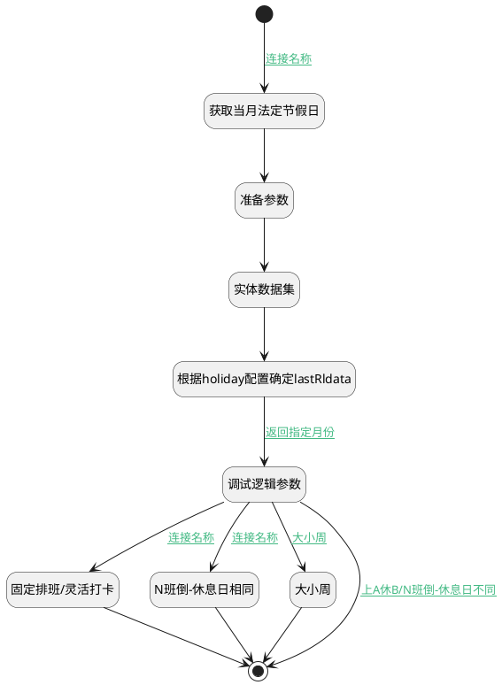

## 计算日历排班 <!-- {docsify-ignore-all} -->

   

### 处理过程




### 处理步骤说明

#### 开始 :id=Begin<sup class="footnote-symbol"> <font color=gray size=1>[开始]</font></sup>


*- N/A*
#### 获取当月法定节假日 :id=RAWSFCODE_07<sup class="footnote-symbol"> <font color=gray size=1>[直接后台代码]</font></sup>


<p class="panel-title"><b>执行代码[Groovy]</b></p>

```groovy
def _filter = logic.param('Filter').getReal()

def dateFormat = new java.text.SimpleDateFormat("yyyy-MM-dd")

def _default = logic.param('Default').getReal()
def rqStr = _default.get("rq")

def yearMonthStr = rqStr.substring(0, 7)
_default.set("rq", yearMonthStr)
def rqDateFormat = new java.text.SimpleDateFormat("yyyy-MM")
def rqDate = rqDateFormat.parse(yearMonthStr)

Calendar cal = Calendar.getInstance()
cal.setTime(rqDate)

// 设置当月第一天
cal.set(Calendar.DAY_OF_MONTH, 1)
Date startOfMonth = cal.getTime()

// 设置下个月第一天并回退一天得到当月最后一天
cal.add(Calendar.MONTH, 1)
cal.set(Calendar.DAY_OF_MONTH, 1)
cal.add(Calendar.DAY_OF_MONTH, -1)
Date endOfMonth = cal.getTime()

// 设置过滤条件（格式化为yyyy-MM-dd）
_default.set("N_DATE_FROM_LTANDEQ", dateFormat.format(endOfMonth))
_default.set("N_DATE_TO_GTANDEQ", dateFormat.format(startOfMonth))
_default.set("startOfMonth",startOfMonth)
```

#### 准备参数 :id=PREPAREPARAM_01<sup class="footnote-symbol"> <font color=gray size=1>[准备参数]</font></sup>


1. 将`Default(传入变量).N_DATE_FROM_LTANDEQ` 设置给  `Filter.N_DATE_FROM_LTANDEQ`
2. 将`Default(传入变量).N_DATE_TO_GTANDEQ` 设置给  `Filter.N_DATE_TO_GTANDEQ`
3. 将`1000` 设置给  `Filter.size`

#### 实体数据集 :id=DEDATASET_01<sup class="footnote-symbol"> <font color=gray size=1>[实体数据集]</font></sup>


调用实体 [休假详细信息(RESOURCE_CALENDAR_LEAVES)](module/resource/resource_calendar_leaves.md) 数据集合 [公共节假日(PUBLIC)](module/resource/resource_calendar_leaves#数据集合) ，查询参数为`Filter`

将执行结果返回给参数`leaves`

#### 根据holiday配置确定lastRldata :id=RAWSFCODE_05<sup class="footnote-symbol"> <font color=gray size=1>[直接后台代码]</font></sup>


<p class="panel-title"><b>执行代码[Groovy]</b></p>

```groovy
def curRldata = logic.param('leaves').getReal()
def lastRldata = logic.param('lastRldata').getReal()
def _default = logic.param('Default').getReal()
def holiday = _default.get("holiday")
def startOfMonth = _default.get("startOfMonth")

if(curRldata && holiday && startOfMonth){
    def sdf = new java.text.SimpleDateFormat("yyyy-MM-dd")
    
    curRldata.each{ i ->
        def holiday_type = i.get("holiday_type")?: ""
        
        if(holiday.contains(holiday_type)){
            def startDate = i.get("date_from")
            def endDate = i.get("date_to")

            if (startDate && endDate) {
                // 日期范围调整逻辑
                if(startOfMonth.after(startDate)){
                    startDate = startOfMonth
                }
                
                // 确保结束日期不小于开始日期
                if(endDate.before(startDate)) return

                // 使用Calendar进行日期遍历
                Calendar cal = Calendar.getInstance()
                cal.setTime(startDate)
                
                while (!cal.getTime().after(endDate)) {  
                    def restday = sys.entity('resource_calendar_leaves')
                    restday.set("date", sdf.format(cal.getTime()))
                    restday.set("iswork", 0)
                    restday.set("name", i.get("name"))
                    lastRldata.add(restday)
                    
                    cal.add(Calendar.DATE, 1) 
                }
            }
        }
    }
}
```

#### 调试逻辑参数 :id=DEBUGPARAM_02<sup class="footnote-symbol"> <font color=gray size=1>[调试逻辑参数]</font></sup>


> [!NOTE|label:调试信息|icon:fa fa-bug]
> 调试输出参数`lastRldata`的详细信息


#### 固定排班/灵活打卡 :id=RAWSFCODE_03<sup class="footnote-symbol"> <font color=gray size=1>[直接后台代码]</font></sup>


<p class="panel-title"><b>执行代码[Groovy]</b></p>

```groovy
//计算排班
def _default = logic.param('Default').getReal()
def schedule_type = _default.get("schedule_type")
def workdays = _default.get("workdays")
def shifts = _default.get("shifts")
def inversion_cycle = _default.get("inversion_cycle")
def inversion_count = _default.get("inversion_count")
def same_restday = _default.get("same_restday")
def inversion_days = _default.get("inversion_days")
def rest = _default.get("rest")
def work = _default.get("reworkst")
def biweekly_cycle = _default.get("biweekly_cycle")
def rq = _default.get("rq")

def lastRldata = logic.param('lastRldata').getReal()

// 解析传入月份并计算起止时间
def sdf = new java.text.SimpleDateFormat("yyyy-MM-dd")
def rqDateFormat = new java.text.SimpleDateFormat("yyyy-MM")
def rqDate = rqDateFormat.parse(rq)

Calendar cal = Calendar.getInstance()
cal.setTime(rqDate)

// 设置当月第一天
cal.set(Calendar.DAY_OF_MONTH, 1)
Date startOfMonth = cal.getTime()

// 设置下个月第一天并回退一天得到当月最后一天
cal.add(Calendar.MONTH, 1)
cal.set(Calendar.DAY_OF_MONTH, 1)
cal.add(Calendar.DAY_OF_MONTH, -1)
Date endOfMonth = cal.getTime()

def startCal = Calendar.getInstance()
startCal.setTime(startOfMonth)

def endCal = Calendar.getInstance()
endCal.setTime(endOfMonth)


// 判断是否工作日
def judgeWork = { Date checkinDate, List workdaysParam, List activeShiftsParam ->
        // 1. 确定当前日期是周几（1-7对应周一到周日）
        def calendarInner = Calendar.getInstance()
    calendarInner.setTime(checkinDate)
    int dayOfWeek = calendarInner.get(Calendar.DAY_OF_WEEK)
    int dayNumber = (dayOfWeek == Calendar.SUNDAY) ? 7 : dayOfWeek - 1
    // print "班次数据, ${activeShiftsParam}!"
    // print "工作日数据, ${workdaysParam}!"
    // print "日期数据, ${checkinDate}!"

    // 2. 查找匹配的工作日配置
    def workdayConfig = workdaysParam.find { it.day_number == dayNumber }

// 3. 未找到工作日配置时返回空班次
if (!workdayConfig || !workdayConfig.shift_id) {
    return 0
}

// 4. 查找对应的班次信息
def shift = activeShiftsParam.find { it.id == workdayConfig.shift_id }

// 5. 未找到班次时返回空班次
if (!shift) {
    return 0

}

return 1;
}

// 遍历日期区间
while (!startCal.after(endCal)) {
    def checkinDate = startCal.getTime()
    def day = lastRldata.find { it.date_to >= checkinDate && it.date_from <= checkinDate }

    if(day == null){
        def res = judgeWork(checkinDate, workdays, shifts)
        if(res==0){
            def restday = sys.entity('resource_calendar_leaves')
            restday.set("date",sdf.format(checkinDate))
            restday.set("iswork",0)
            lastRldata.add(restday)
        }
    }

    startCal.add(Calendar.DAY_OF_MONTH, 1)
}

```

#### N班倒-休息日相同 :id=RAWSFCODE_06<sup class="footnote-symbol"> <font color=gray size=1>[直接后台代码]</font></sup>


<p class="panel-title"><b>执行代码[Groovy]</b></p>

```groovy
def _default = logic.param('Default').getReal()
def schedule_type = _default.get("schedule_type")
def workdays = _default.get("workdays")
def shifts = _default.get("shifts")
def inversion_cycle = _default.get("inversion_cycle")
def inversion_count = _default.get("inversion_count")
def same_restday = _default.get("same_restday")
def inversion_days = _default.get("inversion_days")
def rest = _default.get("rest")
def work = _default.get("reworkst")
def biweekly_cycle = _default.get("biweekly_cycle")
def rq = _default.get("rq")

def lastRldata = logic.param('lastRldata').getReal()

// 解析传入月份并计算起止时间
def sdf = new java.text.SimpleDateFormat("yyyy-MM-dd")
def rqDateFormat = new java.text.SimpleDateFormat("yyyy-MM")
def rqDate = rqDateFormat.parse(rq)

Calendar cal = Calendar.getInstance()
cal.setTime(rqDate)

// 设置当月第一天
cal.set(Calendar.DAY_OF_MONTH, 1)
Date startOfMonth = cal.getTime()

// 设置下个月第一天并回退一天得到当月最后一天
cal.add(Calendar.MONTH, 1)
cal.set(Calendar.DAY_OF_MONTH, 1)
cal.add(Calendar.DAY_OF_MONTH, -1)
Date endOfMonth = cal.getTime()

def startCal = Calendar.getInstance()
startCal.setTime(startOfMonth)

def endCal = Calendar.getInstance()
endCal.setTime(endOfMonth)

// 计算周期天数（N班倒*7天）
int cycleDays = inversion_cycle * 7

// 预处理工作日数据：建立周期映射表（仅保留1~cycleDays的配置）
def validWorkdays = workdays.findAll { it.day_number <= cycleDays }
def cycleMap = [:]
validWorkdays.each { 
    cycleMap[it.day_number] = it 
}

// 计算当月第一天对应的周期基准日（最近的前序周一）
Calendar baseDateCal = Calendar.getInstance()
baseDateCal.setTime(startOfMonth)
// 计算需要回退的天数（1=周日,2=周一,...,7=周六）
int daysToSubtract = (baseDateCal.get(Calendar.DAY_OF_WEEK) - 2 + 7) % 7
if (daysToSubtract > 0) {
    baseDateCal.add(Calendar.DAY_OF_MONTH, -daysToSubtract)
}
Date baseDate = baseDateCal.getTime()

// 遍历当月每一天
while (!startCal.after(endCal)) {
    Date checkinDate = startCal.getTime()
    
    // 计算相对于基准日的天数偏移
    long offsetMillis = checkinDate.getTime() - baseDate.getTime()
    int offsetDays = (offsetMillis / (24 * 60 * 60 * 1000)) as int
    
    // 计算周期位置（1-based）
    int dayInCycle = (offsetDays % cycleDays) + 1

    // 查找工作配置
    def workdayConfig = cycleMap[dayInCycle]
    
    // 判断是否为休息日
    boolean isRestDay = (workdayConfig == null) || 
                       (workdayConfig.title == "休息")
    
    // 如果是休息日且未记录，则添加到结果集
    if (isRestDay) {
        def day = lastRldata.find { it.date_to >= checkinDate && it.date_from <= checkinDate }
        if (day == null) {
            def restday = sys.entity('resource_calendar_leaves')
            restday.set("date",sdf.format(checkinDate))
            restday.set("iswork",0)
            lastRldata.add(restday)
        }
    }
    
    startCal.add(Calendar.DAY_OF_MONTH, 1)
}
```

#### 大小周 :id=RAWSFCODE_04<sup class="footnote-symbol"> <font color=gray size=1>[直接后台代码]</font></sup>


<p class="panel-title"><b>执行代码[Groovy]</b></p>

```groovy
//计算排班
def _default = logic.param('Default').getReal()
def schedule_type = _default.get("schedule_type")
def workdays = _default.get("workdays")
def shifts = _default.get("shifts")
def inversion_cycle = _default.get("inversion_cycle")
def inversion_count = _default.get("inversion_count")
def same_restday = _default.get("same_restday")
def inversion_days = _default.get("inversion_days")
def rest = _default.get("rest")
def work = _default.get("reworkst")
def biweekly_cycle = _default.get("biweekly_cycle")
def rq = _default.get("rq")

def lastRldata = logic.param('lastRldata').getReal()


// 解析传入月份并计算起止时间
def sdf = new java.text.SimpleDateFormat("yyyy-MM-dd")
def rqDateFormat = new java.text.SimpleDateFormat("yyyy-MM")
def rqDate = rqDateFormat.parse(rq)

Calendar cal = Calendar.getInstance()
cal.setTime(rqDate)

// 设置当月第一天
cal.set(Calendar.DAY_OF_MONTH, 1)
Date startOfMonth = cal.getTime()

// 设置下个月第一天并回退一天得到当月最后一天
cal.add(Calendar.MONTH, 1)
cal.set(Calendar.DAY_OF_MONTH, 1)
cal.add(Calendar.DAY_OF_MONTH, -1)
Date endOfMonth = cal.getTime()

def startCal = Calendar.getInstance()
startCal.setTime(startOfMonth)


def endCal = Calendar.getInstance()
endCal.setTime(endOfMonth)

// 判断是否工作日
def judgeWork = { Date checkinDate, List workdaysParam, List activeShiftsParam ->
        // 1. 确定当前日期是周几（1-7对应周一到周日）
        def calendarInner = Calendar.getInstance()
    calendarInner.setTime(checkinDate)
    int dayOfWeek = calendarInner.get(Calendar.DAY_OF_WEEK)
    int dayNumber = (dayOfWeek == Calendar.SUNDAY) ? 7 : dayOfWeek - 1
    // print "所在周的第一天, ${startOfMonth}!"
    // print "日期数据, ${checkinDate}!"
    // 大/小周计算逻辑
    // 计算起始日期所在周的第一天（周一）
    def effectCal = Calendar.getInstance()
    effectCal.setTime(startOfMonth)
    effectCal.set(Calendar.DAY_OF_WEEK, Calendar.MONDAY)

    // 计算检查日期所在周的第一天（周一）
    def checkinCal = Calendar.getInstance()
    checkinCal.setTime(checkinDate)
    checkinCal.set(Calendar.DAY_OF_WEEK, Calendar.MONDAY)

    // 计算周数差（生效日期所在周为第1周）
    long diffMillis = checkinCal.getTimeInMillis() - effectCal.getTimeInMillis()
    int weekNumber = (int)(diffMillis / (7 * 24 * 60 * 60 * 1000)) + 1

    // 判断当前是大周还是小周
    boolean isBigWeek = false
    if (biweekly_cycle == "big_small") {
    isBigWeek = (weekNumber % 2 == 1)  // 奇数周为大周
} else if (biweekly_cycle == "small_big") {
    isBigWeek = (weekNumber % 2 == 0)  // 偶数周为大周
}

// 调整day_number（小周时+7）
int adjustedDayNumber = isBigWeek ? dayNumber : dayNumber + 7

// 2. 查找匹配的工作日配置（直接匹配调整后的day_number）
def workdayConfig = workdaysParam.find {
    it.day_number == adjustedDayNumber
}

// 3. 未找到工作日配置时返回空班次
if (!workdayConfig || !workdayConfig.shift_id) {
    // print "未找到工作日配置时返回空班次, ${workdayConfig}!"
    return 0
}

// 4. 查找对应的班次信息
def shift = activeShiftsParam.find { it.id == workdayConfig.shift_id }

// 5. 未找到班次时返回空班次
if (!shift) {
    // print "未找到班次时返回空班次, ${shift}!"
    return 0
}

// 6. 返回班次数据
// print "返回班次数据, ${shift}!"
return 1
}


// 遍历日期区间
while (!startCal.after(endCal)) {
    def checkinDate = startCal.getTime()
    def day = lastRldata.find { it.date_to >= checkinDate && it.date_from <= checkinDate }
    if (day == null) {
        def res = judgeWork(checkinDate, workdays, shifts)
        if(res==0){
            def restday = sys.entity('resource_calendar_leaves')
            restday.set("date",sdf.format(checkinDate))
            restday.set("iswork",0)
            lastRldata.add(restday)
        }
    }

    startCal.add(Calendar.DAY_OF_MONTH, 1)
}

```

#### 结束 :id=END_01<sup class="footnote-symbol"> <font color=gray size=1>[结束]</font></sup>


返回 `lastRldata`


### 连接条件说明
#### 连接名称 :id=Begin-RAWSFCODE_07

`Default(传入变量).rq` ISNOTNULL
#### 返回指定月份 :id=RAWSFCODE_05-DEBUGPARAM_02

`Default(传入变量).rq` ISNOTNULL
#### 上A休B/N班倒-休息日不同 :id=DEBUGPARAM_02-END_01

(`Default(传入变量).SCHEDULE_TYPE(班次类型)` EQ `work_rest` OR (`Default(传入变量).SCHEDULE_TYPE(班次类型)` EQ `class_inversion` OR `Default(传入变量).SAME_RESTDAY(是否休息日相同)` EQ `0`))
#### 大小周 :id=DEBUGPARAM_02-RAWSFCODE_04

`Default(传入变量).SCHEDULE_TYPE(班次类型)` EQ `alternate_week`
#### 连接名称 :id=DEBUGPARAM_02-RAWSFCODE_06

`Default(传入变量).SCHEDULE_TYPE(班次类型)` EQ `class_inversion` AND `Default(传入变量).SAME_RESTDAY(是否休息日相同)` EQ `1`
#### 连接名称 :id=DEBUGPARAM_02-RAWSFCODE_03

(`Default(传入变量).SCHEDULE_TYPE(班次类型)` EQ `fixed` OR `Default(传入变量).SCHEDULE_TYPE(班次类型)` EQ `flexible`)


### 实体逻辑参数

|    中文名   |    代码名    |  数据类型    |  实体   |备注 |
| --------| --------| -------- | -------- | --------   |
|传入变量(<i class="fa fa-check"/></i>)|Default|过滤器|||
|Filter|Filter|过滤器|||
|lastRldata|lastRldata|数据对象列表|[休假详细信息(RESOURCE_CALENDAR_LEAVES)](module/resource/resource_calendar_leaves.md)||
|leaves|leaves|数据对象列表|[休假详细信息(RESOURCE_CALENDAR_LEAVES)](module/resource/resource_calendar_leaves.md)||
