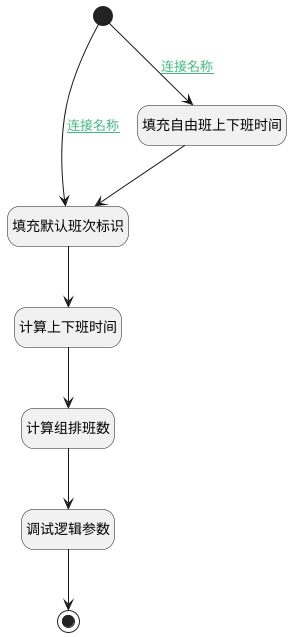

## 计算其他信息 <!-- {docsify-ignore-all} -->

   班次数量、自由班时间范围

### 处理过程




### 处理步骤说明

#### 计算上下班时间 :id=RAWSFCODE_01<sup class="footnote-symbol"> <font color=gray size=1>[直接后台代码]</font></sup>


<p class="panel-title"><b>执行代码[Groovy]</b></p>

```groovy
def _default = logic.param('Default').getReal()
def shifts  = _default.get("shifts")
def schedule_type = _default.get("schedule_type")
if (["alternate_week", "fixed", "flexible", "work_rest", "free"].contains(schedule_type) && shifts) {
    def shift = shifts.find { it.get("default_flag") == 1 }
    def scopes = shift.get("scopes")
    if (scopes) {
        def worktimeParts = []
        def timeFormat = new java.text.SimpleDateFormat("HH:mm")
        scopes.forEach { scope ->
            def next_tag = scope.get("next_tag")
            def start_base_time = scope.get("start_base_time")
            def end_base_time = scope.get("end_base_time")

            def formatTime = { time ->
                timeFormat.format(time instanceof Date ? time : new Date(time.time))
            }
            def start = formatTime(start_base_time)
            if (next_tag && next_tag in ["1,0", "1,1"]) {
                start = "次日" + start
            }

            def end = formatTime(end_base_time)
            if (next_tag && next_tag in ["0,1", "1,1"]) {
                end = "次日" + end
            }
            worktimeParts << "${start}-${end}"

        }

        _default.set("work_time", worktimeParts.join('/'))
    }
}

```

#### 开始 :id=Begin<sup class="footnote-symbol"> <font color=gray size=1>[开始]</font></sup>


*- N/A*
#### 填充默认班次标识 :id=RAWSFCODE_03<sup class="footnote-symbol"> <font color=gray size=1>[直接后台代码]</font></sup>


<p class="panel-title"><b>执行代码[Groovy]</b></p>

```groovy
def _default = logic.param('Default').getReal()
def shifts = _default.get("shifts")
if(shifts){
    def shift = shifts.find { it.default_flag == 1 }
    if(shift){
        _default.set("default_shift",shift.get("id"))
    }
}


```

#### 结束 :id=END_01<sup class="footnote-symbol"> <font color=gray size=1>[结束]</font></sup>


返回 `Default(传入变量)`

#### 填充自由班上下班时间 :id=RAWSFCODE_02<sup class="footnote-symbol"> <font color=gray size=1>[直接后台代码]</font></sup>


<p class="panel-title"><b>执行代码[JavaScript]</b></p>

```javascript
var _default = logic.getParam('Default');
var shifts = _default.get("shifts");
if(shifts!=null && shifts.size()>0){
    var shift = shifts.get(0);
    var scopes = shift.get("scopes")
    var scope = scopes.get(0);
    _default.set("free_start",scope.get("start_base_time"))
    _default.set("free_end",scope.get("end_base_time"))
}

```

#### 调试逻辑参数 :id=DEBUGPARAM_01<sup class="footnote-symbol"> <font color=gray size=1>[调试逻辑参数]</font></sup>


> [!NOTE|label:调试信息|icon:fa fa-bug]
> 调试输出参数`Default(传入变量)`的详细信息


#### 计算组排班数 :id=RAWSFCODE4<sup class="footnote-symbol"> <font color=gray size=1>[直接后台代码]</font></sup>


<p class="panel-title"><b>执行代码[Groovy]</b></p>

```groovy
def _default = logic.param('Default').getReal()
def schedule_type = _default.get('schedule_type')
def group_num = _default.get('group_num')
def group_shifts = _default.get('group_shifts')
if (group_num == null && (schedule_type == "class_inversion" || schedule_type == "work_rest") && group_shifts != null ) {
    _default.set("group_num",group_shifts.size())
}
```


### 连接条件说明
#### 连接名称 :id=Begin-RAWSFCODE_03

`Default(传入变量).SCHEDULE_TYPE(班次类型)` NOTEQ `free`
#### 连接名称 :id=Begin-RAWSFCODE_02

`Default(传入变量).SCHEDULE_TYPE(班次类型)` EQ `free`


### 实体逻辑参数

|    中文名   |    代码名    |  数据类型    |  实体   |备注 |
| --------| --------| -------- | -------- | --------   |
|传入变量(<i class="fa fa-check"/></i>)|Default|数据对象|[考勤规则(ATTENDANCE_RULE)](module/attendance/attendance_rule.md)||
|attendance_shift|attendance_shift|数据对象|[班次(ATTENDANCE_SHIFT)](module/attendance/attendance_shift.md)||
|shifts|shifts|数据对象列表|[班次(ATTENDANCE_SHIFT)](module/attendance/attendance_shift.md)||
