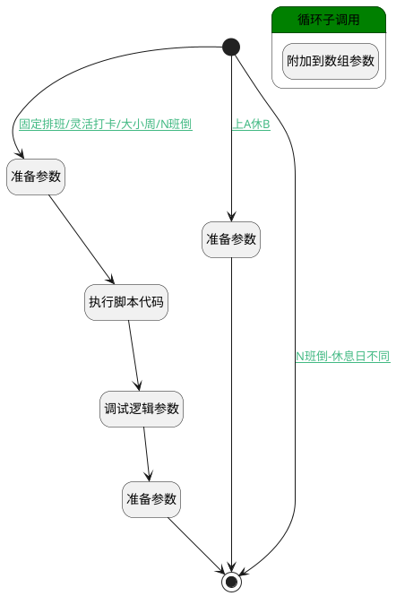

## 创建/更新时清理工作日 <!-- {docsify-ignore-all} -->

   

### 处理过程




### 处理步骤说明

#### 开始 :id=Begin<sup class="footnote-symbol"> <font color=gray size=1>[开始]</font></sup>


*- N/A*
#### 准备参数 :id=PREPAREPARAM_01<sup class="footnote-symbol"> <font color=gray size=1>[准备参数]</font></sup>


1. 将`Default(传入变量).workdays` 绑定给  `workdays`

#### 准备参数 :id=PREPAREPARAM_03<sup class="footnote-symbol"> <font color=gray size=1>[准备参数]</font></sup>


1. 将`空值（NULL）` 设置给  `Default(传入变量).workdays`

#### 执行脚本代码 :id=RAWSFCODE_01<sup class="footnote-symbol"> <font color=gray size=1>[直接后台代码]</font></sup>


<p class="panel-title"><b>执行代码[Groovy]</b></p>

```groovy
def _default = logic.param('Default').getReal()
def schedule_type = _default.schedule_type ;
//N班倒
if(schedule_type == "class_inversion"){
    _default.workday = "";
    def inversion_cycle = _default.inversion_cycle ;

    if(inversion_cycle== 1){
        _default.week2 = "" ;
        _default.week3 = "" ;
        _default.week4 = "" ;
    }
    if(inversion_cycle== 2){
        _default.week3 = "" ;
        _default.week4 = "" ;
    }
    if(inversion_cycle== 3){
        _default.week4 = "" ;
    }
}

//固定排班/灵活打卡
if(schedule_type == "flexible" || schedule_type == "fixed"){
    _default.week1 = "" ;
    _default.week2 = "" ;
    _default.week3 = "" ;
    _default.week4 = "" ;
}

//大小周
if(schedule_type == "alternate_week" ){
    _default.workday = "";
    _default.week3 = "" ;
    _default.week4 = "" ;
}

def workdays = logic.param('workdays').getReal()
def lastDays = logic.param('lastDays').getReal()

def selection = [_default.week1, _default.week2, _default.week3, _default.week4,_default.workday].join(',').split(',')

//遍历workdays
for(workday in workdays){
    if(selection.contains(workday.get("name"))){
        //附加到数组
        lastDays.add(workday)
    }
}
```

#### 调试逻辑参数 :id=DEBUGPARAM_01<sup class="footnote-symbol"> <font color=gray size=1>[调试逻辑参数]</font></sup>


> [!NOTE|label:调试信息|icon:fa fa-bug]
> 调试输出参数`Default(传入变量)`的详细信息


#### 准备参数 :id=PREPAREPARAM_02<sup class="footnote-symbol"> <font color=gray size=1>[准备参数]</font></sup>


1. 将`lastDays` 设置给  `Default(传入变量).workdays`

#### 结束 :id=END_01<sup class="footnote-symbol"> <font color=gray size=1>[结束]</font></sup>


返回 `Default(传入变量)`

#### 循环子调用 :id=LOOPSUBCALL_01<sup class="footnote-symbol"> <font color=gray size=1>[循环子调用]</font></sup>


循环参数`workdays`，子循环参数使用`temp`
#### 附加到数组参数 :id=APPENDPARAM_01<sup class="footnote-symbol"> <font color=gray size=1>[附加到数组参数]</font></sup>


将参数`temp` 添加到数组参数`lastDays`

### 连接条件说明
#### 上A休B :id=Begin-PREPAREPARAM_03

`Default(传入变量).SCHEDULE_TYPE(班次类型)` EQ `work_rest`
#### 固定排班/灵活打卡/大小周/N班倒 :id=Begin-PREPAREPARAM_01

(`Default(传入变量).SCHEDULE_TYPE(班次类型)` EQ `fixed` OR `Default(传入变量).SCHEDULE_TYPE(班次类型)` EQ `flexible` OR `Default(传入变量).SCHEDULE_TYPE(班次类型)` EQ `alternate_week` OR (`Default(传入变量).SCHEDULE_TYPE(班次类型)` EQ `class_inversion` AND `Default(传入变量).SAME_RESTDAY(是否休息日相同)` EQ `1`))
#### N班倒-休息日不同 :id=Begin-END_01

`Default(传入变量).SCHEDULE_TYPE(班次类型)` EQ `class_inversion` AND `Default(传入变量).SAME_RESTDAY(是否休息日相同)` EQ `0`


### 实体逻辑参数

|    中文名   |    代码名    |  数据类型    |  实体   |备注 |
| --------| --------| -------- | -------- | --------   |
|传入变量(<i class="fa fa-check"/></i>)|Default|数据对象|[考勤规则(ATTENDANCE_RULE)](module/attendance/attendance_rule.md)||
|lastDays|lastDays|数据对象列表|[工作日(ATTENDANCE_WORKDAY)](module/attendance/attendance_workday.md)||
|temp|temp|数据对象|[工作日(ATTENDANCE_WORKDAY)](module/attendance/attendance_workday.md)||
|workdays|workdays|数据对象列表|[工作日(ATTENDANCE_WORKDAY)](module/attendance/attendance_workday.md)||
