## 删除激活信息 <!-- {docsify-ignore-all} -->

   

### 处理过程

```plantuml
@startuml
hide empty description
<style>
root {
  HyperlinkColor #42b983
}
</style>

hide empty description
state "开始" as Begin <<start>> [[$./deleteOtherInfo#begin {"开始"}]]
state "实体行为" as DEACTION_01  [[$./deleteOtherInfo#deaction_01 {"实体行为"}]]


Begin --> DEACTION_01


@enduml
```

### 处理步骤说明

#### 实体行为 :id=DEACTION_01 [实体行为]

调用实体 [激活规则(ATTENDANCE_ACTIVATE_RULE)](module/attendance/attendance_activate_rule.md) 行为 [Remove](module/attendance/attendance_activate_rule#行为) ，行为参数为`Default(传入变量)`

#### 开始 :id=Begin [开始]

*- N/A*

### 实体逻辑参数

|    中文名   |    代码名    |  数据类型    |  实体   |备注 |
| --------| --------| -------- | -------- | --------   |
|传入变量(<i class="fa fa-check"/></i>)|Default|数据对象|[考勤规则(ATTENDANCE_RULE)](module/attendance/attendance_rule.md)||
