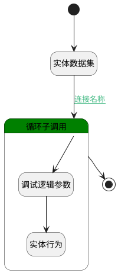

## 定时激活规则 <!-- {docsify-ignore-all} -->

   每日0点执行

### 处理过程

### 处理步骤说明

#### 调试逻辑参数 :id=DEBUGPARAM_01 [调试逻辑参数]

> [!NOTE|label:调试信息|icon:fa fa-bug]
> 调试输出参数`rule`的详细信息

#### 实体数据集 :id=DEDATASET_01 [实体数据集]

调用实体 [考勤规则(ATTENDANCE_RULE)](module/attendance/attendance_rule.md) 数据集合 [全部数据(needActivate)](module/attendance/attendance_rule#数据集合) ，查询参数为`Filter`

将执行结果返回给参数`rules(应激活规则)`

#### 循环子调用 :id=LOOPSUBCALL_01 [循环子调用]

循环参数`rules(应激活规则)`，子循环参数使用`rule`
#### 实体行为 :id=DEACTION_01 [实体行为]

调用实体 [考勤规则(ATTENDANCE_RULE)](module/attendance/attendance_rule.md) 行为 [Update](module/attendance/attendance_rule#行为) ，行为参数为`rule`

将执行结果返回给参数`rule`

#### 开始 :id=Begin [开始]

*- N/A*
#### 结束 :id=END_01 [结束]

*- N/A*

### 连接条件说明
#### 连接名称 :id=DEDATASET_01-LOOPSUBCALL_01

`rules(应激活规则).size` NOTEQ `0`

### 实体逻辑参数

|    中文名   |    代码名    |  数据类型    |  实体   |备注 |
| --------| --------| -------- | -------- | --------   |
|传入变量(<i class="fa fa-check"/></i>)|Default|数据对象|[考勤规则(ATTENDANCE_RULE)](module/attendance/attendance_rule.md)||
|Filter|Filter|过滤器|||
|rule|rule|数据对象|[考勤规则(ATTENDANCE_RULE)](module/attendance/attendance_rule.md)||
|应激活规则|rules|分页查询|||
