## 定时补充排班 <!-- {docsify-ignore-all} -->

   

### 处理过程

```plantuml
@startuml
hide empty description
<style>
root {
  HyperlinkColor #42b983
}
</style>

hide empty description
state "开始" as Begin <<start>> [[$./executeCompletion#begin {"开始"}]]
state "获取所有激活规则" as DEDATASET_04  [[$./executeCompletion#dedataset_04 {"获取所有激活规则"}]]
state "调试逻辑参数" as DEBUGPARAM_01  [[$./executeCompletion#debugparam_01 {"调试逻辑参数"}]]
state "设置时间" as RAWSFCODE_03  [[$./executeCompletion#rawsfcode_03 {"设置时间"}]]
state "为规则人员生成新排班" as RAWSFCODE_07  [[$./executeCompletion#rawsfcode_07 {"为规则人员生成新排班"}]]
state "结束" as END_02 <<end>> [[$./executeCompletion#end_02 {"结束"}]]
state "保存排班" as DEACTION_04  [[$./executeCompletion#deaction_04 {"保存排班"}]]
state "重置参数" as RESETPARAM_01  [[$./executeCompletion#resetparam_01 {"重置参数"}]]
state "循环子调用" as LOOPSUBCALL_05  [[$./executeCompletion#loopsubcall_05 {"循环子调用"}]] #green {
state "获取激活信息" as RAWSFCODE_017  [[$./executeCompletion#rawsfcode_017 {"获取激活信息"}]]
state "调试逻辑参数" as DEBUGPARAM_03  [[$./executeCompletion#debugparam_03 {"调试逻辑参数"}]]
state "准备参数" as PREPAREPARAM_02  [[$./executeCompletion#prepareparam_02 {"准备参数"}]]
state "准备参数" as PREPAREPARAM_06  [[$./executeCompletion#prepareparam_06 {"准备参数"}]]
state "删除当前规则旧排班" as RAWSQLCALL_01  [[$./executeCompletion#rawsqlcall_01 {"删除当前规则旧排班"}]]
state "免考勤" as RAWSFCODE_016  [[$./executeCompletion#rawsfcode_016 {"免考勤"}]]
state "获取当前规则激活班次" as DEDATASET_05  [[$./executeCompletion#dedataset_05 {"获取当前规则激活班次"}]]
state "设置日历参数" as RAWSFCODE_013  [[$./executeCompletion#rawsfcode_013 {"设置日历参数"}]]
state "获取节假日配置" as DEDATASET_03  [[$./executeCompletion#dedataset_03 {"获取节假日配置"}]]
state "固定排班/灵活打卡构造新排班" as RAWSFCODE_02  [[$./executeCompletion#rawsfcode_02 {"固定排班/灵活打卡构造新排班"}]]
state "手动排班构造新排班" as RAWSFCODE_06  [[$./executeCompletion#rawsfcode_06 {"手动排班构造新排班"}]]
state "自由班构造新排班" as RAWSFCODE_01  [[$./executeCompletion#rawsfcode_01 {"自由班构造新排班"}]]
state "大小周构造新排班" as RAWSFCODE_08  [[$./executeCompletion#rawsfcode_08 {"大小周构造新排班"}]]
state "判断节假日" as RAWSFCODE_015  [[$./executeCompletion#rawsfcode_015 {"判断节假日"}]]
state "准备参数" as PREPAREPARAM_04  [[$./executeCompletion#prepareparam_04 {"准备参数"}]]
state "获取所有人员" as DEDATASET_02  [[$./executeCompletion#dedataset_02 {"获取所有人员"}]]
state "人员转换" as RAWSFCODE_012  [[$./executeCompletion#rawsfcode_012 {"人员转换"}]]
}
state "循环子调用" as LOOPSUBCALL_03  [[$./executeCompletion#loopsubcall_03 {"循环子调用"}]] #green {
state "重新建立参数" as PREPAREPARAM_05  [[$./executeCompletion#prepareparam_05 {"重新建立参数"}]]
state "N班倒构造新排班" as RAWSFCODE_011  [[$./executeCompletion#rawsfcode_011 {"N班倒构造新排班"}]]
state "N班倒构造新排班" as RAWSFCODE_010  [[$./executeCompletion#rawsfcode_010 {"N班倒构造新排班"}]]
state "上A休B构造新排班" as RAWSFCODE_05  [[$./executeCompletion#rawsfcode_05 {"上A休B构造新排班"}]]
state "判断节假日" as RAWSFCODE_014  [[$./executeCompletion#rawsfcode_014 {"判断节假日"}]]
state "计算规则成员" as RAWSFCODE_04  [[$./executeCompletion#rawsfcode_04 {"计算规则成员"}]]
state "输出deptids" as DEBUGPARAM_02  [[$./executeCompletion#debugparam_02 {"输出deptids"}]]
state "查询当前生效规则成员" as RAWSQLCALL_05  [[$./executeCompletion#rawsqlcall_05 {"查询当前生效规则成员"}]]
}
state "遍历规则人员" as LOOPSUBCALL_04  [[$./executeCompletion#loopsubcall_04 {"遍历规则人员"}]] #green {
state "删除人员旧排班" as RAWSQLCALL_02  [[$./executeCompletion#rawsqlcall_02 {"删除人员旧排班"}]]
}
state "循环子调用" as LOOPSUBCALL_02  [[$./executeCompletion#loopsubcall_02 {"循环子调用"}]] #green {
state "准备参数" as PREPAREPARAM_01  [[$./executeCompletion#prepareparam_01 {"准备参数"}]]
state "查询部门下人员" as DEDATASET_01  [[$./executeCompletion#dedataset_01 {"查询部门下人员"}]]
state "过滤出不在其他生效规则内的人员" as RAWSFCODE_09  [[$./executeCompletion#rawsfcode_09 {"过滤出不在其他生效规则内的人员"}]]
state "将该部门在其他生效规则内移除" as RAWSQLCALL_04  [[$./executeCompletion#rawsqlcall_04 {"将该部门在其他生效规则内移除"}]]
}


Begin --> DEDATASET_04
DEDATASET_04 --> RAWSFCODE_03 : [[$./executeCompletion#dedataset_04-rawsfcode_03{连接名称} 连接名称]]
RAWSFCODE_03 --> DEBUGPARAM_01
DEBUGPARAM_01 --> LOOPSUBCALL_05
LOOPSUBCALL_05 --> RAWSFCODE_017 : [[$./executeCompletion#loopsubcall_05-rawsfcode_017{连接名称} 连接名称]]
RAWSFCODE_017 --> DEBUGPARAM_03
DEBUGPARAM_03 --> PREPAREPARAM_02
PREPAREPARAM_02 --> PREPAREPARAM_06 : [[$./executeCompletion#prepareparam_02-prepareparam_06{连接名称} 连接名称]]
PREPAREPARAM_06 --> RAWSQLCALL_01 : [[$./executeCompletion#prepareparam_06-rawsqlcall_01{免考勤} 免考勤]]
RAWSQLCALL_01 --> RAWSFCODE_016 : [[$./executeCompletion#rawsqlcall_01-rawsfcode_016{免考勤规则} 免考勤规则]]
RAWSFCODE_016 --> RAWSFCODE_04
RAWSFCODE_04 --> DEBUGPARAM_02
DEBUGPARAM_02 --> RAWSQLCALL_05 : [[$./executeCompletion#debugparam_02-rawsqlcall_05{连接名称} 连接名称]]
RAWSQLCALL_05 --> LOOPSUBCALL_02
LOOPSUBCALL_02 --> PREPAREPARAM_01
PREPAREPARAM_01 --> DEDATASET_01
DEDATASET_01 --> RAWSFCODE_09
RAWSFCODE_09 --> RAWSQLCALL_04
DEBUGPARAM_02 --> LOOPSUBCALL_04
LOOPSUBCALL_04 --> RAWSFCODE_07
RAWSFCODE_07 --> DEACTION_04
DEACTION_04 --> RESETPARAM_01
LOOPSUBCALL_04 --> RAWSQLCALL_02
PREPAREPARAM_06 --> DEDATASET_05
DEDATASET_05 --> RAWSFCODE_013 : [[$./executeCompletion#dedataset_05-rawsfcode_013{连接名称} 连接名称]]
RAWSFCODE_013 --> DEDATASET_03
DEDATASET_03 --> RAWSFCODE_02 : [[$./executeCompletion#dedataset_03-rawsfcode_02{固定排班/灵活打卡} 固定排班/灵活打卡]]
RAWSFCODE_02 --> RAWSFCODE_015
RAWSFCODE_015 --> PREPAREPARAM_04
PREPAREPARAM_04 --> RAWSFCODE_04 : [[$./executeCompletion#prepareparam_04-rawsfcode_04{非全公司} 非全公司]]
PREPAREPARAM_04 --> DEDATASET_02
DEDATASET_02 --> RAWSFCODE_012
RAWSFCODE_012 --> LOOPSUBCALL_04
DEDATASET_03 --> RAWSFCODE_06 : [[$./executeCompletion#dedataset_03-rawsfcode_06{手动排班} 手动排班]]
RAWSFCODE_06 --> RAWSFCODE_015
DEDATASET_03 --> RAWSFCODE_01 : [[$./executeCompletion#dedataset_03-rawsfcode_01{自由班} 自由班]]
RAWSFCODE_01 --> RAWSFCODE_015
DEDATASET_03 --> RAWSFCODE_08 : [[$./executeCompletion#dedataset_03-rawsfcode_08{连接名称} 连接名称]]
RAWSFCODE_08 --> RAWSFCODE_015
DEDATASET_03 --> LOOPSUBCALL_03 : [[$./executeCompletion#dedataset_03-loopsubcall_03{N班倒/上A休B} N班倒/上A休B]]
LOOPSUBCALL_03 --> PREPAREPARAM_05
PREPAREPARAM_05 --> RAWSFCODE_011 : [[$./executeCompletion#prepareparam_05-rawsfcode_011{休息日不同} 休息日不同]]
RAWSFCODE_011 --> RAWSFCODE_014
RAWSFCODE_014 --> RAWSFCODE_04
PREPAREPARAM_05 --> RAWSFCODE_010 : [[$./executeCompletion#prepareparam_05-rawsfcode_010{休息日相同} 休息日相同]]
RAWSFCODE_010 --> RAWSFCODE_014
PREPAREPARAM_05 --> RAWSFCODE_05 : [[$./executeCompletion#prepareparam_05-rawsfcode_05{连接名称} 连接名称]]
RAWSFCODE_05 --> RAWSFCODE_014
LOOPSUBCALL_05 --> END_02


@enduml
```




### 处理步骤说明

#### 获取所有激活规则 :id=DEDATASET_04<sup class="footnote-symbol"> <font color=gray size=1>[实体数据集]</font></sup>


调用实体 [激活规则(ATTENDANCE_ACTIVATE_RULE)](module/attendance/attendance_activate_rule.md) 数据集合 [DEFAULT](module/attendance/attendance_activate_rule#数据集合) ，查询参数为`activeFilter`

将执行结果返回给参数`waitRulePage`

#### 设置时间 :id=RAWSFCODE_03<sup class="footnote-symbol"> <font color=gray size=1>[直接后台代码]</font></sup>


<p class="panel-title"><b>执行代码[Groovy]</b></p>

```groovy
def _default = logic.param('Default').getReal()
def now = new Date()

// 获取下个月第一天
def calendar = Calendar.getInstance()
calendar.setTime(now)
calendar.add(Calendar.MONTH, 1)  
calendar.set(Calendar.DAY_OF_MONTH, 1)
calendar.set(Calendar.HOUR_OF_DAY, 0)
calendar.set(Calendar.MINUTE, 0)
calendar.set(Calendar.SECOND, 0)
calendar.set(Calendar.MILLISECOND, 0)

def nextMonthFirstDay = calendar.getTime()
def sdf = new java.text.SimpleDateFormat("yyyy-MM-dd")
 _default.set("fill_time",sdf.format(nextMonthFirstDay))

```

#### 调试逻辑参数 :id=DEBUGPARAM_01<sup class="footnote-symbol"> <font color=gray size=1>[调试逻辑参数]</font></sup>


> [!NOTE|label:调试信息|icon:fa fa-bug]
> 调试输出参数`Default(传入变量)`的详细信息


#### 开始 :id=Begin<sup class="footnote-symbol"> <font color=gray size=1>[开始]</font></sup>


*- N/A*
#### 循环子调用 :id=LOOPSUBCALL_05<sup class="footnote-symbol"> <font color=gray size=1>[循环子调用]</font></sup>


循环参数`waitRulePage`，子循环参数使用`activeRule(激活规则)`
#### 结束 :id=END_02<sup class="footnote-symbol"> <font color=gray size=1>[结束]</font></sup>


返回 `Default(传入变量)`

#### 获取激活信息 :id=RAWSFCODE_017<sup class="footnote-symbol"> <font color=gray size=1>[直接后台代码]</font></sup>


<p class="panel-title"><b>执行代码[Groovy]</b></p>

```groovy
def activeRule = logic.param('activeRule').getReal()
def rule_data = activeRule.get("rule_data")
def _default = logic.param('Default').getReal()

print "rule_data配置, ${rule_data}"


if (rule_data != null ) {
    Map<String, Object> ruleData = rule_data as Map<String, Object>;
    def workdays = ruleData.get("workdays")
    if (workdays) {
        _default.set("workdays",workdays)
    }
    _workdays = new ArrayList<>(workdays)

    
    def attendance_group_shifts = ruleData.get("attendance_group_shifts")
    if (attendance_group_shifts) {
        _default.set("attendance_group_shifts",attendance_group_shifts)
    }

    def effect_time = ruleData.get("effect_time")
    if(effect_time){
        _default.set("effect_time",effect_time)
    } 
       
    def rest = ruleData.get("rest")
    if(rest){
        _default.set("rest",rest)
    }
    def work = ruleData.get("work")
    if(work){
        _default.set("work",work)
    }  

    def inversion_cycle = ruleData.get("inversion_cycle")
    if(inversion_cycle){
        _default.set("inversion_cycle",inversion_cycle)
    }  
    
    def schedule_type = ruleData.get("schedule_type")
    if(schedule_type){
        _default.set("schedule_type",schedule_type)
    }
}
```

#### 调试逻辑参数 :id=DEBUGPARAM_03<sup class="footnote-symbol"> <font color=gray size=1>[调试逻辑参数]</font></sup>


> [!NOTE|label:调试信息|icon:fa fa-bug]
> 调试输出参数`Default(传入变量)`的详细信息


#### 准备参数 :id=PREPAREPARAM_02<sup class="footnote-symbol"> <font color=gray size=1>[准备参数]</font></sup>


1. 将`Default(传入变量).attendance_group_shifts` 绑定给  `attendance_group_shifts(组排班)`
2. 将`Default(传入变量).workdays` 绑定给  `workdays`

#### 准备参数 :id=PREPAREPARAM_06<sup class="footnote-symbol"> <font color=gray size=1>[准备参数]</font></sup>


1. 将`activeRule(激活规则).ID(主键)` 设置给  `shiftFilter.n_rule_id_eq`

#### 获取当前规则激活班次 :id=DEDATASET_05<sup class="footnote-symbol"> <font color=gray size=1>[实体数据集]</font></sup>


调用实体 [激活班次(ATTENDANCE_ACTIVATE_SHIFT)](module/attendance/attendance_activate_shift.md) 数据集合 [DEFAULT](module/attendance/attendance_activate_shift#数据集合) ，查询参数为`shiftFilter`

将执行结果返回给参数`activeShifts`

#### 删除当前规则旧排班 :id=RAWSQLCALL_01<sup class="footnote-symbol"> <font color=gray size=1>[直接SQL调用]</font></sup>


<p class="panel-title"><b>执行sql语句</b></p>

```sql
DELETE FROM attendance_schedule WHERE rule_id = ? AND checkin_date >= ?
```

<p class="panel-title"><b>执行sql参数</b></p>

1. `activeRule(激活规则).ID(主键)`
2. `Default(传入变量).EFFECT_TIME(生效时间)`


#### 设置日历参数 :id=RAWSFCODE_013<sup class="footnote-symbol"> <font color=gray size=1>[直接后台代码]</font></sup>


<p class="panel-title"><b>执行代码[Groovy]</b></p>

```groovy
def calendarFilter = logic.param('calendarFilter').getReal()
def _default = logic.param('Default').getReal()

_default.copyTo(calendarFilter)

```

#### 获取节假日配置 :id=DEDATASET_03<sup class="footnote-symbol"> <font color=gray size=1>[实体数据集]</font></sup>


调用实体 [考勤规则(ATTENDANCE_RULE)](module/attendance/attendance_rule.md) 数据集合 [日历排班(Calendar)](module/attendance/attendance_rule#数据集合) ，查询参数为`calendarFilter`

将执行结果返回给参数`calendarList`

#### 循环子调用 :id=LOOPSUBCALL_03<sup class="footnote-symbol"> <font color=gray size=1>[循环子调用]</font></sup>


循环参数`attendance_group_shifts(组排班)`，子循环参数使用`attendance_group_shift`
#### 重新建立参数 :id=PREPAREPARAM_05<sup class="footnote-symbol"> <font color=gray size=1>[准备参数]</font></sup>


1. 将`null` 重新建立为  `members`
2. 将`null` 重新建立为  `lastSchedules(新排班)`
3. 将`null` 重新建立为  `newSchedules`
4. 将`null` 重新建立为  `depts`

#### 大小周构造新排班 :id=RAWSFCODE_08<sup class="footnote-symbol"> <font color=gray size=1>[直接后台代码]</font></sup>


<p class="panel-title"><b>执行代码[Groovy]</b></p>

```groovy
//1、排班日期区间为五个月，即[ 前三个月 - 当前月 - 下个月]
//2、生成新排班时需要生成生效日期起到排班日期区间止的所有排班
def activeShifts  = logic.param('activeShifts').getReal()
def activeRule = logic.param('activeRule').getReal()
def newSchedules = logic.param('newSchedules').getReal()
def _default = logic.param('Default').getReal()
def effect_time = _default.get("effect_time")
def workdays =  logic.param('workdays').getReal()
//大小周
def biweekly_cycle = _default.get("biweekly_cycle")

// 获取当前日期
def now = new Date()
def calendar = Calendar.getInstance()
def sdf = new java.text.SimpleDateFormat("yyyy-MM-dd")
calendar.setTime(now)
 
// 跳转到下个月
calendar.add(Calendar.MONTH, 1)
// 设置为下个月最后一天
calendar.set(Calendar.DAY_OF_MONTH, calendar.getActualMaximum(Calendar.DAY_OF_MONTH))
    
// 排班结束日期
def endDate = sdf.format(calendar.getTime())

// 计算当天排班班次
def generateShiftData = { Date checkinDate, List workdaysParam, List activeShiftsParam ->
    // 1. 确定当前日期是周几（1-7对应周一到周日）
    def calendarInner = Calendar.getInstance()
    calendarInner.setTime(checkinDate)
    int dayOfWeek = calendarInner.get(Calendar.DAY_OF_WEEK)
    int dayNumber = (dayOfWeek == Calendar.SUNDAY) ? 7 : dayOfWeek - 1

    // 新增大/小周计算逻辑
    // 计算生效日期所在周的第一天（周一）
    def effectCal = Calendar.getInstance()
    effectCal.setTime(effect_time)
    effectCal.set(Calendar.DAY_OF_WEEK, Calendar.MONDAY)

    // 计算检查日期所在周的第一天（周一）
    def checkinCal = Calendar.getInstance()
    checkinCal.setTime(checkinDate)
    checkinCal.set(Calendar.DAY_OF_WEEK, Calendar.MONDAY)

    // 计算周数差（生效日期所在周为第1周）
    long diffMillis = checkinCal.getTimeInMillis() - effectCal.getTimeInMillis()
    int weekNumber = (int)(diffMillis / (7 * 24 * 60 * 60 * 1000)) + 1

    // 判断当前是大周还是小周
    boolean isBigWeek = false
    if (biweekly_cycle == "big_small") {
    isBigWeek = (weekNumber % 2 == 1)  // 奇数周为大周
} else if (biweekly_cycle == "small_big") {
    isBigWeek = (weekNumber % 2 == 0)  // 偶数周为大周
}

// 调整day_number（小周时+7）
int adjustedDayNumber = isBigWeek ? dayNumber : dayNumber + 7

// 2. 查找匹配的工作日配置（直接匹配调整后的day_number）
def workdayConfig = workdaysParam.find {
    it.day_number == adjustedDayNumber
}

// 3. 未找到工作日配置时返回空班次
if (!workdayConfig || !workdayConfig.shift_id) {
    return null
}

// 4. 查找对应的班次信息
def shift = activeShiftsParam.find { it.id == workdayConfig.shift_id }

// 5. 未找到班次时返回空班次
if (!shift || !shift.shift_data) {
    return null
}

// 6. 返回班次数据
return shift.shift_data
}

// 排班生成
def startCal = Calendar.getInstance()
startCal.setTime(effect_time)
    
// 解析结束日期
def endCal = Calendar.getInstance()
endCal.setTime(sdf.parse(endDate))

// 遍历日期区间
while (!startCal.after(endCal)) {
    def checkinDate = startCal.getTime()
    def shift_data = generateShiftData(checkinDate, workdays, activeShifts)
    def workTime = shift_data?.work_times ?: null

    def attendance_schedule = sys.entity('attendance_schedule')
    attendance_schedule.rule_data = activeRule.get("rule_data")
    attendance_schedule.rule_name = activeRule.get("name")
    attendance_schedule.rule_id = activeRule.get("id")
    attendance_schedule.checkin_date =  sdf.format(checkinDate)
    if(shift_data){
        shift_data.name = "白班"
    }
    attendance_schedule.shift_data = shift_data
    attendance_schedule.work_time = workTime
    attendance_schedule.workday = shift_data != null ? 1 : 0 
    // attendance_schedule.id = UUID.randomUUID().toString() 

    newSchedules.add(attendance_schedule)
    startCal.add(Calendar.DAY_OF_MONTH, 1)
}
```

#### 固定排班/灵活打卡构造新排班 :id=RAWSFCODE_02<sup class="footnote-symbol"> <font color=gray size=1>[直接后台代码]</font></sup>


<p class="panel-title"><b>执行代码[Groovy]</b></p>

```groovy
//1、排班日期区间为五个月，即[ 前三个月 - 当前月 - 下个月]
//2、生成新排班时需要生成生效日期起到排班日期区间止的所有排班
def activeShifts  = logic.param('activeShifts').getReal()
def activeRule = logic.param('activeRule').getReal()
def newSchedules = logic.param('newSchedules').getReal()
def _default = logic.param('Default').getReal()
def effect_time = _default.get("fill_time")
def workdays =  logic.param('workdays').getReal()

// 获取当前日期
def now = new Date()
def calendar = Calendar.getInstance()
def sdf = new java.text.SimpleDateFormat("yyyy-MM-dd")
calendar.setTime(now)
 
// 跳转到下个月
calendar.add(Calendar.MONTH, 1)
// 设置为下个月最后一天
calendar.set(Calendar.DAY_OF_MONTH, calendar.getActualMaximum(Calendar.DAY_OF_MONTH))
    
// 排班结束日期
def endDate = sdf.format(calendar.getTime())

// 计算当天排班班次
def generateShiftData = { Date checkinDate, List workdaysParam, List activeShiftsParam ->
    // 1. 确定当前日期是周几（1-7对应周一到周日）
    def calendarInner = Calendar.getInstance()
    calendarInner.setTime(checkinDate)
    int dayOfWeek = calendarInner.get(Calendar.DAY_OF_WEEK)
    int dayNumber = (dayOfWeek == Calendar.SUNDAY) ? 7 : dayOfWeek - 1

    // 2. 查找匹配的工作日配置
    def workdayConfig = workdaysParam.find { it.day_number == dayNumber }
    
    // 3. 未找到工作日配置时返回空班次
    if (!workdayConfig || !workdayConfig.shift_id) {
        // print "未找到工作日配置时返回空班次, ${workdayConfig}!"
        return null
    }

    // 4. 查找对应的班次信息
    def shift = activeShiftsParam.find { it.id == workdayConfig.shift_id }
    
    // 5. 未找到班次时返回空班次
    if (!shift || !shift.shift_data) {
        // print "未找到班次时返回空班次, ${shift}!"
        return null 
    }

    // 6. 返回班次数据
    // print "返回班次数据, ${shift}!"
    return shift.shift_data
}

// 排班生成
def startCal = Calendar.getInstance()
if (effect_time instanceof String) {
    startCal.setTime(sdf.parse(effect_time))
} else {
    startCal.setTime(effect_time)
}       
// 解析结束日期
def endCal = Calendar.getInstance()
endCal.setTime(sdf.parse(endDate))

// 遍历日期区间
while (!startCal.after(endCal)) {
    def checkinDate = startCal.getTime()
    def shift_data = generateShiftData(checkinDate, workdays, activeShifts)
    def workTime = shift_data?.work_times ?: null

    def attendance_schedule = sys.entity('attendance_schedule')
    attendance_schedule.rule_data = activeRule.get("rule_data")
    attendance_schedule.rule_name = activeRule.get("name")
    attendance_schedule.rule_id = activeRule.get("id")
    attendance_schedule.checkin_date =  sdf.format(checkinDate)
    attendance_schedule.shift_data = shift_data
    attendance_schedule.work_time = workTime
    attendance_schedule.workday = shift_data != null ? 1 : 0 
    // attendance_schedule.id = UUID.randomUUID().toString() 

    newSchedules.add(attendance_schedule)
    startCal.add(Calendar.DAY_OF_MONTH, 1)
}
```

#### 手动排班构造新排班 :id=RAWSFCODE_06<sup class="footnote-symbol"> <font color=gray size=1>[直接后台代码]</font></sup>


<p class="panel-title"><b>执行代码[Groovy]</b></p>

```groovy
//1、排班日期区间为五个月，即[ 前三个月 - 当前月 - 下个月]
//2、生成新排班时需要生成生效日期起到排班日期区间止的所有排班
def activeRule = logic.param('activeRule').getReal()
def newSchedules = logic.param('newSchedules').getReal()
def _default = logic.param('Default').getReal()
def effect_time = _default.get("fill_time")
def workdays =  logic.param('workdays').getReal()

// 获取当前日期
def now = new Date()
def calendar = Calendar.getInstance()
def sdf = new java.text.SimpleDateFormat("yyyy-MM-dd")
calendar.setTime(now)
 
// 跳转到下个月
calendar.add(Calendar.MONTH, 1)
// 设置为下个月最后一天
calendar.set(Calendar.DAY_OF_MONTH, calendar.getActualMaximum(Calendar.DAY_OF_MONTH))
    
// 排班结束日期
def endDate = sdf.format(calendar.getTime())

// 排班生成
def startCal = Calendar.getInstance()
if (effect_time instanceof String) {
    startCal.setTime(sdf.parse(effect_time))
} else {
    startCal.setTime(effect_time)
}       
// 解析结束日期
def endCal = Calendar.getInstance()
endCal.setTime(sdf.parse(endDate))

// 遍历日期区间
while (!startCal.after(endCal)) {
    def checkinDate = startCal.getTime()

    def attendance_schedule = sys.entity('attendance_schedule')
    attendance_schedule.rule_data = activeRule.get("rule_data")
    attendance_schedule.rule_name = activeRule.get("name")
    attendance_schedule.rule_id = activeRule.get("id")
    attendance_schedule.checkin_date =  sdf.format(checkinDate)
    // attendance_schedule.id = UUID.randomUUID().toString() 

    newSchedules.add(attendance_schedule)
    startCal.add(Calendar.DAY_OF_MONTH, 1)
}
```

#### 自由班构造新排班 :id=RAWSFCODE_01<sup class="footnote-symbol"> <font color=gray size=1>[直接后台代码]</font></sup>


<p class="panel-title"><b>执行代码[Groovy]</b></p>

```groovy
//1、排班日期区间为五个月，即[ 前三个月 - 当前月 - 下个月]
//2、生成新排班时需要生成生效日期起到排班日期区间止的所有排班
def activeShifts  = logic.param('activeShifts').getReal()
def activeRule = logic.param('activeRule').getReal()
def newSchedules = logic.param('newSchedules').getReal()
def _default = logic.param('Default').getReal()
def effect_time = _default.get("fill_time")

// 获取当前日期
def now = new Date()
def calendar = Calendar.getInstance()
def sdf = new java.text.SimpleDateFormat("yyyy-MM-dd")
calendar.setTime(now)
 
// 跳转到下个月
calendar.add(Calendar.MONTH, 1)
// 设置为下个月最后一天
calendar.set(Calendar.DAY_OF_MONTH, calendar.getActualMaximum(Calendar.DAY_OF_MONTH))
    
// 排班结束日期
def endDate = sdf.format(calendar.getTime())


// 排班生成
def startCal = Calendar.getInstance()
if (effect_time instanceof String) {
    startCal.setTime(sdf.parse(effect_time))
} else {
    startCal.setTime(effect_time)
}       
// 解析结束日期
def endCal = Calendar.getInstance()
endCal.setTime(sdf.parse(endDate))

// 遍历日期区间
while (!startCal.after(endCal)) {
    def checkinDate = startCal.getTime()
    def shift_data = activeShifts[0].shift_data
    def workTime = shift_data?.work_times ?: null

    def attendance_schedule = sys.entity('attendance_schedule')
    attendance_schedule.rule_data = activeRule.get("rule_data")
    attendance_schedule.rule_name = activeRule.get("name")
    attendance_schedule.rule_id = activeRule.get("id")
    attendance_schedule.checkin_date =  sdf.format(checkinDate)
    attendance_schedule.shift_data = shift_data
    attendance_schedule.work_time = workTime
    attendance_schedule.workday = shift_data != null ? 1 : 0 
    // attendance_schedule.id = UUID.randomUUID().toString() 

    newSchedules.add(attendance_schedule)
    startCal.add(Calendar.DAY_OF_MONTH, 1)
}
```

#### 免考勤 :id=RAWSFCODE_016<sup class="footnote-symbol"> <font color=gray size=1>[直接后台代码]</font></sup>


<p class="panel-title"><b>执行代码[Groovy]</b></p>

```groovy
//1、排班日期区间为五个月，即[ 前三个月 - 当前月 - 下个月]
//2、生成新排班时需要生成生效日期起到排班日期区间止的所有排班
def activeRule = logic.param('activeRule').getReal()
def newSchedules = logic.param('newSchedules').getReal()
def _default = logic.param('Default').getReal()
def effect_time = _default.get("fill_time")

// 获取当前日期
def now = new Date()
def calendar = Calendar.getInstance()
def sdf = new java.text.SimpleDateFormat("yyyy-MM-dd")
calendar.setTime(now)
 
// 跳转到下个月
calendar.add(Calendar.MONTH, 1)
// 设置为下个月最后一天
calendar.set(Calendar.DAY_OF_MONTH, calendar.getActualMaximum(Calendar.DAY_OF_MONTH))
    
// 排班结束日期
def endDate = sdf.format(calendar.getTime())


// 排班生成
def startCal = Calendar.getInstance()
if (effect_time instanceof String) {
    startCal.setTime(sdf.parse(effect_time))
} else {
    startCal.setTime(effect_time)
}   
// 解析结束日期
def endCal = Calendar.getInstance()
endCal.setTime(sdf.parse(endDate))

// 遍历日期区间
while (!startCal.after(endCal)) {
    def checkinDate = startCal.getTime()

    def attendance_schedule = sys.entity('attendance_schedule')
    attendance_schedule.rule_name = activeRule.get("name")
    attendance_schedule.rule_id = activeRule.get("id")
    attendance_schedule.checkin_date =  sdf.format(checkinDate)
    attendance_schedule.workday = 0

    newSchedules.add(attendance_schedule)
    startCal.add(Calendar.DAY_OF_MONTH, 1)
}
```

#### N班倒构造新排班 :id=RAWSFCODE_010<sup class="footnote-symbol"> <font color=gray size=1>[直接后台代码]</font></sup>


<p class="panel-title"><b>执行代码[Groovy]</b></p>

```groovy
//1、排班日期区间为五个月，即[ 前三个月 - 当前月 - 下个月]
//2、生成新排班时需要生成生效日期起到排班日期区间止的所有排班
def activeShifts  = logic.param('activeShifts').getReal()
def activeRule = logic.param('activeRule').getReal()
def newSchedules = logic.param('newSchedules').getReal()
def _default = logic.param('Default').getReal()
def effect_time = _default.get("effect_time")
def inversion_cycle = _default.get("inversion_cycle")

//获取workdays
def attendance_group_shift = logic.param('attendance_group_shift').getReal()
def workdays = attendance_group_shift.get("workdays")

// 获取当前日期
def now = new Date()
def calendar = Calendar.getInstance()
def sdf = new java.text.SimpleDateFormat("yyyy-MM-dd")
calendar.setTime(now)
 
// 跳转到下个月
calendar.add(Calendar.MONTH, 1)
// 设置为下个月最后一天
calendar.set(Calendar.DAY_OF_MONTH, calendar.getActualMaximum(Calendar.DAY_OF_MONTH))
    
// 排班结束日期
def endDate = sdf.format(calendar.getTime())


// 排班生成
def startCal = Calendar.getInstance()
startCal.setTime(effect_time)
    
// 解析结束日期
def endCal = Calendar.getInstance()
endCal.setTime(sdf.parse(endDate))

// 计算周期天数（N班倒*7天）
int cycleDays = inversion_cycle * 7

// 预处理工作日数据：建立周期映射表（仅保留1~cycleDays的配置）
def validWorkdays = workdays.findAll { it.day_number <= cycleDays }
def cycleMap = [:]
validWorkdays.each { 
    cycleMap[it.day_number] = it 
}

// 计算生效日期对应的周期基准日（最近的前序周一）
Calendar baseDateCal = Calendar.getInstance()
baseDateCal.setTime(effect_time)
// 计算需要回退的天数（1=周日,2=周一,...,7=周六）
int daysToSubtract = (baseDateCal.get(Calendar.DAY_OF_WEEK) - 2 + 7) % 7
if (daysToSubtract > 0) {
    baseDateCal.add(Calendar.DAY_OF_MONTH, -daysToSubtract)
}
Date baseDate = baseDateCal.getTime()

// 遍历当月每一天
while (!startCal.after(endCal)) {
    Date checkinDate = startCal.getTime()
    
    // 计算相对于基准日的天数偏移
    long offsetMillis = checkinDate.getTime() - baseDate.getTime()
    int offsetDays = (offsetMillis / (24 * 60 * 60 * 1000)) as int
    
    // 计算周期位置（1-based）
    int dayInCycle = (offsetDays % cycleDays) + 1
    
    // 查找工作配置
    def workdayConfig = cycleMap[dayInCycle]

    if(workdayConfig!=null){
          //查找对应的班次信息
        def shift = activeShifts.find { it.id == workdayConfig.shift_id }
        def shift_data =  shift?.shift_data?:null
        def workTime = shift_data?.work_times ?: null

        def attendance_schedule = sys.entity('attendance_schedule')
        attendance_schedule.rule_data = activeRule.get("rule_data")
        attendance_schedule.rule_name = activeRule.get("name")
        attendance_schedule.rule_id = activeRule.get("id")
        attendance_schedule.checkin_date =  sdf.format(checkinDate)
        attendance_schedule.shift_data = shift_data
        attendance_schedule.work_time = workTime
        attendance_schedule.workday = shift_data != null ? 1 : 0 
        newSchedules.add(attendance_schedule)

    }
    startCal.add(Calendar.DAY_OF_MONTH, 1)
}


```

#### N班倒构造新排班 :id=RAWSFCODE_011<sup class="footnote-symbol"> <font color=gray size=1>[直接后台代码]</font></sup>


<p class="panel-title"><b>执行代码[Groovy]</b></p>

```groovy
def activeShifts = logic.param('activeShifts').getReal()
def activeRule = logic.param('activeRule').getReal()
def newSchedules = logic.param('newSchedules').getReal()
def _default = logic.param('Default').getReal()
def effect_time = _default.get("effect_time")
def inversion_days = _default.get("inversion_days")

def attendance_group_shift = logic.param('attendance_group_shift').getReal()
def workdays = attendance_group_shift.get("workdays")

def sdf = new java.text.SimpleDateFormat("yyyy-MM-dd")
def endCal = Calendar.getInstance()
endCal.add(Calendar.MONTH, 1)
endCal.set(Calendar.DAY_OF_MONTH, endCal.getActualMaximum(Calendar.DAY_OF_MONTH))

def startCal = Calendar.getInstance()
startCal.setTime(effect_time)
startCal.set(Calendar.HOUR_OF_DAY, 0)
startCal.set(Calendar.MINUTE, 0)
startCal.set(Calendar.SECOND, 0)
startCal.set(Calendar.MILLISECOND, 0)

def cycleMap = [:]
workdays.eachWithIndex { workday, index ->
    if (index + 1 <= inversion_days) {
        cycleMap[(index + 1)] = workday
    }
}

Date baseDate = startCal.getTime()
while (!startCal.after(endCal)) {
    Date checkinDate = startCal.getTime()
    long offsetMillis = checkinDate.time - baseDate.time
    int offsetDays = (offsetMillis / (24 * 60 * 60 * 1000)) as int
    int dayInCycle = (offsetDays % inversion_days) + 1

    def workdayConfig = cycleMap[dayInCycle]
    if (workdayConfig) {
        def shift = activeShifts.find { it.id == workdayConfig.shift_id }
        def shiftData = shift?.shift_data ?: [:]
        def workTime = shiftData?.work_times ?: []

        def attendance_schedule = sys.entity('attendance_schedule')
        attendance_schedule.rule_data = activeRule.rule_data
        attendance_schedule.rule_name = activeRule.name
        attendance_schedule.rule_id = activeRule.id
        attendance_schedule.checkin_date = sdf.format(checkinDate)
        attendance_schedule.shift_data = shiftData
        attendance_schedule.work_time = workTime
        attendance_schedule.workday = shiftData ? 1 : 0
        newSchedules.add(attendance_schedule)
    }
    startCal.add(Calendar.DAY_OF_MONTH, 1)
}
```

#### 上A休B构造新排班 :id=RAWSFCODE_05<sup class="footnote-symbol"> <font color=gray size=1>[直接后台代码]</font></sup>


<p class="panel-title"><b>执行代码[Groovy]</b></p>

```groovy
def activeShifts = logic.param('activeShifts').getReal()
def activeRule = logic.param('activeRule').getReal()
def newSchedules = logic.param('newSchedules').getReal()
def _default = logic.param('Default').getReal()
def effect_time = _default.get("effect_time")
def fill_time = _default.get("fill_time")

def rest = _default.get("rest")
def work = _default.get("work")

def attendance_group_shift = logic.param('attendance_group_shift').getReal()
def workdays = attendance_group_shift.get("workdays")

def sdf = new java.text.SimpleDateFormat("yyyy-MM-dd")
def endCal = Calendar.getInstance()
endCal.add(Calendar.MONTH, 1)
endCal.set(Calendar.DAY_OF_MONTH, endCal.getActualMaximum(Calendar.DAY_OF_MONTH))

// 修改点1：以fill_time作为排班生成起点（零点时间）
def startCal = Calendar.getInstance()
if (fill_time instanceof String) {
    startCal.setTime(sdf.parse(fill_time))
} else {
    startCal.setTime(fill_time)
}
startCal.set(Calendar.HOUR_OF_DAY, 0)
startCal.set(Calendar.MINUTE, 0)
startCal.set(Calendar.SECOND, 0)
startCal.set(Calendar.MILLISECOND, 0)

// 保持effect_time作为周期计算基准

Date baseDate = effect_time
Calendar effectCal = Calendar.getInstance()
if (effect_time instanceof String) {
    effectCal.setTime(sdf.parse(effect_time))
} else {
    effectCal.setTime(effect_time)
}

// 计算fill_time相对于effect_time的初始偏移天数
long effectMillis = effectCal.getTimeInMillis()
long fillMillis = startCal.getTimeInMillis()
int initialOffsetDays = (fillMillis - effectMillis) / (24 * 60 * 60 * 1000)

// 构建天数循环映射（保持原逻辑）
def workdayNum = rest + work
def cycleMap = [:]
workdays.eachWithIndex { workday, index ->
    if (index + 1 <= workdayNum) {
        cycleMap[(index + 1)] = workday
    }
}

// 生成排班数据
while (!startCal.after(endCal)) {
    Date checkinDate = startCal.getTime()
    
    // 计算相对于effect_time的偏移天数（核心修改）
    long offsetMillis = checkinDate.time - effectMillis
    int offsetDays = (offsetMillis / (24 * 60 * 60 * 1000)) as int
    int dayInCycle = (offsetDays % workdayNum) + 1  // 周期位置计算

    def workdayConfig = cycleMap[dayInCycle]
    if (workdayConfig) {
        def shift = workdayConfig.get("is_work") == 1 ? activeShifts[0] : null
        def shiftData = shift?.shift_data ?: [:]
        def workTime = shiftData?.work_times ?: []

        def attendance_schedule = sys.entity('attendance_schedule')
        attendance_schedule.rule_data = activeRule.rule_data
        attendance_schedule.rule_name = activeRule.name
        attendance_schedule.rule_id = activeRule.id
        attendance_schedule.checkin_date = sdf.format(checkinDate)
        attendance_schedule.shift_data = shiftData
        attendance_schedule.work_time = workTime
        attendance_schedule.workday = shiftData ? 1 : 0
        newSchedules.add(attendance_schedule)
    }
    startCal.add(Calendar.DAY_OF_MONTH, 1)
}
```

#### 判断节假日 :id=RAWSFCODE_015<sup class="footnote-symbol"> <font color=gray size=1>[直接后台代码]</font></sup>


<p class="panel-title"><b>执行代码[Groovy]</b></p>

```groovy
def newSchedules = logic.param('newSchedules').getReal()
def holidays = logic.param('calendarList').getReal()
def sdf = new java.text.SimpleDateFormat("yyyy-MM-dd")

newSchedules.each { attendance_schedule ->
    def checkin_date = sdf.format(attendance_schedule.checkin_date)
    def holiday = holidays.find { sdf.format(it.rq) == checkin_date }
    if(holiday != null ){
        attendance_schedule.shift_data = null
        attendance_schedule.work_time = null
        attendance_schedule.workday = 0
    }
}

```

#### 准备参数 :id=PREPAREPARAM_04<sup class="footnote-symbol"> <font color=gray size=1>[准备参数]</font></sup>


1. 将`attendance_group_shifts(组排班).0` 绑定给  `attendance_group_shift`
2. 将`9999` 设置给  `empFilter.size`

#### 计算规则成员 :id=RAWSFCODE_04<sup class="footnote-symbol"> <font color=gray size=1>[直接后台代码]</font></sup>


<p class="panel-title"><b>执行代码[Groovy]</b></p>

```groovy
def attendance_group_shifts = logic.param('attendance_group_shifts').getReal()
def members = logic.param('members').getReal()
def depts = logic.param('depts').getReal()

def uniqueMemberIdMap = new HashMap()
def uniqueDeptIdMap = new HashMap()

def _default = logic.param('Default').getReal()
if(attendance_group_shifts!=null){
  attendance_group_shifts.each{ attendance_group_shift ->
    if (attendance_group_shift.members != null) {
      attendance_group_shift.members.each { member ->
      if(member.type == "person"){
        uniqueMemberIdMap.put(member.user_id, member) 
      }
      if(member.type == "dept"){
        uniqueDeptIdMap.put(member.user_id, member) 
      }
      }
    }
  }
}

members.addAll(uniqueMemberIdMap.values())
depts.addAll(uniqueDeptIdMap.values())


// def memberIds = uniqueMemberIdMap.keySet().collect { "'$it'" }.join(',')
// def deptIds = uniqueDeptIdMap.keySet().collect { "'$it'" }.join(',')

// _default.set("memberIds",memberIds)


```

#### 判断节假日 :id=RAWSFCODE_014<sup class="footnote-symbol"> <font color=gray size=1>[直接后台代码]</font></sup>


<p class="panel-title"><b>执行代码[Groovy]</b></p>

```groovy
def newSchedules = logic.param('newSchedules').getReal()
def holidays = logic.param('calendarList').getReal()
def sdf = new java.text.SimpleDateFormat("yyyy-MM-dd")

newSchedules.each { attendance_schedule ->
    def checkin_date = sdf.format(attendance_schedule.checkin_date)
    def holiday = holidays.find { sdf.format(it.rq) == checkin_date }
    println("判断节假日attendance_schedule"+attendance_schedule)
    println("判断节假日"+holiday)
    if(holiday != null ){
        attendance_schedule.shift_data = null
        attendance_schedule.work_time = null
        attendance_schedule.workday = 0
    }
}

```

#### 循环子调用 :id=LOOPSUBCALL_02<sup class="footnote-symbol"> <font color=gray size=1>[循环子调用]</font></sup>


循环参数`depts`，子循环参数使用`deptTemp`
#### 获取所有人员 :id=DEDATASET_02<sup class="footnote-symbol"> <font color=gray size=1>[实体数据集]</font></sup>


调用实体 [员工信息(EMPLOYEE)](module/employee_management/employee.md) 数据集合 [员工(user)](module/employee_management/employee#数据集合) ，查询参数为`empFilter`

将执行结果返回给参数`employees`

#### 输出deptids :id=DEBUGPARAM_02<sup class="footnote-symbol"> <font color=gray size=1>[调试逻辑参数]</font></sup>


> [!NOTE|label:调试信息|icon:fa fa-bug]
> 调试输出参数`depts`的详细信息


#### 查询当前生效规则成员 :id=RAWSQLCALL_05<sup class="footnote-symbol"> <font color=gray size=1>[直接SQL调用]</font></sup>


<p class="panel-title"><b>执行sql语句</b></p>

```sql
select * FROM attendance_group_shift_member WHERE  rule_id != ?
 AND EXISTS (
    SELECT 1 
    FROM attendance_rule rule  
    WHERE 
      rule.id = attendance_group_shift_member.rule_id 
      AND rule.IS_ACTIVATE  = 1
  )
```

<p class="panel-title"><b>执行sql参数</b></p>

1. `Default(传入变量).ID(主键)`

将执行sql结果赋值给参数`curActiveMember(curActiveMember)`

#### 准备参数 :id=PREPAREPARAM_01<sup class="footnote-symbol"> <font color=gray size=1>[准备参数]</font></sup>


1. 将`deptTemp.USER_ID(标识)` 设置给  `empFilter.N_DEPT_ID_EQ`
2. 将`null` 重新建立为  `employees`

#### 查询部门下人员 :id=DEDATASET_01<sup class="footnote-symbol"> <font color=gray size=1>[实体数据集]</font></sup>


调用实体 [员工信息(EMPLOYEE)](module/employee_management/employee.md) 数据集合 [员工(user)](module/employee_management/employee#数据集合) ，查询参数为`empFilter`

将执行结果返回给参数`employees`

#### 人员转换 :id=RAWSFCODE_012<sup class="footnote-symbol"> <font color=gray size=1>[直接后台代码]</font></sup>


<p class="panel-title"><b>执行代码[Groovy]</b></p>

```groovy
def employees = logic.param('employees').getReal()
def members = logic.param('members').getReal()


def uniqueMemberIdMap = new HashMap()

employees.each { emp ->
    def member = sys.entity('Attendance_group_shift_member')
    member.set("user_id",emp.id)
    member.set("name",emp.name)
    uniqueMemberIdMap.put(member.user_id, member)
}

members.clear()
members.addAll(uniqueMemberIdMap.values())

```

#### 遍历规则人员 :id=LOOPSUBCALL_04<sup class="footnote-symbol"> <font color=gray size=1>[循环子调用]</font></sup>


循环参数`members`，子循环参数使用`memberTemp`
#### 过滤出不在其他生效规则内的人员 :id=RAWSFCODE_09<sup class="footnote-symbol"> <font color=gray size=1>[直接后台代码]</font></sup>


<p class="panel-title"><b>执行代码[Groovy]</b></p>

```groovy
def employees = logic.param('employees').getReal()
def allDeptEmp = logic.param('allDeptEmp').getReal()
def curActiveMember = logic.param('curActiveMember').getReal()
def members = logic.param('members').getReal()

allDeptEmp.addAll(employees)

def uniqueMemberIdMap = new HashMap()
// 先将原始 members 放入Map
members.each { member ->
    uniqueMemberIdMap.put(member.user_id, member)
}

allDeptEmp.each { emp ->
    def isAlreadyActive = curActiveMember.find { it.user_id == emp.id }
    if (isAlreadyActive) {
        return
    }

    def member = sys.entity('Attendance_group_shift_member')
    member.set("user_id",emp.id)
    member.set("name",emp.name)
    uniqueMemberIdMap.put(member.user_id, member)
}

members.clear()
members.addAll(uniqueMemberIdMap.values())

```

#### 删除人员旧排班 :id=RAWSQLCALL_02<sup class="footnote-symbol"> <font color=gray size=1>[直接SQL调用]</font></sup>


<p class="panel-title"><b>执行sql语句</b></p>

```sql
DELETE FROM attendance_schedule WHERE  checkin_date >= ? AND member_id = ?
```

<p class="panel-title"><b>执行sql参数</b></p>

1. `Default(传入变量).fill_time`
2. `memberTemp.USER_ID(标识)`

重置参数`members(members)`，并将执行sql结果赋值给参数`members(members)`

#### 为规则人员生成新排班 :id=RAWSFCODE_07<sup class="footnote-symbol"> <font color=gray size=1>[直接后台代码]</font></sup>


<p class="panel-title"><b>执行代码[Groovy]</b></p>

```groovy
def members = logic.param('members').getReal()
def lastSchedules = logic.param('lastSchedules').getReal()
def newSchedules = logic.param('newSchedules').getReal()

members.each { member ->
    if (member == null) return
    newSchedules.each { attendance_schedule ->
        def newSchedule = sys.entity('attendance_schedule')
        attendance_schedule.copyTo(newSchedule)
        newSchedule.member_id = member.user_id
        newSchedule.member_name = member.name
        lastSchedules.add(newSchedule)
    }
}
```

#### 将该部门在其他生效规则内移除 :id=RAWSQLCALL_04<sup class="footnote-symbol"> <font color=gray size=1>[直接SQL调用]</font></sup>


<p class="panel-title"><b>执行sql语句</b></p>

```sql
DELETE FROM attendance_group_shift_member WHERE  user_id = ? and  rule_id != ?
 AND EXISTS (
    SELECT 1 
    FROM attendance_rule rule  
    WHERE 
      rule.id = attendance_group_shift_member.rule_id 
      AND rule.IS_ACTIVATE  = 1
  )
```

<p class="panel-title"><b>执行sql参数</b></p>

1. `deptTemp.USER_ID(标识)`
2. `Default(传入变量).ID(主键)`


#### 保存排班 :id=DEACTION_04<sup class="footnote-symbol"> <font color=gray size=1>[实体行为]</font></sup>


调用实体 [排班(ATTENDANCE_SCHEDULE)](module/attendance/attendance_schedule.md) 行为 [Create](module/attendance/attendance_schedule#行为) ，行为参数为`lastSchedules(新排班)`

#### 重置参数 :id=RESETPARAM_01<sup class="footnote-symbol"> <font color=gray size=1>[重置参数]</font></sup>


重置参数```attendance_group_shift(attendance_group_shift)```

### 连接条件说明
#### 连接名称 :id=DEDATASET_04-RAWSFCODE_03

`waitRulePage(waitRulePage).size` NOTEQ `0`
#### 连接名称 :id=LOOPSUBCALL_05-RAWSFCODE_017

`activeRule(激活规则).ID(主键)` EQ `00d0d586d1da1fa3151946037a982682`
#### 连接名称 :id=PREPAREPARAM_02-PREPAREPARAM_06

`attendance_group_shifts(组排班).size` NOTEQ `0`
#### 免考勤 :id=PREPAREPARAM_06-RAWSQLCALL_01

`Default(传入变量).SCHEDULE_TYPE(班次类型)` EQ `no_required`
#### 免考勤规则 :id=RAWSQLCALL_01-RAWSFCODE_016

`Default(传入变量).SCHEDULE_TYPE(班次类型)` EQ `no_required`
#### 连接名称 :id=DEBUGPARAM_02-RAWSQLCALL_05

`depts(depts).size` NOTEQ `0`
#### 连接名称 :id=DEDATASET_05-RAWSFCODE_013

`activeShifts(activeShifts).size` NOTEQ `0`
#### 固定排班/灵活打卡 :id=DEDATASET_03-RAWSFCODE_02

(`Default(传入变量).SCHEDULE_TYPE(班次类型)` EQ `fixed` OR `Default(传入变量).SCHEDULE_TYPE(班次类型)` EQ `flexible`)
#### 非全公司 :id=PREPAREPARAM_04-RAWSFCODE_04

`attendance_group_shift(attendance_group_shift).ALL_COMPANY(考勤人员类型)` EQ `false`
#### 手动排班 :id=DEDATASET_03-RAWSFCODE_06

`Default(传入变量).SCHEDULE_TYPE(班次类型)` EQ `manual`
#### 自由班 :id=DEDATASET_03-RAWSFCODE_01

`Default(传入变量).SCHEDULE_TYPE(班次类型)` EQ `free`
#### 连接名称 :id=DEDATASET_03-RAWSFCODE_08

`Default(传入变量).SCHEDULE_TYPE(班次类型)` EQ `alternate_week`
#### N班倒/上A休B :id=DEDATASET_03-LOOPSUBCALL_03

(`Default(传入变量).SCHEDULE_TYPE(班次类型)` EQ `class_inversion` OR `Default(传入变量).SCHEDULE_TYPE(班次类型)` EQ `work_rest`)
#### 休息日不同 :id=PREPAREPARAM_05-RAWSFCODE_011

`Default(传入变量).SCHEDULE_TYPE(班次类型)` EQ `class_inversion` AND `Default(传入变量).SAME_RESTDAY(是否休息日相同)` EQ `0` AND `attendance_group_shift(attendance_group_shift).WORKDAYS(工作日)` ISNOTNULL
#### 休息日相同 :id=PREPAREPARAM_05-RAWSFCODE_010

`Default(传入变量).SCHEDULE_TYPE(班次类型)` EQ `class_inversion` AND `attendance_group_shift(attendance_group_shift).WORKDAYS(工作日)` ISNOTNULL AND `Default(传入变量).SAME_RESTDAY(是否休息日相同)` EQ `1`
#### 连接名称 :id=PREPAREPARAM_05-RAWSFCODE_05

`Default(传入变量).SCHEDULE_TYPE(班次类型)` EQ `work_rest` AND `attendance_group_shift(attendance_group_shift).WORKDAYS(工作日)` ISNOTNULL


### 实体逻辑参数

|    中文名   |    代码名    |  数据类型    |  实体   |备注 |
| --------| --------| -------- | -------- | --------   |
|传入变量(<i class="fa fa-check"/></i>)|Default|数据对象|[考勤规则(ATTENDANCE_RULE)](module/attendance/attendance_rule.md)||
|当前规则下的排班|CurRuleSchedules|分页查询|||
|activeFilter|activeFilter|过滤器|||
|激活规则|activeRule|数据对象|[激活规则(ATTENDANCE_ACTIVATE_RULE)](module/attendance/attendance_activate_rule.md)||
|activeShift|activeShift|数据对象|[激活班次(ATTENDANCE_ACTIVATE_SHIFT)](module/attendance/attendance_activate_shift.md)||
|activeShifts|activeShifts|数据对象列表|[激活班次(ATTENDANCE_ACTIVATE_SHIFT)](module/attendance/attendance_activate_shift.md)||
|allDeptEmp|allDeptEmp|数据对象列表|[考勤规则成员(ATTENDANCE_GROUP_SHIFT_MEMBER)](module/attendance/attendance_group_shift_member.md)||
|allmembers|allmembers|数据对象列表|[考勤规则成员(ATTENDANCE_GROUP_SHIFT_MEMBER)](module/attendance/attendance_group_shift_member.md)||
|attendance_group_shift|attendance_group_shift|数据对象|[组排班(ATTENDANCE_GROUP_SHIFT)](module/attendance/attendance_group_shift.md)||
|组排班|attendance_group_shifts|数据对象列表|||
|attendance_scheduleFilter|attendance_scheduleFilter|过滤器|||
|attendance_scheduleTemp|attendance_scheduleTemp|数据对象|[排班(ATTENDANCE_SCHEDULE)](module/attendance/attendance_schedule.md)||
|attendance_scheduleTemps|attendance_scheduleTemps|数据对象列表|[排班(ATTENDANCE_SCHEDULE)](module/attendance/attendance_schedule.md)||
|calendarFilter|calendarFilter|过滤器|||
|calendarList|calendarList|数据对象列表|||
|curActiveMember|curActiveMember|数据对象列表|[考勤规则成员(ATTENDANCE_GROUP_SHIFT_MEMBER)](module/attendance/attendance_group_shift_member.md)||
|deptTemp|deptTemp|数据对象|[考勤规则成员(ATTENDANCE_GROUP_SHIFT_MEMBER)](module/attendance/attendance_group_shift_member.md)||
|depts|depts|数据对象列表|[考勤规则成员(ATTENDANCE_GROUP_SHIFT_MEMBER)](module/attendance/attendance_group_shift_member.md)||
|empFilter|empFilter|过滤器|||
|employees|employees|分页查询|||
|新排班|lastSchedules|数据对象列表|[排班(ATTENDANCE_SCHEDULE)](module/attendance/attendance_schedule.md)||
|memberTemp|memberTemp|数据对象|[考勤规则成员(ATTENDANCE_GROUP_SHIFT_MEMBER)](module/attendance/attendance_group_shift_member.md)||
|members|members|数据对象列表|[考勤规则成员(ATTENDANCE_GROUP_SHIFT_MEMBER)](module/attendance/attendance_group_shift_member.md)||
|newSchedules|newSchedules|数据对象列表|[排班(ATTENDANCE_SCHEDULE)](module/attendance/attendance_schedule.md)||
|shiftFilter|shiftFilter|过滤器|||
|shifts|shifts|数据对象列表|[班次(ATTENDANCE_SHIFT)](module/attendance/attendance_shift.md)||
|srfactionparam|srfactionparam|数据对象列表|||
|temp|temp|数据对象|||
|waitRulePage|waitRulePage|分页查询|||
|workdays|workdays|数据对象列表|||
