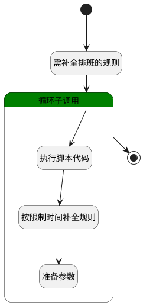

## 定时补充排班3 <!-- {docsify-ignore-all} -->

   为已激活规则补全排班，每月1日执行，生成下个月排班

### 处理过程




### 处理步骤说明

#### 开始 :id=Begin<sup class="footnote-symbol"> <font color=gray size=1>[开始]</font></sup>


*- N/A*
#### 需补全排班的规则 :id=RAWSQLCALL1<sup class="footnote-symbol"> <font color=gray size=1>[直接SQL调用]</font></sup>


<p class="panel-title"><b>执行sql语句</b></p>

```sql
SELECT 
   *
FROM 
    attendance_activate_rule r
WHERE 
    EXISTS (
        SELECT 
            1
        FROM 
            attendance_group_shift_member gsm
        WHERE 
            gsm.rule_id = r.id
    )
```


将执行sql结果赋值给参数`rules(rules)`

#### 循环子调用 :id=LOOPSUBCALL_01<sup class="footnote-symbol"> <font color=gray size=1>[循环子调用]</font></sup>


循环参数`rules`，子循环参数使用`temp`
#### 执行脚本代码 :id=RAWSFCODE2<sup class="footnote-symbol"> <font color=gray size=1>[直接后台代码]</font></sup>


<p class="panel-title"><b>执行代码[Groovy]</b></p>

```groovy
def temp = logic.param('temp').getReal()
def rule = logic.param('rule').getReal()

def rule_data = temp.get("rule_data").any()
if (rule_data){

    def rule_runtime = sys.dataentity('attendance_rule')
    rule_runtime.createEntity(rule_data).copyTo(rule)
    // 获取下个月第一天
    def calendar = Calendar.getInstance()
    calendar.time = new Date()
    calendar.add(Calendar.MONTH, 1)
    calendar.set(Calendar.DAY_OF_MONTH, 1)
    calendar.set(Calendar.HOUR_OF_DAY, 0)
    calendar.set(Calendar.MINUTE, 0)
    calendar.set(Calendar.SECOND, 0)
    calendar.set(Calendar.MILLISECOND, 0)
    rule.set("limitTime", calendar.getTime())
    //转换scope
    def shifts = temp.get("rule_data").any().get("shifts")
    if(shifts){
        def _shifts = logic.param('shifts').getReal()
        shifts.forEach { shift ->
            def newShift = sys.entity('shift')
            shift.copyTo(newShift)
            _shifts.add(newShift)
        }
        rule.set("shifts",_shifts)
    }
}
```

#### 按限制时间补全规则 :id=DELOGIC_01<sup class="footnote-symbol"> <font color=gray size=1>[实体逻辑]</font></sup>


调用实体 [考勤规则(ATTENDANCE_RULE)](module/attendance/attendance_rule.md) 处理逻辑 [激活规则]((module/attendance/attendance_rule/logic/activeRule.md)) ，行为参数为`rule(rule)`

#### 结束 :id=END_01<sup class="footnote-symbol"> <font color=gray size=1>[结束]</font></sup>


*- N/A*

#### 准备参数 :id=PREPAREPARAM1<sup class="footnote-symbol"> <font color=gray size=1>[准备参数]</font></sup>


1. 将` ==> shifts` 重新建立为  `shifts`
2. 将` ==> rule` 重新建立为  `rule`


### 实体逻辑参数

|    中文名   |    代码名    |  数据类型    |  实体   |备注 |
| --------| --------| -------- | -------- | --------   |
|传入变量(<i class="fa fa-check"/></i>)|Default|数据对象|[考勤规则(ATTENDANCE_RULE)](module/attendance/attendance_rule.md)||
|rule|rule|数据对象|[考勤规则(ATTENDANCE_RULE)](module/attendance/attendance_rule.md)||
|ruleFilter|ruleFilter|过滤器|||
|rules|rules|数据对象列表|[激活规则(ATTENDANCE_ACTIVATE_RULE)](module/attendance/attendance_activate_rule.md)||
|shifts|shifts|数据对象列表|[班次(ATTENDANCE_SHIFT)](module/attendance/attendance_shift.md)||
|temp|temp|数据对象|[激活规则(ATTENDANCE_ACTIVATE_RULE)](module/attendance/attendance_activate_rule.md)||
