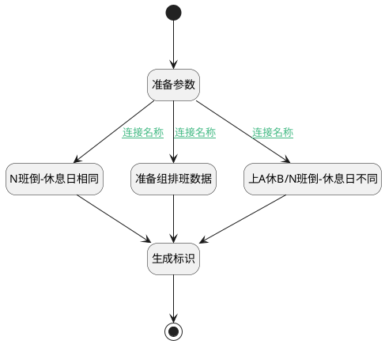

## 填充组排班 <!-- {docsify-ignore-all} -->

   

### 处理过程




### 处理步骤说明

#### 开始 :id=Begin<sup class="footnote-symbol"> <font color=gray size=1>[开始]</font></sup>


*- N/A*
#### 准备参数 :id=PREPAREPARAM_02<sup class="footnote-symbol"> <font color=gray size=1>[准备参数]</font></sup>


1. 将`groupShifts` 设置给  `Default(传入变量).group_shifts`

#### N班倒-休息日相同 :id=RAWSFCODE_04<sup class="footnote-symbol"> <font color=gray size=1>[直接后台代码]</font></sup>


<p class="panel-title"><b>执行代码[Groovy]</b></p>

```groovy
def _default = logic.param('Default').getReal()

def groupShifts = _default.get("group_shifts")

def group_num = _default.group_num ?: 2

def inversion_cycle = _default.get("inversion_cycle")
def workdays = _default.get("workdays")

def week1 = _default.get("week1")?:""
def week2 = _default.get("week2")?:""
def week3 = _default.get("week3")?:""
def week4 = _default.get("week4")?:""

// 将week字符串转换为数字集合
def getWeekSet = { weekStr ->
    weekStr?.tokenize(',')*.toInteger() as Set
}

def weekSet1 = getWeekSet(week1)
def weekSet2 = getWeekSet(week2)
def weekSet3 = getWeekSet(week3)
def weekSet4 = getWeekSet(week4)

// 根据 inversion_cycle 计算阈值并筛选工作日
def filteredWorkdays = []
Set<Integer> selectionSet = []
switch (inversion_cycle) {
    case 1:
        selectionSet.addAll(weekSet1)
        filteredWorkdays = workdays.findAll { it.day_number < 8 }
        break
    case 2:
        selectionSet.addAll(weekSet1 + weekSet2)
        filteredWorkdays = workdays.findAll { it.day_number < 15 }
        break
    case 3:
        selectionSet.addAll(weekSet1 + weekSet2 + weekSet3)
        filteredWorkdays = workdays.findAll { it.day_number < 22 }

        break
    case 4:
        selectionSet.addAll(weekSet1 + weekSet2 + weekSet3 + weekSet4)
        filteredWorkdays = workdays 
        break
}
filteredWorkdays = filteredWorkdays.sort { a, b -> a.day_number <=> b.day_number }

final WEEK_DAYS = ['周一', '周二', '周三', '周四', '周五', '周六', '周日']

filteredWorkdays.each { day ->
    def offset = (day.day_number - 8 + 7) % 7
    day.set("name", WEEK_DAYS[offset])
    day.set("is_work", selectionSet.contains(day.day_number) ? 1 : 0)
}

(1..group_num).each { i ->
    def new_group = sys.entity('attendance_group_shift')
    if (new_group) {
        new_group.schedule_type = _default.get("schedule_type")
        new_group.rule_id = _default.get("id")
        new_group.workdays = filteredWorkdays
        new_group.all_company = false
        new_group.order_num = i
        groupShifts.add(new_group)
    }
}
```

#### 上A休B/N班倒-休息日不同 :id=RAWSFCODE_03<sup class="footnote-symbol"> <font color=gray size=1>[直接后台代码]</font></sup>


<p class="panel-title"><b>执行代码[Groovy]</b></p>

```groovy
def _default = logic.param('Default').getReal()

def groupShifts = _default.get("group_shifts")

def group_num = _default.group_num ?: 2
def workdays = _default.get("workdays")

(1..group_num).each { i ->
    def new_group = sys.entity('attendance_group_shift')
    if (new_group) {
        new_group.schedule_type = _default.get("schedule_type")
        new_group.rule_id = _default.get("id")
        new_group.workdays = workdays
        new_group.all_company = false
        new_group.order_num = i
        groupShifts.add(new_group)
    }
}

```

#### 准备组排班数据 :id=PREPAREPARAM_01<sup class="footnote-symbol"> <font color=gray size=1>[准备参数]</font></sup>


1. 将`false` 设置给  `groupShift.ALL_COMPANY(考勤人员类型)`
2. 将`1` 设置给  `groupShift.ORDER_NUM(组数)`
3. 将`groupShift` 追加到  `groupShifts`
4. 将`groupShifts` 设置给  `Default(传入变量).group_shifts`

#### 生成标识 :id=RAWSFCODE_01<sup class="footnote-symbol"> <font color=gray size=1>[直接后台代码]</font></sup>


<p class="panel-title"><b>执行代码[Groovy]</b></p>

```groovy
def groupShifts = logic.param('groupShifts').getReal()

groupShifts.each { group ->
    if (group == null) return
    logic.param('groupShifts').getDataEntityRuntime().fillEntityKeyValue(group)
}

```

#### 结束 :id=END_01<sup class="footnote-symbol"> <font color=gray size=1>[结束]</font></sup>


返回 `Default(传入变量)`


### 连接条件说明
#### 连接名称 :id=PREPAREPARAM_02-PREPAREPARAM_01

`Default(传入变量).SCHEDULE_TYPE(班次类型)` NOTEQ `class_inversion` AND `Default(传入变量).SCHEDULE_TYPE(班次类型)` NOTEQ `work_rest`
#### 连接名称 :id=PREPAREPARAM_02-RAWSFCODE_04

`Default(传入变量).SCHEDULE_TYPE(班次类型)` EQ `class_inversion` AND `Default(传入变量).SAME_RESTDAY(是否休息日相同)` EQ `1`
#### 连接名称 :id=PREPAREPARAM_02-RAWSFCODE_03

(`Default(传入变量).SCHEDULE_TYPE(班次类型)` EQ `work_rest` OR (`Default(传入变量).SCHEDULE_TYPE(班次类型)` EQ `class_inversion` AND `Default(传入变量).SAME_RESTDAY(是否休息日相同)` EQ `0`))


### 实体逻辑参数

|    中文名   |    代码名    |  数据类型    |  实体   |备注 |
| --------| --------| -------- | -------- | --------   |
|传入变量(<i class="fa fa-check"/></i>)|Default|数据对象|[考勤规则(ATTENDANCE_RULE)](module/attendance/attendance_rule.md)||
|groupShift|groupShift|数据对象|[组排班(ATTENDANCE_GROUP_SHIFT)](module/attendance/attendance_group_shift.md)||
|groupShifts|groupShifts|数据对象列表|[组排班(ATTENDANCE_GROUP_SHIFT)](module/attendance/attendance_group_shift.md)||
