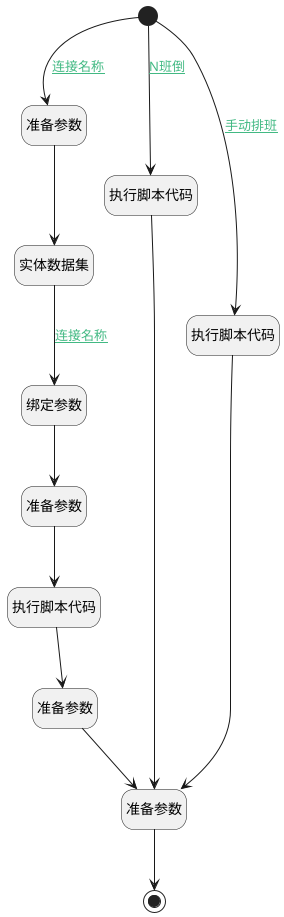

## 填充默认班次 <!-- {docsify-ignore-all} -->

   

### 处理过程




### 处理步骤说明

#### 准备参数 :id=PREPAREPARAM_03<sup class="footnote-symbol"> <font color=gray size=1>[准备参数]</font></sup>


1. 将`1` 设置给  `shiftFilter.n_public_flag_eq`
2. 将`1` 设置给  `shiftFilter.n_default_flag_eq`

#### 实体数据集 :id=DEDATASET_01<sup class="footnote-symbol"> <font color=gray size=1>[实体数据集]</font></sup>


调用实体 [班次(ATTENDANCE_SHIFT)](module/attendance/attendance_shift.md) 数据集合 [DEFAULT](module/attendance/attendance_shift#数据集合) ，查询参数为`shiftFilter`

将执行结果返回给参数`shiftPage`

#### 绑定参数 :id=BINDPARAM_01<sup class="footnote-symbol"> <font color=gray size=1>[绑定参数]</font></sup>


绑定参数`shiftPage` 到 `shift`
#### 开始 :id=Begin<sup class="footnote-symbol"> <font color=gray size=1>[开始]</font></sup>


*- N/A*
#### 准备参数 :id=PREPAREPARAM_04<sup class="footnote-symbol"> <font color=gray size=1>[准备参数]</font></sup>


1. 将`0` 设置给  `shift.PUBLIC_FLAG(公共)`
2. 将`空值（NULL）` 设置给  `shift.ID(主键)`
3. 将`shift.SCOPES(时间范围)` 绑定给  `scopes`
4. 将`scopes.0` 绑定给  `scope`
5. 将`空值（NULL）` 设置给  `scope.ID(主键)`
6. 将`空值（NULL）` 设置给  `scope.SHIFT_ID(班次ID)`
7. 将`白班` 设置给  `shift.NAME(班次名称)`
8. 将`1` 设置给  `scope.ORDER_VALUE(排序值)`

#### 执行脚本代码 :id=RAWSFCODE_03<sup class="footnote-symbol"> <font color=gray size=1>[直接后台代码]</font></sup>


<p class="panel-title"><b>执行代码[Groovy]</b></p>

```groovy
def _shifts = logic.param('shifts').getReal()

def createShift = { name, startTime, endTime ->
    return [
        attendance_ratio: 1.0,
        working_number: 1,
        schedule_type: "manual",
        order_value:1,
        scopes: [
            [
                early_for_absenteeism: 60,
                early_for_early: 0,
                latest_checkout: 480,
                earliest_checkin: 60,
                end_base_time: endTime,
                late_for_absenteeism: 60,
                late_for_late: 0,
                shift_name: name,
                start_base_time: startTime,
                order_value:1
            ]
        ],
        default_flag: 0,
        public_flag: 0,
        name: name,
        id:  java.util.UUID.randomUUID()
    ]
}

def shift1 = createShift("班次1", "08:00:00", "17:00:00")

_shifts << shift1

def _default = logic.param('Default').getReal();
_default.set("shifts",_shifts);
_default.set("shift_num",1);


```

#### 执行脚本代码 :id=RAWSFCODE_01<sup class="footnote-symbol"> <font color=gray size=1>[直接后台代码]</font></sup>


<p class="panel-title"><b>执行代码[Groovy]</b></p>

```groovy
def _shifts = logic.param('shifts').getReal()

// 生成白班和晚班配置
def createShift = { name, startTime, endTime,order_value ->
    return [
        attendance_ratio: 1.0,
        order_value: order_value,
        working_number: 1,
        schedule_type: "class_inversion",
        scopes: [
            [
                early_for_absenteeism: 60,
                early_for_early: 0,
                latest_checkout: 480,
                earliest_checkin: 60,
                end_base_time: endTime,
                late_for_absenteeism: 60,
                late_for_late: 0,
                shift_name: name,
                start_base_time: startTime,
                order_value:1,
                next_tag: name=="晚班"?"0,1":null
            ]
        ],
        default_flag: 0,
        public_flag: 0,
        name: name,
        id:  java.util.UUID.randomUUID()
    ]
}

def dayShift = createShift("白班", "09:00:00", "20:00:00",1)
def nightShift = createShift("晚班", "20:00:00", "08:00:00",2) 

_shifts << dayShift
_shifts << nightShift

def _default = logic.param('Default').getReal();
_default.set("shifts",_shifts);

```

#### 执行脚本代码 :id=RAWSFCODE_02<sup class="footnote-symbol"> <font color=gray size=1>[直接后台代码]</font></sup>


<p class="panel-title"><b>执行代码[Groovy]</b></p>

```groovy
def _shift = logic.param('shift').getReal()

logic.param('shift').getDataEntityRuntime().fillEntityKeyValue(_shift)

def _scope = logic.param('scope').getReal()

logic.param('scope').getDataEntityRuntime().fillEntityKeyValue(_scope)
_scope.shift_id = _shift.id

```

#### 准备参数 :id=PREPAREPARAM_01<sup class="footnote-symbol"> <font color=gray size=1>[准备参数]</font></sup>


1. 将`shift` 追加到  `shifts.shifts`
2. 将`shifts` 设置给  `Default(传入变量).shifts`
3. 将`Default(传入变量).SCHEDULE_TYPE(班次类型)` 设置给  `shift.SCHEDULE_TYPE(班次类型)`

#### 准备参数 :id=PREPAREPARAM4<sup class="footnote-symbol"> <font color=gray size=1>[准备参数]</font></sup>


1. 将`shift.ID(主键)` 设置给  `Default(传入变量).DEFAULT_SHIFT(默认班次标识)`

#### 结束 :id=END_01<sup class="footnote-symbol"> <font color=gray size=1>[结束]</font></sup>


返回 `Default(传入变量)`


### 连接条件说明
#### 连接名称 :id=Begin-PREPAREPARAM_03

(`Default(传入变量).SCHEDULE_TYPE(班次类型)` EQ `flexible` OR `Default(传入变量).SCHEDULE_TYPE(班次类型)` EQ `alternate_week` OR `Default(传入变量).SCHEDULE_TYPE(班次类型)` EQ `fixed` OR `Default(传入变量).SCHEDULE_TYPE(班次类型)` EQ `free` OR `Default(传入变量).SCHEDULE_TYPE(班次类型)` EQ `work_rest`)
#### 连接名称 :id=DEDATASET_01-BINDPARAM_01

`shiftPage(shiftPage).size` NOTEQ `0`
#### N班倒 :id=Begin-RAWSFCODE_01

`Default(传入变量).SCHEDULE_TYPE(班次类型)` EQ `class_inversion`
#### 手动排班 :id=Begin-RAWSFCODE_03

`Default(传入变量).SCHEDULE_TYPE(班次类型)` EQ `manual`


### 实体逻辑参数

|    中文名   |    代码名    |  数据类型    |  实体   |备注 |
| --------| --------| -------- | -------- | --------   |
|传入变量(<i class="fa fa-check"/></i>)|Default|数据对象|[考勤规则(ATTENDANCE_RULE)](module/attendance/attendance_rule.md)||
|scope|scope|数据对象|[时间范围(ATTENDANCE_SCOPE)](module/attendance/attendance_scope.md)||
|scopes|scopes|数据对象列表|[时间范围(ATTENDANCE_SCOPE)](module/attendance/attendance_scope.md)||
|shift|shift|数据对象|[班次(ATTENDANCE_SHIFT)](module/attendance/attendance_shift.md)||
|shiftFilter|shiftFilter|过滤器|||
|shiftPage|shiftPage|分页查询|||
|shifts|shifts|数据对象列表|[班次(ATTENDANCE_SHIFT)](module/attendance/attendance_shift.md)||
|work_time|work_time|简单数据|||
