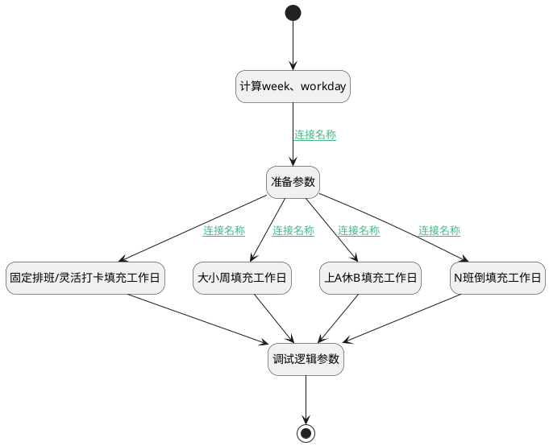

## 填充工作日 <!-- {docsify-ignore-all} -->

   

### 处理过程




### 处理步骤说明

#### 固定排班/灵活打卡填充工作日 :id=RAWSFCODE_01<sup class="footnote-symbol"> <font color=gray size=1>[直接后台代码]</font></sup>


<p class="panel-title"><b>执行代码[Groovy]</b></p>

```groovy
def _default = logic.param('Default').getReal();
def shifts = logic.param('shifts').getReal();
def defaultShift = shifts.find { it.default_flag == 1 }
if(defaultShift){
    def workdays = _default.get("workdays") ? _default.get("workdays") : [];
    def selection = _default.get("workday") ?_default.get("workday"):""

  // 获取已存在的 workday
    def existingDays = workdays.collect { it.name as Integer }

    def fillWorkdays = []
    (1..7).each { i ->  
        if (!existingDays.contains(i)) {
            def workday = [
                name  : i.toString(),
                day_number : i,
                shift_id : selection.contains(i.toString())?defaultShift.id:null
        ]
            fillWorkdays << workday
        }
    }

    // 合并后排序
    def combinedWorkdays = (workdays + fillWorkdays).sort { 
        it.day_number
    }    
    
    // // 为每个工作日填充工作时间
    // combinedWorkdays = combinedWorkdays.collect { workday ->
    //     def worktimeParts = []
 
    //     if (workday.shift_id != null && defaultShift?.scopes) {
    //         // 创建时间格式化工具 (HH:mm 格式)
    //         def timeFormat = new java.text.SimpleDateFormat("HH:mm")
    //         defaultShift.scopes.each { scope ->
    //             // 安全处理时间戳
    //             def start = scope.start_base_time ? timeFormat.format(scope.start_base_time) : ""
    //             def end = scope.end_base_time ? timeFormat.format(scope.end_base_time) : ""
    //             if (start && end) worktimeParts << "${start}-${end}"
    //         }
    //     }
 
    //     // 构建工作时间字符串
    //     workday.work_time = worktimeParts.isEmpty() ? "休息日" : worktimeParts.join('/')
    //     return workday
    // }
    
    _default.set("workdays", combinedWorkdays)
}
```

#### 计算week、workday :id=RAWSFCODE_05<sup class="footnote-symbol"> <font color=gray size=1>[直接后台代码]</font></sup>


<p class="panel-title"><b>执行代码[Groovy]</b></p>

```groovy
def _default = logic.param('Default').getReal()
def workday = _default.get("workday")?: ""
def schedule_type = _default.get("schedule_type")
def workdays = _default.get("workdays")

//固定排班、灵活打卡>workday
if (workday == "" && 
    workdays != null&&
    ( schedule_type == "fixed" || schedule_type == "flexible")) 
{
        workday = workdays
                .findAll { it.shift_id != null } 
                .sort { a, b -> a.day_number <=> b.day_number }
                .collect { it.day_number } 
                .join(',')

        _default.set("workday",workday)    
}

//计算工作日week1
def week1 = _default.get("week1")?: ""
if (week1 == ""&& workdays != null) {
    if(schedule_type == "alternate_week" ){
        week1 = workdays
                .findAll { it.shift_id != null && it.day_number < 8} 
                .sort { a, b -> a.day_number <=> b.day_number }
                .collect { it.day_number } 
                .join(',')
    }
    if(schedule_type == "class_inversion") {
         week1 = workdays
                .findAll { it.id != null && it.day_number < 8} 
                .sort { a, b -> a.day_number <=> b.day_number }
                .collect { it.day_number } 
                .join(',')
    }
    _default.set("week1",week1)    
}
//计算工作日week2
def week2 = _default.get("week2")?: ""
if (week2 == ""&& workdays != null) {
    if(schedule_type == "alternate_week" ){
        week2 = workdays
                .findAll { it.shift_id != null && 7<it.day_number && it.day_number < 15} 
                .sort { a, b -> a.day_number <=> b.day_number }
                .collect { it.day_number } 
                .join(',')
    }
    if(schedule_type == "class_inversion") {
         week2 = workdays
                .findAll { it.id != null && 7<it.day_number && it.day_number < 15} 
                .sort { a, b -> a.day_number <=> b.day_number }
                .collect { it.day_number } 
                .join(',')
    }
    _default.set("week2",week2)    

}

//计算工作日week3
def week3 = _default.get("week3")?: ""
if (week3 == "" && schedule_type == "class_inversion" && workdays != null) {
    week3 = workdays
        .findAll { it.id != null && 14<it.day_number && it.day_number < 22} 
        .sort { a, b -> a.day_number <=> b.day_number }
        .collect { it.day_number } 
        .join(',')
    _default.set("week3",week3) 
}
//计算工作日week4
def week4 = _default.get("week4")?: ""
if (week4 == "" && schedule_type == "class_inversion"&& workdays != null) {
    week4 = workdays
        .findAll { it.id != null && 21<it.day_number && it.day_number < 29} 
        .sort { a, b -> a.day_number <=> b.day_number }
        .collect { it.day_number } 
        .join(',')
    _default.set("week4",week4) 

}


```

#### 准备参数 :id=PREPAREPARAM_01<sup class="footnote-symbol"> <font color=gray size=1>[准备参数]</font></sup>


1. 将`Default(传入变量).shifts` 绑定给  `shifts`

#### 大小周填充工作日 :id=RAWSFCODE_02<sup class="footnote-symbol"> <font color=gray size=1>[直接后台代码]</font></sup>


<p class="panel-title"><b>执行代码[Groovy]</b></p>

```groovy
def _default = logic.param('Default').getReal();
def shifts = logic.param('shifts').getReal();
def defaultShift = shifts.find { it.default_flag == 1 }
if(defaultShift){
    def workdays = _default.get("workdays") ? _default.get("workdays") : [];
    def big_week = _default.get("week1") ?_default.get("week1"):"";
    def small_week = _default.get("week2") ?_default.get("week2"):"";
    def selection = big_week+","+small_week

  // 获取已存在的 workday
    def existingDays = workdays.collect { it.day_number }

    def fillWorkdays = []
    (1..14).each { i ->  
        if (!existingDays.contains(i)) {
            def workday = [
                name  : i.toString(),
                day_number : i,
                shift_id : selection.contains(i.toString())?defaultShift.id:null
        ]
            fillWorkdays << workday
        }
    }

    // 合并后排序
    def combinedWorkdays = (workdays + fillWorkdays).sort { 
        it.day_number 
    }    
    _default.set("workdays", combinedWorkdays)
}
```

#### 调试逻辑参数 :id=DEBUGPARAM_01<sup class="footnote-symbol"> <font color=gray size=1>[调试逻辑参数]</font></sup>


> [!NOTE|label:调试信息|icon:fa fa-bug]
> 调试输出参数`Default(传入变量)`的详细信息


#### 开始 :id=Begin<sup class="footnote-symbol"> <font color=gray size=1>[开始]</font></sup>


*- N/A*
#### 结束 :id=END_01<sup class="footnote-symbol"> <font color=gray size=1>[结束]</font></sup>


返回 `Default(传入变量)`

#### 上A休B填充工作日 :id=RAWSFCODE_03<sup class="footnote-symbol"> <font color=gray size=1>[直接后台代码]</font></sup>


<p class="panel-title"><b>执行代码[Groovy]</b></p>

```groovy
def _default = logic.param('Default').getReal();
def shifts = logic.param('shifts').getReal();
def defaultShift = shifts.find { it.default_flag == 1 }
if(defaultShift){
    def work = _default.get("work") ?_default.get("work"):5;
    def rest = _default.get("rest") ?_default.get("rest"):2;
    def num = work+rest;

    def fillWorkdays = [];
    (1..num).each { i ->  
        def workday = [
            name  : "第"+i+"天",
            day_number : i,
            title : "工作/休息"
        ]
        fillWorkdays << workday
    }

    _default.set("workdays", fillWorkdays)
}
```

#### N班倒填充工作日 :id=RAWSFCODE_04<sup class="footnote-symbol"> <font color=gray size=1>[直接后台代码]</font></sup>


<p class="panel-title"><b>执行代码[Groovy]</b></p>

```groovy
def _default = logic.param('Default').getReal();
def shifts = logic.param('shifts').getReal();
def same_restday = _default.same_restday;
if(shifts){
    def title = shifts.collect { it.name }.join('/')
    def fillWorkdays = []
    //休息日相同
    if(same_restday ==1){
        def workdays = _default.get("workdays") ?: []
        def week1 = _default.get("week1") ?: ""
        def week2 = _default.get("week2") ?: ""
        def week3 = _default.get("week3") ?: ""
        def week4 = _default.get("week4") ?: ""
        def selection = [week1, week2, week3, week4].join(',').split(',')  

        // 获取已存在的 workday
        def existingDays = workdays.collect { it.day_number }

        (1..28).each { i ->
            if (!existingDays.contains(i)) {
                def workday = [
                    name: i.toString(),
                    day_number: i,
                    title: selection.contains(i.toString()) ? title : "休息"  
                ]
                fillWorkdays << workday
            }else{
                // 为已存在的workday填充title
                def existingWorkday = workdays.find { it.day_number == i }
                if (existingWorkday) {
                    existingWorkday.title = title
                }
        }

        // 合并后排序
        def combinedWorkdays = (workdays + fillWorkdays).sort { 
            it.day_number 
        }    
        _default.set("workdays", combinedWorkdays)
    }
    }
    //休息日不同
    if(same_restday ==0 ){
        title = title+"/休息"  
        if( _default.get("workdays") == null){
            def inversion_days = _default.inversion_days
            if(inversion_days){
                (1..inversion_days).each { i ->
                    def workday = [
                        name  : "第"+i+"天",
                        day_number: i,
                        title: title,
                        rule_id : _default.id
                    ]
                    fillWorkdays << workday
                }
                _default.set("workdays", fillWorkdays)
        }
        }else{
            _default.get("workdays").each{ w ->
                w.title =title
            }           
        }
    }
}
```


### 连接条件说明
#### 连接名称 :id=RAWSFCODE_05-PREPAREPARAM_01

`Default(传入变量).SCHEDULE_TYPE(班次类型)` NOTEQ `manual` AND `Default(传入变量).SCHEDULE_TYPE(班次类型)` NOTEQ `free`
#### 连接名称 :id=PREPAREPARAM_01-RAWSFCODE_01

(`Default(传入变量).SCHEDULE_TYPE(班次类型)` EQ `flexible` OR `Default(传入变量).SCHEDULE_TYPE(班次类型)` EQ `fixed`)
#### 连接名称 :id=PREPAREPARAM_01-RAWSFCODE_02

`Default(传入变量).SCHEDULE_TYPE(班次类型)` EQ `alternate_week`
#### 连接名称 :id=PREPAREPARAM_01-RAWSFCODE_03

`Default(传入变量).SCHEDULE_TYPE(班次类型)` EQ `work_rest`
#### 连接名称 :id=PREPAREPARAM_01-RAWSFCODE_04

`Default(传入变量).SCHEDULE_TYPE(班次类型)` EQ `class_inversion`


### 实体逻辑参数

|    中文名   |    代码名    |  数据类型    |  实体   |备注 |
| --------| --------| -------- | -------- | --------   |
|传入变量(<i class="fa fa-check"/></i>)|Default|数据对象|[考勤规则(ATTENDANCE_RULE)](module/attendance/attendance_rule.md)||
|shifts|shifts|数据对象列表|[班次(ATTENDANCE_SHIFT)](module/attendance/attendance_shift.md)||
|workDay|workDay|数据对象|[工作日(ATTENDANCE_WORKDAY)](module/attendance/attendance_workday.md)||
|workDays|workDays|数据对象列表|[工作日(ATTENDANCE_WORKDAY)](module/attendance/attendance_workday.md)||
