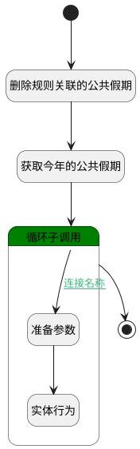

## 生成Odoo公共节假日 <!-- {docsify-ignore-all} -->

   根据所勾选的节假日进行拷贝

### 处理过程




### 处理步骤说明

#### 获取今年的公共假期 :id=RAWSQLCALL_02<sup class="footnote-symbol"> <font color=gray size=1>[直接SQL调用]</font></sup>


<p class="panel-title"><b>执行sql语句</b></p>

```sql
SELECT * 
FROM resource_calendar_leaves 
WHERE DATE_FROM >= DATE_FORMAT(CURDATE(), '%Y-01-01') 
  AND DATE_FROM < DATE_ADD(DATE_FORMAT(CURDATE(), '%Y-01-01'), INTERVAL 1 YEAR)
  AND CALENDAR_ID IS NULL
```


将执行sql结果赋值给参数`holidays(holidays)`

#### 循环子调用 :id=LOOPSUBCALL_01<sup class="footnote-symbol"> <font color=gray size=1>[循环子调用]</font></sup>


循环参数`holidays`，子循环参数使用`temp`
#### 开始 :id=Begin<sup class="footnote-symbol"> <font color=gray size=1>[开始]</font></sup>


*- N/A*
#### 删除规则关联的公共假期 :id=RAWSQLCALL_01<sup class="footnote-symbol"> <font color=gray size=1>[直接SQL调用]</font></sup>


<p class="panel-title"><b>执行sql语句</b></p>

```sql
delete from resource_calendar_leaves where CALENDAR_ID = ?
```

<p class="panel-title"><b>执行sql参数</b></p>

1. `Default(传入变量).ID(主键)`


#### 结束 :id=END_01<sup class="footnote-symbol"> <font color=gray size=1>[结束]</font></sup>


*- N/A*

#### 准备参数 :id=PREPAREPARAM_01<sup class="footnote-symbol"> <font color=gray size=1>[准备参数]</font></sup>


1. 将`Default(传入变量).ID(主键)` 设置给  `temp.CALENDAR_ID(工作时间)`
2. 将`空值（NULL）` 设置给  `temp.ID(主键)`

#### 实体行为 :id=DEACTION_01<sup class="footnote-symbol"> <font color=gray size=1>[实体行为]</font></sup>


调用实体 [休假详细信息(RESOURCE_CALENDAR_LEAVES)](module/resource/resource_calendar_leaves.md) 行为 [Create](module/resource/resource_calendar_leaves#行为) ，行为参数为`temp`


### 连接条件说明
#### 连接名称 :id=LOOPSUBCALL_01-PREPAREPARAM_01

`temp(temp).HOLIDAY_TYPE(节假日类型)` ISNOTNULL AND 


### 实体逻辑参数

|    中文名   |    代码名    |  数据类型    |  实体   |备注 |
| --------| --------| -------- | -------- | --------   |
|传入变量(<i class="fa fa-check"/></i>)|Default|数据对象|[考勤规则(ATTENDANCE_RULE)](module/attendance/attendance_rule.md)||
|holidays|holidays|数据对象列表|[休假详细信息(RESOURCE_CALENDAR_LEAVES)](module/resource/resource_calendar_leaves.md)||
|temp|temp|数据对象|[休假详细信息(RESOURCE_CALENDAR_LEAVES)](module/resource/resource_calendar_leaves.md)||
