## 生成Odoo工作时间 <!-- {docsify-ignore-all} -->

   

### 处理过程

```plantuml
@startuml
hide empty description
<style>
root {
  HyperlinkColor #42b983
}
</style>

hide empty description
state "开始" as Begin <<start>> [[$./generateOther#begin {"开始"}]]
state "构造工作时间" as RAWSFCODE_01  [[$./generateOther#rawsfcode_01 {"构造工作时间"}]]
state "实体行为" as DEACTION_01  [[$./generateOther#deaction_01 {"实体行为"}]]
state "结束" as END_01 <<end>> [[$./generateOther#end_01 {"结束"}]]


Begin --> RAWSFCODE_01
RAWSFCODE_01 --> DEACTION_01
DEACTION_01 --> END_01


@enduml
```




### 处理步骤说明

#### 构造工作时间 :id=RAWSFCODE_01<sup class="footnote-symbol"> <font color=gray size=1>[直接后台代码]</font></sup>


<p class="panel-title"><b>执行代码[Groovy]</b></p>

```groovy
def _default = logic.param('Default').getReal()
def workdays = _default.get("workdays")
def shifts = _default.get("shifts")
def schedule_type = _default.get("schedule_type")

def attendances = logic.param('attendances').getReal()

def resource_calendar = logic.param('resource_calendar').getReal()
// 基础字段默认值
resource_calendar.set("id", _default.get("id"))
resource_calendar.set("name", _default.get("name")+"的工作时间")
// resource_calendar.set("name", _default.get("company")+"的工作时间")
resource_calendar.set("active", 1)
resource_calendar.set("company_id", _default.get("company_id"))
resource_calendar.set("tz", java.util.TimeZone.getDefault().ID)
resource_calendar.set("flexible_hours", 0)
resource_calendar.set("full_time_required_hours", 0.0)
resource_calendar.set("two_weeks_calendar", schedule_type == "alternate_week" ? 1 : 0)

def timeFormatter = java.time.format.DateTimeFormatter.ofPattern("HH:mm")
def noon = java.time.LocalTime.of(12, 0)
final WEEK_DAYS = ['Monday', 'Tuesday', 'Wednesday', 'Thursday', 'Friday', 'Saturday', 'Sunday']

// 时间转换函数（含四舍五入逻辑）
def convertTimeToHours = { time ->
def hours, minutes
def calendar = Calendar.getInstance()
calendar.setTimeInMillis(time.getTime())
hours = calendar.get(Calendar.HOUR_OF_DAY)
minutes = calendar.get(Calendar.MINUTE)
def totalMinutes = hours * 60 + minutes
def decimalHours = totalMinutes / 60.0
// 四舍五入到一位小数
return (decimalHours * 10).round() / 10.0
}

//固定排班、灵活打卡、大小周
if(workdays && (schedule_type == "fixed" || schedule_type == "flexible" || schedule_type == "alternate_week")){
    workdays.forEach { workday ->
        def offset = (workday.day_number - 1) % 7
        def shift = shifts.find { it.get("id") == workday.get(("shift_id")) }
        if (shift) {
            def scopes = shift.get("scopes");
            if (scopes){
                scopes.forEach { scope ->
                    def attendance = sys.entity('resource_calendar_attendance')

                    def dayName = WEEK_DAYS[offset]
                    def startTimeStr = new java.text.SimpleDateFormat("HH:mm").format(scope.start_base_time)
                    def startTime = java.time.LocalTime.parse(startTimeStr, timeFormatter)

                    // 设置考勤名称
                    def period = (startTime >= noon) ? "Afternoon" : "Morning"
                    attendance.set("name", "${dayName} ${period}")
                    attendance.set("dayofweek", offset)
                    attendance.set("sequence", offset)

                    // 大小周
                    if (schedule_type == "alternate_week") {
                        def biweekly_cycle = _default.get("biweekly_cycle")
                        if(biweekly_cycle == "big_small"){
                            attendance.set("sequence", workday.day_number)
                            attendance.set("week_type", workday.day_number > 7 ? 1 : 0)
                        }
                        else if(biweekly_cycle == "small_big"){
                            attendance.set("sequence", workday.day_number > 7 ? workday.day_number - 7 : workday.day_number + 7)
                            attendance.set("week_type", workday.day_number > 7 ? 0 : 1)
                        }
                    }
                    
                    // 转换时间字段
                    def hourFrom = convertTimeToHours(scope.start_base_time)
                    def hourTo = convertTimeToHours(scope.end_base_time)

                    attendance.set("hour_from", hourFrom)
                    attendance.set("hour_to", hourTo)
                    attendance.set("day_period", hourFrom >= 12 ? "afternoon" : "morning")
                    attendances.add(attendance);
                }
            }

        }
    }
}


resource_calendar.set("attendances", attendances)

```

#### 实体行为 :id=DEACTION_01<sup class="footnote-symbol"> <font color=gray size=1>[实体行为]</font></sup>


调用实体 [资源工作时间(RESOURCE_CALENDAR)](module/resource/resource_calendar.md) 行为 [Save](module/resource/resource_calendar#行为) ，行为参数为`resource_calendar`

#### 开始 :id=Begin<sup class="footnote-symbol"> <font color=gray size=1>[开始]</font></sup>


*- N/A*
#### 结束 :id=END_01<sup class="footnote-symbol"> <font color=gray size=1>[结束]</font></sup>


*- N/A*


### 实体逻辑参数

|    中文名   |    代码名    |  数据类型    |  实体   |备注 |
| --------| --------| -------- | -------- | --------   |
|传入变量(<i class="fa fa-check"/></i>)|Default|数据对象|[考勤规则(ATTENDANCE_RULE)](module/attendance/attendance_rule.md)||
|attendances|attendances|数据对象列表|[工作细节(RESOURCE_CALENDAR_ATTENDANCE)](module/resource/resource_calendar_attendance.md)||
|resource_calendar|resource_calendar|数据对象|[资源工作时间(RESOURCE_CALENDAR)](module/resource/resource_calendar.md)||
