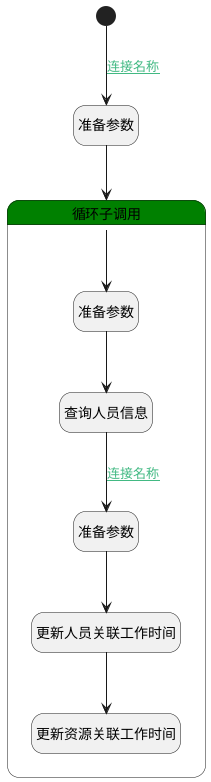

## 生成Odoo资源关联 <!-- {docsify-ignore-all} -->

   

### 处理过程




### 处理步骤说明

#### 准备参数 :id=PREPAREPARAM_01<sup class="footnote-symbol"> <font color=gray size=1>[准备参数]</font></sup>


1. 将`Default(传入变量).members` 绑定给  `members`

#### 循环子调用 :id=LOOPSUBCALL_01<sup class="footnote-symbol"> <font color=gray size=1>[循环子调用]</font></sup>


循环参数`members`，子循环参数使用`temp`
#### 开始 :id=Begin<sup class="footnote-symbol"> <font color=gray size=1>[开始]</font></sup>


*- N/A*
#### 准备参数 :id=PREPAREPARAM_02<sup class="footnote-symbol"> <font color=gray size=1>[准备参数]</font></sup>


1. 将`null` 重新建立为  `Filter`
2. 将`null` 重新建立为  `empPage`
3. 将`temp.USER_ID(标识)` 设置给  `Filter.N_ID_EQ`
4. 将`null` 重新建立为  `emp`

#### 查询人员信息 :id=DEDATASET_01<sup class="footnote-symbol"> <font color=gray size=1>[实体数据集]</font></sup>


调用实体 [员工(HR_EMPLOYEE)](module/hr/hr_employee.md) 数据集合 [DEFAULT](module/hr/hr_employee#数据集合) ，查询参数为`Filter`

将执行结果返回给参数`empPage`

#### 准备参数 :id=PREPAREPARAM_03<sup class="footnote-symbol"> <font color=gray size=1>[准备参数]</font></sup>


1. 将`empPage.0` 绑定给  `emp`

#### 更新人员关联工作时间 :id=RAWSQLCALL_02<sup class="footnote-symbol"> <font color=gray size=1>[直接SQL调用]</font></sup>


<p class="panel-title"><b>执行sql语句</b></p>

```sql
UPDATE hr_employee
SET RESOURCE_CALENDAR_ID = ?
WHERE ID = ?
```

<p class="panel-title"><b>执行sql参数</b></p>

1. `Default(传入变量).ID(主键)`
2. `emp.ID(标识)`


#### 更新资源关联工作时间 :id=RAWSQLCALL_01<sup class="footnote-symbol"> <font color=gray size=1>[直接SQL调用]</font></sup>


<p class="panel-title"><b>执行sql语句</b></p>

```sql
UPDATE resource_resource 
SET CALENDAR_ID = ?
WHERE ID = ?
```

<p class="panel-title"><b>执行sql参数</b></p>

1. `Default(传入变量).ID(主键)`
2. `emp.RESOURCE_ID(资源)`


### 连接条件说明
#### 连接名称 :id=Begin-PREPAREPARAM_01

`Default(传入变量).IS_ACTIVATE(是否激活)` EQ `1` AND `Default(传入变量).members` ISNOTNULL
#### 连接名称 :id=DEDATASET_01-PREPAREPARAM_03

`empPage(empPage).size` NOTEQ `0`


### 实体逻辑参数

|    中文名   |    代码名    |  数据类型    |  实体   |备注 |
| --------| --------| -------- | -------- | --------   |
|传入变量(<i class="fa fa-check"/></i>)|Default|数据对象|[考勤规则(ATTENDANCE_RULE)](module/attendance/attendance_rule.md)||
|Filter|Filter|过滤器|||
|emp|emp|数据对象|[员工(HR_EMPLOYEE)](module/hr/hr_employee.md)||
|empPage|empPage|分页查询|||
|members|members|数据对象列表|[考勤规则成员(ATTENDANCE_GROUP_SHIFT_MEMBER)](module/attendance/attendance_group_shift_member.md)||
|resource|resource|数据对象|[资源(RESOURCE_RESOURCE)](module/resource/resource_resource.md)||
|ret|ret|数据对象|[资源(RESOURCE_RESOURCE)](module/resource/resource_resource.md)||
|temp|temp|数据对象|[考勤规则成员(ATTENDANCE_GROUP_SHIFT_MEMBER)](module/attendance/attendance_group_shift_member.md)||
