## 判断生效 <!-- {docsify-ignore-all} -->

   

### 处理过程

```plantuml
@startuml
hide empty description
<style>
root {
  HyperlinkColor #42b983
}
</style>

hide empty description
state "开始" as Begin <<start>> [[$./judgingEffect#begin {"开始"}]]
state "准备参数" as PREPAREPARAM_01  [[$./judgingEffect#prepareparam_01 {"准备参数"}]]
state "准备参数" as PREPAREPARAM_02  [[$./judgingEffect#prepareparam_02 {"准备参数"}]]
state "结束" as END_01 <<end>> [[$./judgingEffect#end_01 {"结束"}]]


Begin --> PREPAREPARAM_01 : [[$./judgingEffect#begin-prepareparam_01{连接名称} 连接名称]]
PREPAREPARAM_01 --> END_01
Begin --> PREPAREPARAM_02
PREPAREPARAM_02 --> END_01


@enduml
```

### 处理步骤说明

#### 准备参数 :id=PREPAREPARAM_01 [准备参数]

1. 将`1` 设置给  `Default(传入变量).IS_ACTIVATE(是否激活)`

#### 开始 :id=Begin [开始]

*- N/A*
#### 准备参数 :id=PREPAREPARAM_02 [准备参数]

1. 将`0` 设置给  `Default(传入变量).IS_ACTIVATE(是否激活)`

#### 结束 :id=END_01 [结束]

返回 `Default(传入变量)`

### 连接条件说明
#### 连接名称 :id=Begin-PREPAREPARAM_01

`Default(传入变量).EFFECT_TIME(生效时间)` LTANDEQ `当前时间`

### 实体逻辑参数

|    中文名   |    代码名    |  数据类型    |  实体   |备注 |
| --------| --------| -------- | -------- | --------   |
|传入变量(<i class="fa fa-check"/></i>)|Default|数据对象|[考勤规则(ATTENDANCE_RULE)](module/attendance/attendance_rule.md)||
