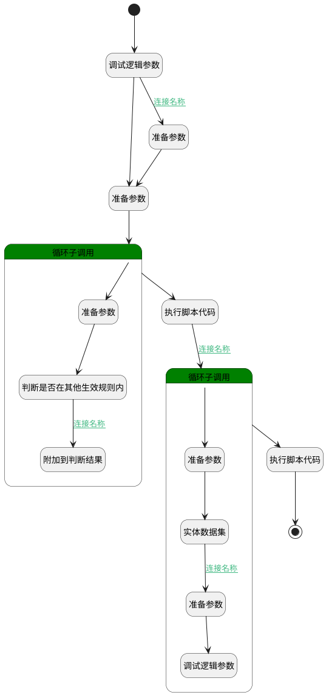

## 判断人员是否已存在其他规则 <!-- {docsify-ignore-all} -->

   

### 处理过程




### 处理步骤说明

#### 调试逻辑参数 :id=DEBUGPARAM_01<sup class="footnote-symbol"> <font color=gray size=1>[调试逻辑参数]</font></sup>


> [!NOTE|label:调试信息|icon:fa fa-bug]
> 调试输出参数`Default(传入变量)`的详细信息


#### 准备参数 :id=PREPAREPARAM_01<sup class="footnote-symbol"> <font color=gray size=1>[准备参数]</font></sup>


1. 将`Default(传入变量).members` 绑定给  `members`

#### 循环子调用 :id=LOOPSUBCALL_01<sup class="footnote-symbol"> <font color=gray size=1>[循环子调用]</font></sup>


循环参数`members`，子循环参数使用`memberTemp`
#### 准备参数 :id=PREPAREPARAM_02<sup class="footnote-symbol"> <font color=gray size=1>[准备参数]</font></sup>


1. 将`null` 重新建立为  `memberResult`

#### 判断是否在其他生效规则内 :id=RAWSQLCALL_01<sup class="footnote-symbol"> <font color=gray size=1>[直接SQL调用]</font></sup>


<p class="panel-title"><b>执行sql语句</b></p>

```sql
select * FROM attendance_group_shift_member WHERE  rule_id != ? and user_id = ?
 AND EXISTS (
    SELECT 1 
    FROM attendance_rule rule  
    WHERE 
      rule.id = attendance_group_shift_member.rule_id 
      AND rule.IS_ACTIVATE  = 1
  )
```

<p class="panel-title"><b>执行sql参数</b></p>

1. `Default(传入变量).ID(主键)`
2. `memberTemp.ID(主键)`

将执行sql结果赋值给参数`memberResult(memberResult)`

#### 附加到判断结果 :id=RAWSFCODE_01<sup class="footnote-symbol"> <font color=gray size=1>[直接后台代码]</font></sup>


<p class="panel-title"><b>执行代码[Groovy]</b></p>

```groovy
def memberResult = logic.param('memberResult').getReal()
def results = logic.param('results').getReal()

if(memberResult){
    memberResult.each{ i ->
        results.add(i)
    }
}
```

#### 开始 :id=Begin<sup class="footnote-symbol"> <font color=gray size=1>[开始]</font></sup>


*- N/A*
#### 执行脚本代码 :id=RAWSFCODE_02<sup class="footnote-symbol"> <font color=gray size=1>[直接后台代码]</font></sup>


<p class="panel-title"><b>执行代码[Groovy]</b></p>

```groovy
def results = logic.param('results').getReal()
def groupResult = logic.param('groupResult').getReal()
def _default = logic.param('Default').getReal()

if (results) {
    // 按rule_id分组并构建新结构
    def grouped = results.groupBy { it.rule_id }
    grouped.each { ruleId, items ->
        def temp = sys.entity('Attendance_group_shift_member')
        def names = items.collect { it.get("name") }.findAll { it != null }
        temp.set("name", names.join('、'))
        temp.set("rule_id",ruleId )
        groupResult.add(temp)
    }
}

```

#### 循环子调用 :id=LOOPSUBCALL_02<sup class="footnote-symbol"> <font color=gray size=1>[循环子调用]</font></sup>


循环参数`groupResult`，子循环参数使用`temp`
#### 准备参数 :id=PREPAREPARAM_04<sup class="footnote-symbol"> <font color=gray size=1>[准备参数]</font></sup>


1. 将`temp.RULE_ID(规则标识)` 设置给  `Filter.n_id_eq`

#### 实体数据集 :id=DEDATASET_01<sup class="footnote-symbol"> <font color=gray size=1>[实体数据集]</font></sup>


调用实体 [考勤规则(ATTENDANCE_RULE)](module/attendance/attendance_rule.md) 数据集合 [DEFAULT](module/attendance/attendance_rule#数据集合) ，查询参数为`Filter`

将执行结果返回给参数`rules`

#### 准备参数 :id=PREPAREPARAM_05<sup class="footnote-symbol"> <font color=gray size=1>[准备参数]</font></sup>


1. 将`rules.0` 绑定给  `rule`
2. 将`rule.NAME(规则名称)` 设置给  `temp.rule_name`

#### 调试逻辑参数 :id=DEBUGPARAM_02<sup class="footnote-symbol"> <font color=gray size=1>[调试逻辑参数]</font></sup>


> [!NOTE|label:调试信息|icon:fa fa-bug]
> 调试输出参数`temp`的详细信息


#### 准备参数 :id=PREPAREPARAM_03<sup class="footnote-symbol"> <font color=gray size=1>[准备参数]</font></sup>


1. 将`1` 设置给  `Default(传入变量).ID(主键)`

#### 执行脚本代码 :id=RAWSFCODE_03<sup class="footnote-symbol"> <font color=gray size=1>[直接后台代码]</font></sup>


<p class="panel-title"><b>执行代码[Groovy]</b></p>

```groovy
def groupResult = logic.param('groupResult').getReal()
def _default = logic.param('Default').getReal()

// 提取需要拼接的内容
def namesWithRules = groupResult.collect { item ->
    "${item.name}已在考勤规则${item.get("rule_name")}内"
}
// 拼接最终消息
def msg = "${namesWithRules.join('、')},是否将其移入当前考勤规则？"
_default.set("msg",msg)
```

#### 结束 :id=END_01<sup class="footnote-symbol"> <font color=gray size=1>[结束]</font></sup>


返回 `Default(传入变量).msg`


### 连接条件说明
#### 连接名称 :id=DEBUGPARAM_01-PREPAREPARAM_03

`Default(传入变量).ID(主键)` ISNULL
#### 连接名称 :id=RAWSQLCALL_01-RAWSFCODE_01

`memberResult(memberResult).size` NOTEQ `0`
#### 连接名称 :id=RAWSFCODE_02-LOOPSUBCALL_02

`groupResult(groupResult).size` NOTEQ `0`
#### 连接名称 :id=DEDATASET_01-PREPAREPARAM_05

`rules(rules).size` NOTEQ `0`


### 实体逻辑参数

|    中文名   |    代码名    |  数据类型    |  实体   |备注 |
| --------| --------| -------- | -------- | --------   |
|传入变量(<i class="fa fa-check"/></i>)|Default|数据对象|[考勤规则(ATTENDANCE_RULE)](module/attendance/attendance_rule.md)||
|Filter|Filter|过滤器|||
|groupResult|groupResult|数据对象列表|[考勤规则成员(ATTENDANCE_GROUP_SHIFT_MEMBER)](module/attendance/attendance_group_shift_member.md)||
|memberResult|memberResult|数据对象列表|[考勤规则成员(ATTENDANCE_GROUP_SHIFT_MEMBER)](module/attendance/attendance_group_shift_member.md)||
|memberTemp|memberTemp|数据对象|[考勤规则成员(ATTENDANCE_GROUP_SHIFT_MEMBER)](module/attendance/attendance_group_shift_member.md)||
|members|members|数据对象列表|[考勤规则成员(ATTENDANCE_GROUP_SHIFT_MEMBER)](module/attendance/attendance_group_shift_member.md)||
|msg|msg|简单数据|||
|results|results|数据对象列表|[考勤规则成员(ATTENDANCE_GROUP_SHIFT_MEMBER)](module/attendance/attendance_group_shift_member.md)||
|rule|rule|数据对象|[考勤规则(ATTENDANCE_RULE)](module/attendance/attendance_rule.md)||
|rules|rules|分页查询|||
|temp|temp|数据对象|[考勤规则成员(ATTENDANCE_GROUP_SHIFT_MEMBER)](module/attendance/attendance_group_shift_member.md)||
