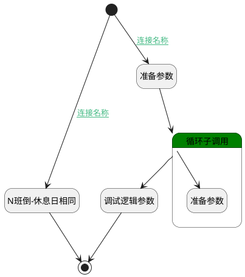

## 更新组排班工作日 <!-- {docsify-ignore-all} -->

   

### 处理过程




### 处理步骤说明

#### 开始 :id=Begin<sup class="footnote-symbol"> <font color=gray size=1>[开始]</font></sup>


*- N/A*
#### N班倒-休息日相同 :id=RAWSFCODE_02<sup class="footnote-symbol"> <font color=gray size=1>[直接后台代码]</font></sup>


<p class="panel-title"><b>执行代码[Groovy]</b></p>

```groovy
def _default = logic.param('Default').getReal()

def groupShifts = _default.get("attendance_group_shifts")

def inversion_cycle = _default.get("inversion_cycle")
def workdays = _default.get("workdays")

def week1 = _default.get("week1")?:""
def week2 = _default.get("week2")?:""
def week3 = _default.get("week3")?:""
def week4 = _default.get("week4")?:""

def selection = week1
// 根据 inversion_cycle 计算阈值并筛选工作日
def filteredWorkdays = []
if (inversion_cycle == 1) {
    filteredWorkdays = workdays.findAll { it.day_number < 8 }
} else if (inversion_cycle == 2) {
    filteredWorkdays = workdays.findAll { it.day_number < 15 }
    selection = selection + week2
} else if (inversion_cycle == 3) {
    filteredWorkdays = workdays.findAll { it.day_number < 22 }
    selection = selection + week2 + week3
} else if (inversion_cycle == 4) {
    selection = selection + week2 + week3 + week4
    filteredWorkdays = workdays 
}

final WEEK_DAYS = ['周一', '周二', '周三', '周四', '周五', '周六', '周日']

filteredWorkdays.each { day ->
        def offset = (day.day_number - 8 + 7) % 7
        day.set("name",WEEK_DAYS[offset])
        day.set("is_work", selection.contains(day.day_number.toString())?1:0)
}

groupShifts.forEach { i ->
    i.workdays = filteredWorkdays
}
```

#### 准备参数 :id=PREPAREPARAM_01<sup class="footnote-symbol"> <font color=gray size=1>[准备参数]</font></sup>


1. 将`Default(传入变量).attendance_group_shifts` 绑定给  `groupShifts`

#### 循环子调用 :id=LOOPSUBCALL_01<sup class="footnote-symbol"> <font color=gray size=1>[循环子调用]</font></sup>


循环参数`groupShifts`，子循环参数使用`groupShift`
#### 准备参数 :id=PREPAREPARAM_02<sup class="footnote-symbol"> <font color=gray size=1>[准备参数]</font></sup>


1. 将`Default(传入变量).workdays` 设置给  `groupShift.WORKDAYS(工作日)`

#### 调试逻辑参数 :id=DEBUGPARAM_01<sup class="footnote-symbol"> <font color=gray size=1>[调试逻辑参数]</font></sup>


> [!NOTE|label:调试信息|icon:fa fa-bug]
> 调试输出参数`groupShifts`的详细信息


#### 结束 :id=END_01<sup class="footnote-symbol"> <font color=gray size=1>[结束]</font></sup>


返回 `Default(传入变量)`


### 连接条件说明
#### 连接名称 :id=Begin-RAWSFCODE_02

`Default(传入变量).SCHEDULE_TYPE(班次类型)` EQ `class_inversion` AND `Default(传入变量).SAME_RESTDAY(是否休息日相同)` EQ `1`
#### 连接名称 :id=Begin-PREPAREPARAM_01

(`Default(传入变量).SCHEDULE_TYPE(班次类型)` EQ `work_rest` OR (`Default(传入变量).SCHEDULE_TYPE(班次类型)` EQ `class_inversion` AND `Default(传入变量).SAME_RESTDAY(是否休息日相同)` EQ `0`))


### 实体逻辑参数

|    中文名   |    代码名    |  数据类型    |  实体   |备注 |
| --------| --------| -------- | -------- | --------   |
|传入变量(<i class="fa fa-check"/></i>)|Default|数据对象|[考勤规则(ATTENDANCE_RULE)](module/attendance/attendance_rule.md)||
|groupShift|groupShift|数据对象|[组排班(ATTENDANCE_GROUP_SHIFT)](module/attendance/attendance_group_shift.md)||
|groupShifts|groupShifts|数据对象列表|||
