## 自动保存 <!-- {docsify-ignore-all} -->

   自动保存页面

### 处理过程

```plantuml
@startuml
hide footbox
<style>
root {
  HyperlinkColor #42b983
}
</style>

hide empty description
state "开始" as Begin <<start>> [[$./auto_save#begin {开始}]]
state "结束" as END_01 <<end>> [[$./auto_save#end_01 {结束}]]
state "保存并关闭视图" as RAWJSCODE_02  [[$./auto_save#rawjscode_02 {保存并关闭视图}]]


Begin --> RAWJSCODE_02
RAWJSCODE_02 --> END_01


@enduml
```




### 处理步骤说明

#### 保存并关闭视图 :id=RAWJSCODE_02<sup class="footnote-symbol"> <font color=gray size=1>[直接前台代码]</font></sup>


<p class="panel-title"><b>执行代码</b></p>

```javascript
console.log(uiLogic.form.data.$origin);
const _data = uiLogic.form.data.$origin;

_data.effect_time = uiLogic.default.effect_time
_data.effect_date = uiLogic.default.effect_date
// const serviceUtil = ibiz.hub.getApp(context.srfappid).deService;
// const deService = await serviceUtil.getService(context, 'attendanceapp.attendance_rule');
// await deService.exec(
//     'Save',
//     context,
//     _data,
//     params,
// );

const formC =  uiLogic.form;
console.log("自动保存"+formC)
if (formC) {
    formC.isDirty = false;
    await formC.save({ silent: true });
    context.allowClose = true;
    // const isChange = formC.state.modified;
    // if (isChange && context.allowClose == null) {
    //     if (formC) {
    //         await formC.save({ silent: true });
    //         context.allowClose = true;
    //     }
    // }
}

view.state.isLoading = false;
view.closeView();
```

#### 开始 :id=Begin<sup class="footnote-symbol"> <font color=gray size=1>[开始]</font></sup>


#### 结束 :id=END_01<sup class="footnote-symbol"> <font color=gray size=1>[结束]</font></sup>


### 实体逻辑参数

|    中文名   |    代码名    |  数据类型      |备注 |
| --------| --------| --------  | --------   |
|data|data|数据对象||
|表单|FORM|部件对象||
|传入变量(<i class="fa fa-check"/></i>)|Default|数据对象||
|参数|param|数据对象||
