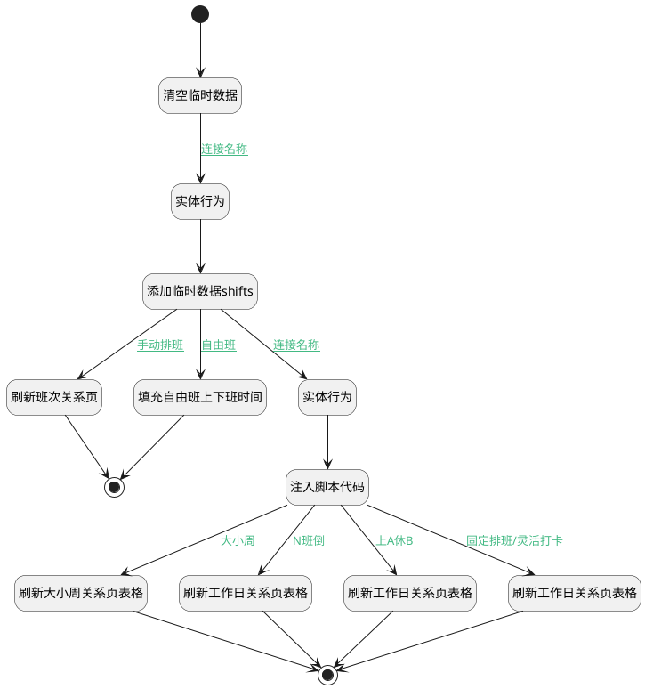

## 清空临时数据 <!-- {docsify-ignore-all} -->

   

### 处理过程




### 处理步骤说明

#### 清空临时数据 :id=RAWJSCODE_01<sup class="footnote-symbol"> <font color=gray size=1>[直接前台代码]</font></sup>


<p class="panel-title"><b>执行代码</b></p>

```javascript
return (async function () {
        var _default = uiLogic.default;
        _default.shifts = null;
        _default.workdays = null;
        // _default.workday = "1,2,3,4,5";

        const serviceUtil = ibiz.hub.getApp(context.srfappid).deService;
        const service = await serviceUtil.getService(context, 'checkinweb.shift');

        const list = service.local.getList();
        if (list != null) {
            for (const shift of list) {
                //遍历shift临时数据删除
                service.local.delete(context, shift.id);
                const scopeService = await serviceUtil.getService(context, 'checkinweb.scope');
                const scopes = scopeService.local.getList();
                // 遍历scope临时数据删除
                for (const s of scopes) {
                    if (s.shift_id == shift.id) {
                        scopeService.local.delete(context, s.id);
                    }
                }
            }
        }
        //遍历workday临时数据删除
        const workdayService = await serviceUtil.getService(context, 'checkinweb.workday');
        const workdays = workdayService.local.getList();
        if (workdays != null) {
            for (const workday of workdays) {
                workdayService.local.delete(context, workday.id);
            }
        }

    }
)();
```

#### 实体行为 :id=DEACTION_01<sup class="footnote-symbol"> <font color=gray size=1>[实体行为]</font></sup>


调用实体 [考勤规则(ATTENDANCE_RULE)](module/attendance/attendance_rule.md) 行为 [填充默认班次(fillDefaultShift)](module/attendance/attendance_rule#行为) ，行为参数为`Default(传入变量)`

将执行结果返回给参数`Default(传入变量)`

#### 添加临时数据shifts :id=RAWJSCODE_02<sup class="footnote-symbol"> <font color=gray size=1>[直接前台代码]</font></sup>


<p class="panel-title"><b>执行代码</b></p>

```javascript
var shifts = uiLogic.default.shifts;
for (var i = 0; i < shifts.length; i++) {
        await ibiz.hub.getApp(context.srfappid).deService.exec(
                'checkinweb.shift',
                'CreateTemp',
                context,
                shifts[i]
                );
}
```

#### 填充自由班上下班时间 :id=RAWJSCODE_06<sup class="footnote-symbol"> <font color=gray size=1>[直接前台代码]</font></sup>


<p class="panel-title"><b>执行代码</b></p>

```javascript
    var shifts = uiLogic.default.shifts;
    var scopes = shifts[0].scopes;
    var _default = uiLogic.default;
    _default.free_start = scopes[0].start_base_time;
    _default.free_end = scopes[0].end_base_time;
    var form = view.layoutPanel.panelItems.form;
    form.control.state.data.free_start  = scopes[0].start_base_time;
    form.control.state.data.free_end  = scopes[0].end_base_time;

```

#### 开始 :id=Begin<sup class="footnote-symbol"> <font color=gray size=1>[开始]</font></sup>


#### 结束 :id=END_02<sup class="footnote-symbol"> <font color=gray size=1>[结束]</font></sup>


#### 实体行为 :id=DEACTION_02<sup class="footnote-symbol"> <font color=gray size=1>[实体行为]</font></sup>


调用实体 [考勤规则(ATTENDANCE_RULE)](module/attendance/attendance_rule.md) 行为 [填充工作日(fillWorkDays)](module/attendance/attendance_rule#行为) ，行为参数为`Default(传入变量)`

将执行结果返回给参数`Default(传入变量)`

#### 刷新班次关系页 :id=RAWJSCODE_09<sup class="footnote-symbol"> <font color=gray size=1>[直接前台代码]</font></sup>


<p class="panel-title"><b>执行代码</b></p>

```javascript
var druipart1 = view.layoutPanel.panelItems.form.control.formDruipart.find(item => item.model.codeName ==="druipart1")

// 刷新druipart1关系界面
if (druipart1) {
    druipart1?.embedView?.callUIAction('Refresh')
}

```

#### 注入脚本代码 :id=RAWJSCODE_03<sup class="footnote-symbol"> <font color=gray size=1>[直接前台代码]</font></sup>


<p class="panel-title"><b>执行代码</b></p>

```javascript
var workdays = uiLogic.default.workdays;
for (var i = 0; i < workdays.length; i++) {
    ibiz.hub.getApp(context.srfappid).deService.exec(
        'checkinweb.workday',
        'CreateTemp',
        context,
        uiLogic.default.workdays[i],
    );
}
```

#### 刷新大小周关系页表格 :id=RAWJSCODE_05<sup class="footnote-symbol"> <font color=gray size=1>[直接前台代码]</font></sup>


<p class="panel-title"><b>执行代码</b></p>

```javascript
var druipart6 = view.layoutPanel.panelItems.form.control.formDruipart.find(item => item.model.codeName ==="druipart6")

// 刷新druipart6关系界面
if (druipart6) {
    druipart6?.embedView?.callUIAction('Refresh')
}
```

#### 刷新工作日关系页表格 :id=RAWJSCODE_08<sup class="footnote-symbol"> <font color=gray size=1>[直接前台代码]</font></sup>


<p class="panel-title"><b>执行代码</b></p>

```javascript
var druipart9 = view.layoutPanel.panelItems.form.control.formDruipart.find(item => item.model.codeName ==="druipart9")

// 刷新druipart9关系界面
if (druipart9) {
    druipart9?.embedView?.callUIAction('Refresh')
}

var druipart13 = view.layoutPanel.panelItems.form.control.formDruipart.find(item => item.model.codeName ==="druipart13")

// 刷新druipart13关系界面
if (druipart13) {
    druipart13?.embedView?.callUIAction('Refresh')
}
```

#### 刷新工作日关系页表格 :id=RAWJSCODE_07<sup class="footnote-symbol"> <font color=gray size=1>[直接前台代码]</font></sup>


<p class="panel-title"><b>执行代码</b></p>

```javascript
var druipart8 = view.layoutPanel.panelItems.form.control.formDruipart.find(item => item.model.codeName ==="druipart8")

// 刷新druipart8关系界面
if (druipart8) {
    druipart8?.embedView?.callUIAction('Refresh')
}
```

#### 刷新工作日关系页表格 :id=RAWJSCODE_04<sup class="footnote-symbol"> <font color=gray size=1>[直接前台代码]</font></sup>


<p class="panel-title"><b>执行代码</b></p>

```javascript
var druiPart5 = view.layoutPanel.panelItems.form.control.formDruipart.find(item => item.model.codeName ==="druipart5")

// 刷新druipart5关系界面
if (druiPart5) {
    druiPart5?.embedView?.callUIAction('Refresh')
}
```

#### 结束 :id=END_01<sup class="footnote-symbol"> <font color=gray size=1>[结束]</font></sup>


### 连接条件说明
#### 连接名称 :id=RAWJSCODE_01-DEACTION_01

(```Default(传入变量).schedule_type``` EQ ```fixed``` OR ```Default(传入变量).schedule_type``` EQ ```free``` OR ```Default(传入变量).schedule_type``` EQ ```work_rest``` OR ```Default(传入变量).schedule_type``` EQ ```alternate_week``` OR ```Default(传入变量).schedule_type``` EQ ```flexible``` OR ```Default(传入变量).schedule_type``` EQ ```class_inversion``` OR ```Default(传入变量).schedule_type``` EQ ```manual```)
#### 连接名称 :id=RAWJSCODE_02-DEACTION_02

```Default(传入变量).schedule_type``` NOTEQ ```free``` AND ```Default(传入变量).schedule_type``` NOTEQ ```manual```
#### 固定排班/灵活打卡 :id=RAWJSCODE_03-RAWJSCODE_04

(```Default(传入变量).schedule_type``` EQ ```fixed``` OR ```Default(传入变量).schedule_type``` EQ ```flexible```)
#### 大小周 :id=RAWJSCODE_03-RAWJSCODE_05

```Default(传入变量).schedule_type``` EQ ```alternate_week```
#### 上A休B :id=RAWJSCODE_03-RAWJSCODE_07

```Default(传入变量).schedule_type``` EQ ```work_rest```
#### N班倒 :id=RAWJSCODE_03-RAWJSCODE_08

```Default(传入变量).schedule_type``` EQ ```class_inversion```
#### 自由班 :id=RAWJSCODE_02-RAWJSCODE_06

```Default(传入变量).schedule_type``` EQ ```free```
#### 手动排班 :id=RAWJSCODE_02-RAWJSCODE_09

```Default(传入变量).schedule_type``` EQ ```manual```


### 实体逻辑参数

|    中文名   |    代码名    |  数据类型      |备注 |
| --------| --------| --------  | --------   |
|传入变量(<i class="fa fa-check"/></i>)|Default|数据对象||
|shifts|shifts|数据对象列表||
|shiftpage|shiftpage|分页查询||
|attendance_shift|attendance_shift|数据对象||
|scopes|scopes|数据对象列表||
|Filter|Filter|过滤器||
|scope|scope|数据对象||
