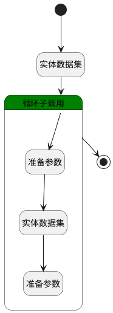

## 排班视图查询 <!-- {docsify-ignore-all} -->

   

### 处理过程

### 处理步骤说明

#### 实体数据集 :id=DEDATASET_01 [实体数据集]

调用实体 [排班(ATTENDANCE_SCHEDULE)](module/attendance/attendance_schedule.md) 数据集合 [全部(group_by_member)](module/attendance/attendance_schedule#数据集合) ，查询参数为`Filter`

将执行结果返回给参数`attendance_schedules`

#### 循环子调用 :id=LOOPSUBCALL_01 [循环子调用]

循环参数`attendance_schedules`，子循环参数使用`temp`
#### 开始 :id=Begin [开始]

*- N/A*
#### 结束 :id=END_01 [结束]

返回 `attendance_schedules`

#### 准备参数 :id=PREPAREPARAM_01 [准备参数]

1. 将`temp.MEMBER_ID(员工ID)` 设置给  `Filter.n_member_id_eq`

#### 实体数据集 :id=DEDATASET_02 [实体数据集]

调用实体 [排班(ATTENDANCE_SCHEDULE)](module/attendance/attendance_schedule.md) 数据集合 [全部(all)](module/attendance/attendance_schedule#数据集合) ，查询参数为`Filter`

将执行结果返回给参数`data`

#### 准备参数 :id=PREPAREPARAM_02 [准备参数]

1. 将`data` 设置给  `temp.data`

### 实体逻辑参数

|    中文名   |    代码名    |  数据类型    |  实体   |备注 |
| --------| --------| -------- | -------- | --------   |
|传入变量(<i class="fa fa-check"/></i>)|Default|过滤器|||
|Filter|Filter|过滤器|||
|attendance_schedules|attendance_schedules|分页查询|||
|data|data|数据对象列表|[排班(ATTENDANCE_SCHEDULE)](module/attendance/attendance_schedule.md)||
|temp|temp|数据对象|[排班(ATTENDANCE_SCHEDULE)](module/attendance/attendance_schedule.md)||
