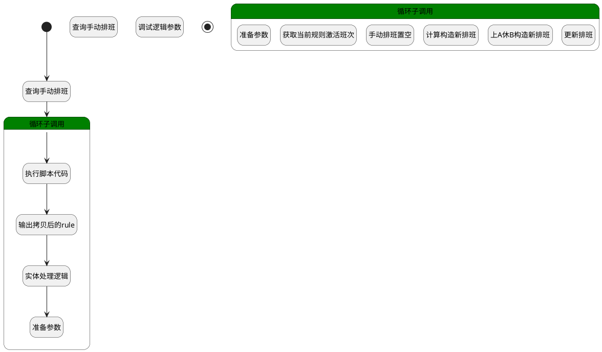

## 清除手动排班 <!-- {docsify-ignore-all} -->

   

### 处理过程




### 处理步骤说明

#### 开始 :id=Begin<sup class="footnote-symbol"> <font color=gray size=1>[开始]</font></sup>


*- N/A*
#### 查询手动排班 :id=RAWSQLCALL_01<sup class="footnote-symbol"> <font color=gray size=1>[直接SQL调用]</font></sup>


<p class="panel-title"><b>执行sql语句</b></p>

```sql
select
	t1.`CHECKIN_DATE`,
	t1.`ID`,
	t1.`MANUAL`,
	t1.`MANUAL_TYPE`,
	t1.`MEMBER_ID`,
	t1.`MEMBER_NAME`,
	t1.`NAME`,
	t1.`RULE_DATA`,
	t1.`RULE_ID`,
	t11.`NAME` as `RULE_NAME`,
	t11.`SCHEDULE_TYPE`,
	t1.`SHIFT_DATA`,
	t1.`WORKDAY`,
	t1.`WORK_TIME`
from
	`ATTENDANCE_SCHEDULE` t1
left join `ATTENDANCE_ACTIVATE_RULE` t11 on
	t1.`RULE_ID` = t11.`ID`
where 
	t1.MANUAL = 1
	and t1.CHECKIN_DATE >= CURDATE()
```


将执行sql结果赋值给参数`manualSchedules(manualSchedules)`

#### 调试逻辑参数 :id=DEBUGPARAM_01<sup class="footnote-symbol"> <font color=gray size=1>[调试逻辑参数]</font></sup>


> [!NOTE|label:调试信息|icon:fa fa-bug]
> 调试输出参数`manualSchedules`的详细信息


#### 查询手动排班 :id=RAWSQLCALL_02<sup class="footnote-symbol"> <font color=gray size=1>[直接SQL调用]</font></sup>


<p class="panel-title"><b>执行sql语句</b></p>

```sql
select

	t1.`RULE_DATA`,
	t1.`RULE_ID`

from
	`ATTENDANCE_SCHEDULE` t1
left join `ATTENDANCE_ACTIVATE_RULE` t11 on
	t1.`RULE_ID` = t11.`ID`
where 
	t1.MANUAL = 1
	and t1.CHECKIN_DATE >= CURDATE()
	GROUP BY t1.RULE_ID
```


将执行sql结果赋值给参数`manualSchedules(manualSchedules)`

#### 循环子调用 :id=LOOPSUBCALL_01<sup class="footnote-symbol"> <font color=gray size=1>[循环子调用]</font></sup>


循环参数`manualSchedules`，子循环参数使用`temp`
#### 结束 :id=END_01<sup class="footnote-symbol"> <font color=gray size=1>[结束]</font></sup>


*- N/A*

#### 循环子调用 :id=LOOPSUBCALL_02<sup class="footnote-symbol"> <font color=gray size=1>[循环子调用]</font></sup>


循环参数`manualSchedules`，子循环参数使用`temp`
#### 准备参数 :id=PREPAREPARAM_01<sup class="footnote-symbol"> <font color=gray size=1>[准备参数]</font></sup>


1. 将`0` 设置给  `temp.MANUAL(是否手动)`
2. 将`空值（NULL）` 设置给  `temp.SHIFT_DATA(当前班次信息)`
3. 将`空值（NULL）` 设置给  `temp.WORK_TIME(工作时段)`
4. 将`temp.RULE_ID(主键)` 设置给  `shiftFilter.n_rule_id_eq`

#### 执行脚本代码 :id=RAWSFCODE_03<sup class="footnote-symbol"> <font color=gray size=1>[直接后台代码]</font></sup>


<p class="panel-title"><b>执行代码[Groovy]</b></p>

```groovy
def _default = logic.param('Default').getReal()
def temp = logic.param('temp').getReal()
def rule = logic.param('rule').getReal()

def rule_data = temp.get("rule_data").any()
if (rule_data){

    def rule_runtime = sys.dataentity('attendance_rule')
    rule_runtime.createEntity(rule_data).copyTo(rule)
    //限制时间：今日
    def cal = Calendar.getInstance()
    cal.time = new Date()
    cal.set(Calendar.HOUR_OF_DAY, 0)
    cal.set(Calendar.MINUTE, 0)
    cal.set(Calendar.SECOND, 0)
    cal.set(Calendar.MILLISECOND, 0)
    rule.set("limitTime", cal.getTime())

    //转换scope
    def shifts = temp.get("rule_data").any().get("shifts")
    if(shifts){
        def _shifts = logic.param('shifts').getReal()
        shifts.forEach { shift ->
            def newShift = sys.entity('attendance_shift')
            shift.copyTo(newShift)
            _shifts.add(newShift)
        }
        rule.set("shifts",_shifts)
    }
}


```

#### 获取当前规则激活班次 :id=DEDATASET_01<sup class="footnote-symbol"> <font color=gray size=1>[实体数据集]</font></sup>


调用实体 [激活班次(ATTENDANCE_ACTIVATE_SHIFT)](module/attendance/attendance_activate_shift.md) 数据集合 [DEFAULT](module/attendance/attendance_activate_shift#数据集合) ，查询参数为`shiftFilter`

将执行结果返回给参数`activeShifts`

#### 计算构造新排班 :id=RAWSFCODE_01<sup class="footnote-symbol"> <font color=gray size=1>[直接后台代码]</font></sup>


<p class="panel-title"><b>执行代码[Groovy]</b></p>

```groovy
def temp = logic.param('temp').getReal()
def checkinDate = temp.get("checkin_date")
def activeShifts = logic.param('activeShifts').getReal()

def rule_data = temp.get("rule_data")
print "rule_data配置, ${rule_data}"
print "activeShifts配置, ${activeShifts}"
print "checkinDate配置, ${checkinDate}"

if (rule_data != null && checkinDate != null && activeShifts != null) {
    Map<String, Object> ruleData = rule_data as Map<String, Object>;
    def workdays = ruleData.get("workdays")
    print "工作日配置, ${workdays}"


    // 计算当天排班班次
    def calcShiftData = { Date checkinDateParam, List workdaysParam, List activeShiftsParam ->
        // 1. 确定当前日期是周几（1-7对应周一到周日）
        def calendarInner = Calendar.getInstance()
        calendarInner.setTime(checkinDateParam)
        int dayOfWeek = calendarInner.get(Calendar.DAY_OF_WEEK)
        int dayNumber = (dayOfWeek == Calendar.SUNDAY) ? 7 : dayOfWeek - 1

        // 2. 查找匹配的工作日配置
        def workdayConfig = workdaysParam.find { it.day_number == dayNumber }

        // 3. 未找到工作日配置时返回空班次
        if (!workdayConfig || !workdayConfig.shift_id) {
            print "未找到工作日配置时返回空班次, ${workdayConfig}!"
            return null
        }

        // 4. 查找对应的班次信息
        def shift = activeShiftsParam.find { it.id == workdayConfig.shift_id }

        // 5. 未找到班次时返回空班次
        if (!shift || !shift.shift_data) {
            print "未找到班次时返回空班次, ${shift}!"
            return null
        }

        // 6. 返回班次数据
        print "返回班次数据, ${shift}!"
        return shift.shift_data
    }

    def shift_data = calcShiftData(checkinDate, workdays, activeShifts)
    def workTime = shift_data?.work_times ?: null
    temp.set("shift_data",shift_data)
    temp.set("work_time",workTime)
    temp.set("workday",shift_data != null ? 1 : 0)

}

```

#### 输出拷贝后的rule :id=DEBUGPARAM_04<sup class="footnote-symbol"> <font color=gray size=1>[调试逻辑参数]</font></sup>


> [!NOTE|label:调试信息|icon:fa fa-bug]
> 调试输出参数`rule`的详细信息


#### 上A休B构造新排班 :id=RAWSFCODE_02<sup class="footnote-symbol"> <font color=gray size=1>[直接后台代码]</font></sup>


<p class="panel-title"><b>执行代码[Groovy]</b></p>

```groovy
def temp = logic.param('temp').getReal()
def checkinDate = temp.get("checkin_date")
def activeShifts = logic.param('activeShifts').getReal()
def member_id = temp.get("member_id")
def rule_data = temp.get("rule_data")

if (rule_data != null && checkinDate != null && activeShifts != null) {
    Map<String, Object> ruleData = rule_data as Map<String, Object>
    def attendance_group_shifts = ruleData.get("attendance_group_shifts")
    def effect_time = ruleData.get("effect_time")
    def inversion_cycle = ruleData.get("inversion_cycle") as Integer

    // 解析日期工具
    def sdf = new java.text.SimpleDateFormat("yyyy-MM-dd")
    def checkinCal = Calendar.getInstance()
    if (checkinDate instanceof String) {
        checkinCal.setTime(sdf.parse(checkinDate))
    } else {
        checkinCal.setTime(checkinDate)
    }

    // 计算周期天数
    int cycleDays = inversion_cycle * 7

    // 预处理工作日数据
    def validWorkdays = attendance_group_shifts.findAll { it.day_number <= cycleDays }
    def cycleMap = validWorkdays.collectEntries { [(it.day_number): it] }

    // 计算基准日（effect_time的最近前序周一）
    Calendar baseCal = Calendar.getInstance()
    baseCal.setTime(sdf.parse(effect_time))
    int daysToSubtract = (baseCal.get(Calendar.DAY_OF_WEEK) - 2 + 7) % 7
    if (daysToSubtract > 0) {
        baseCal.add(Calendar.DAY_OF_MONTH, -daysToSubtract)
    }
    Date baseDate = baseCal.getTime()

    // 计算日期偏移
    long offsetMillis = checkinCal.getTimeInMillis() - baseDate.getTime()
    int offsetDays = (offsetMillis / (24 * 60 * 60 * 1000)) as int
    int dayInCycle = (offsetDays % cycleDays) + 1

    // 查找班次配置
    def workdayConfig = cycleMap[dayInCycle]
    if (workdayConfig) {
        def shift = activeShifts.find { it.id == workdayConfig.shift_id }
        if (shift) {
            def shiftData = shift.shift_data
            def workTime = shiftData?.work_times
            // 更新临时参数
            temp.set("shift_data", shiftData)
            temp.set("work_time", workTime)
            temp.set("workday", shiftData ? 1 : 0)
        }
    }
}
```

#### 手动排班置空 :id=PREPAREPARAM_02<sup class="footnote-symbol"> <font color=gray size=1>[准备参数]</font></sup>


1. 将`空值（NULL）` 设置给  `temp.WORKDAY(是否工作日)`

#### 实体处理逻辑 :id=DELOGIC_01<sup class="footnote-symbol"> <font color=gray size=1>[实体逻辑]</font></sup>


调用实体 [考勤规则(ATTENDANCE_RULE)](module/attendance/attendance_rule.md) 处理逻辑 [激活规则]((module/attendance/attendance_rule/logic/activeRule.md)) ，行为参数为`rule(rule)`

#### 准备参数 :id=PREPAREPARAM3<sup class="footnote-symbol"> <font color=gray size=1>[准备参数]</font></sup>


1. 将` ==> shifts` 重新建立为  `shifts`
2. 将` ==> rule` 重新建立为  `rule`
3. 将` ==> temp` 重新建立为  `temp`

#### 更新排班 :id=DEACTION_01<sup class="footnote-symbol"> <font color=gray size=1>[实体行为]</font></sup>


调用实体 [排班(ATTENDANCE_SCHEDULE)](module/attendance/attendance_schedule.md) 行为 [Update](module/attendance/attendance_schedule#行为) ，行为参数为`temp`


### 实体逻辑参数

|    中文名   |    代码名    |  数据类型    |  实体   |备注 |
| --------| --------| -------- | -------- | --------   |
|传入变量(<i class="fa fa-check"/></i>)|Default|数据对象|[排班(ATTENDANCE_SCHEDULE)](module/attendance/attendance_schedule.md)||
|activeShifts|activeShifts|数据对象列表|[激活班次(ATTENDANCE_ACTIVATE_SHIFT)](module/attendance/attendance_activate_shift.md)||
|attendance_group_shifts|attendance_group_shifts|数据对象列表|[组排班(ATTENDANCE_GROUP_SHIFT)](module/attendance/attendance_group_shift.md)||
|manualSchedules|manualSchedules|数据对象列表|[排班(ATTENDANCE_SCHEDULE)](module/attendance/attendance_schedule.md)||
|rule|rule|数据对象|[考勤规则(ATTENDANCE_RULE)](module/attendance/attendance_rule.md)||
|scopes|scopes|数据对象列表|[时间范围(ATTENDANCE_SCOPE)](module/attendance/attendance_scope.md)||
|shiftFilter|shiftFilter|过滤器|||
|shifts|shifts|数据对象列表|[班次(ATTENDANCE_SHIFT)](module/attendance/attendance_shift.md)||
|temp|temp|数据对象|[排班(ATTENDANCE_SCHEDULE)](module/attendance/attendance_schedule.md)||
|tempRule|tempRule|数据对象|[考勤规则(ATTENDANCE_RULE)](module/attendance/attendance_rule.md)||
|workdays|workdays|数据对象列表|[工作日(ATTENDANCE_WORKDAY)](module/attendance/attendance_workday.md)||
