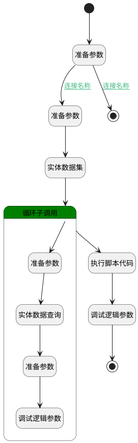

## fillShifts <!-- {docsify-ignore-all} -->

   

### 处理过程




### 处理步骤说明

#### 实体数据集 :id=DEDATASET_01<sup class="footnote-symbol"> <font color=gray size=1>[实体数据集]</font></sup>


调用实体 [激活班次(ATTENDANCE_ACTIVATE_SHIFT)](module/attendance/attendance_activate_shift.md) 数据集合 [DEFAULT](module/attendance/attendance_activate_shift#数据集合) ，查询参数为`Filter`

将执行结果返回给参数`shifts`

#### 循环子调用 :id=LOOPSUBCALL_01<sup class="footnote-symbol"> <font color=gray size=1>[循环子调用]</font></sup>


循环参数`shifts`，子循环参数使用`attendance_shift`
#### 执行脚本代码 :id=RAWSFCODE_01<sup class="footnote-symbol"> <font color=gray size=1>[直接后台代码]</font></sup>


<p class="panel-title"><b>执行代码[JavaScript]</b></p>

```javascript
var shifts = logic.getParam('shifts');
var _default = logic.getParam('Default');

var lastShifts = [];

for (var i = 0; i < shifts.getLength(); i++) {
  var shift = shifts.get(i);
  var work_times = [];
  if(shift.get("scopes")!=null){
    var scopes = shift.get("scopes");
    for (var a =0; a<scopes.getLength(); a++) {
      var scope = scopes.get(a);
      var work_time ={
        start : scope.get("start_base_time"),
        end: scope.get("end_base_time")

      }
      work_times.push(work_time);
    }
    var lastshift = {
      id : i+1,
      name : shift.name,
      work_times : work_times,
      rule_id : _default.get("id")
    }
    lastShifts.push(lastshift);
  }

}

_default.set("work_time",lastShifts[0].work_times)

_default.set("shifts",lastShifts)

```

#### 开始 :id=Begin<sup class="footnote-symbol"> <font color=gray size=1>[开始]</font></sup>


*- N/A*
#### 准备参数 :id=PREPAREPARAM_01<sup class="footnote-symbol"> <font color=gray size=1>[准备参数]</font></sup>


1. 将`Default(传入变量).RULE_ID(主键)` 设置给  `Filter.n_rule_id_eq`

#### 结束 :id=END_01<sup class="footnote-symbol"> <font color=gray size=1>[结束]</font></sup>


返回 `Default(传入变量)`

#### 准备参数 :id=PREPAREPARAM_03<sup class="footnote-symbol"> <font color=gray size=1>[准备参数]</font></sup>


1. 将`attendance_shift.ID(标识)` 设置给  `scopeFilter.n_shift_id_eq`

#### 准备参数 :id=PREPAREPARAM_04<sup class="footnote-symbol"> <font color=gray size=1>[准备参数]</font></sup>


1. 将`空值（NULL）` 设置给  `Default(传入变量).SHIFTS(班次信息)`
2. 将`空值（NULL）` 设置给  `Default(传入变量).WORK_TIME(工作时段)`

#### 调试逻辑参数 :id=DEBUGPARAM_02<sup class="footnote-symbol"> <font color=gray size=1>[调试逻辑参数]</font></sup>


> [!NOTE|label:调试信息|icon:fa fa-bug]
> 调试输出参数`shifts`的详细信息


#### 实体数据查询 :id=DEDATAQUERY_01<sup class="footnote-symbol"> <font color=gray size=1>[实体数据查询]</font></sup>


调用实体 [时间范围(ATTENDANCE_SCOPE)](module/attendance/attendance_scope.md) 数据查询 [DEFAULT](module/attendance/attendance_scope#数据查询) ，查询参数为`scopeFilter`

将执行结果返回给参数`scopes`

#### 结束 :id=END_02<sup class="footnote-symbol"> <font color=gray size=1>[结束]</font></sup>


返回 `Default(传入变量)`

#### 准备参数 :id=PREPAREPARAM_02<sup class="footnote-symbol"> <font color=gray size=1>[准备参数]</font></sup>


1. 将`scopes` 设置给  `attendance_shift.scopes`

#### 调试逻辑参数 :id=DEBUGPARAM_01<sup class="footnote-symbol"> <font color=gray size=1>[调试逻辑参数]</font></sup>


> [!NOTE|label:调试信息|icon:fa fa-bug]
> 调试输出参数`attendance_shift`的详细信息


### 连接条件说明
#### 连接名称 :id=PREPAREPARAM_04-PREPAREPARAM_01

`Default(传入变量).RULE_ID(主键)` ISNOTNULL
#### 连接名称 :id=PREPAREPARAM_04-END_02

`Default(传入变量).RULE_ID(主键)` ISNULL


### 实体逻辑参数

|    中文名   |    代码名    |  数据类型    |  实体   |备注 |
| --------| --------| -------- | -------- | --------   |
|传入变量(<i class="fa fa-check"/></i>)|Default|数据对象|[排班(ATTENDANCE_SCHEDULE)](module/attendance/attendance_schedule.md)||
|Filter|Filter|过滤器|||
|attendance_shift|attendance_shift|数据对象|[激活班次(ATTENDANCE_ACTIVATE_SHIFT)](module/attendance/attendance_activate_shift.md)||
|scopeFilter|scopeFilter|过滤器|||
|scopes|scopes|数据对象列表|[时间范围(ATTENDANCE_SCOPE)](module/attendance/attendance_scope.md)||
|shifts|shifts|分页查询|||
