## 手动排班 <!-- {docsify-ignore-all} -->

   

### 处理过程

```plantuml
@startuml
hide empty description
<style>
root {
  HyperlinkColor #42b983
}
</style>

hide empty description
state "开始" as Begin <<start>> [[$./manual#begin {"开始"}]]
state "手动调班" as RAWSFCODE1  [[$./manual#rawsfcode1 {"手动调班"}]]
state "结束" as END1 <<end>> [[$./manual#end1 {"结束"}]]


Begin --> RAWSFCODE1
RAWSFCODE1 --> END1


@enduml
```




### 处理步骤说明

#### 开始 :id=Begin<sup class="footnote-symbol"> <font color=gray size=1>[开始]</font></sup>


*- N/A*
#### 手动调班 :id=RAWSFCODE1<sup class="footnote-symbol"> <font color=gray size=1>[直接后台代码]</font></sup>


<p class="panel-title"><b>执行代码[Groovy]</b></p>

```groovy
def _default = logic.param('Default').getReal()
def attendance_schedule_runtime = sys.dataentity('attendance_schedule')

if(_default != null){
    _default.each { it ->
        def attendance_schedule = attendance_schedule_runtime.entity()
        def attendance_schedule_id = it.get("id")
        def workday = it.get("workday")
        if(attendance_schedule_id != null){
            attendance_schedule.set("id", attendance_schedule_id)
            attendance_schedule.set("manual", 1)
            attendance_schedule.set("workday", workday)
            def choose_shift = it.get("choose_shift")
            if(choose_shift != null){
                def shift_data = choose_shift.get("shift_data")
                def work_time = choose_shift.get("work_times")?choose_shift.get("work_times"):shift_data.get("work_times")
                attendance_schedule.set("work_time", work_time)
                attendance_schedule.set("shift_data", shift_data)
            }
            attendance_schedule_runtime.update(attendance_schedule)
        }
    }
}


```

#### 结束 :id=END1<sup class="footnote-symbol"> <font color=gray size=1>[结束]</font></sup>


返回 `attendance_schedule(排班)`


### 实体逻辑参数

|    中文名   |    代码名    |  数据类型    |  实体   |备注 |
| --------| --------| -------- | -------- | --------   |
|传入变量(<i class="fa fa-check"/></i>)|Default|数据对象|[排班(ATTENDANCE_SCHEDULE)](module/attendance/attendance_schedule.md)||
|排班|attendance_schedule|数据对象|[排班(ATTENDANCE_SCHEDULE)](module/attendance/attendance_schedule.md)||
