## 搜索月份 <!-- {docsify-ignore-all} -->

   

### 处理过程

```plantuml
@startuml
hide empty description
<style>
root {
  HyperlinkColor #42b983
}
</style>

hide empty description
state "开始" as Begin <<start>> [[$./search_month#begin {"开始"}]]
state "获取最近五个月的月份" as RAWSFCODE1  [[$./search_month#rawsfcode1 {"获取最近五个月的月份"}]]
state "结束" as END1 <<end>> [[$./search_month#end1 {"结束"}]]


Begin --> RAWSFCODE1
RAWSFCODE1 --> END1


@enduml
```




### 处理步骤说明

#### 开始 :id=Begin<sup class="footnote-symbol"> <font color=gray size=1>[开始]</font></sup>


*- N/A*
#### 获取最近五个月的月份 :id=RAWSFCODE1<sup class="footnote-symbol"> <font color=gray size=1>[直接后台代码]</font></sup>


<p class="panel-title"><b>执行代码[Groovy]</b></p>

```groovy
def result_list = logic.param('result_list').getReal()

// 获取当前日期
def currentDate = new Date()

// 设置日期格式
def dateFormat = new java.text.SimpleDateFormat("yyyy-MM")

// 获取当前年月字符串
def cur_month = dateFormat.format(currentDate)
def cur_month_map = new HashMap()
cur_month_map.put('name', cur_month)

// 获取当前日期的 Calendar 实例
def calendar = java.util.Calendar.getInstance()
calendar.setTime(currentDate)

// 获取前3个月
for (int i = 3; i >= 1; i--) {
    calendar.setTime(currentDate)
    calendar.add(Calendar.MONTH, -i)
    def month_map = new HashMap()
    month_map.put('name', dateFormat.format(calendar.getTime()))
    result_list.add(month_map)
}
result_list.add(cur_month_map)
// 获取后1个月
calendar.setTime(currentDate) // 重置为当前日期
calendar.add(Calendar.MONTH, 1)
def next_month = dateFormat.format(calendar.getTime())
def next_month_map = new HashMap()
next_month_map.put('name', next_month)
result_list.add(next_month_map)
```

#### 结束 :id=END1<sup class="footnote-symbol"> <font color=gray size=1>[结束]</font></sup>


返回 `result_list(返回结果列表变量)`


### 实体逻辑参数

|    中文名   |    代码名    |  数据类型    |  实体   |备注 |
| --------| --------| -------- | -------- | --------   |
|传入变量(<i class="fa fa-check"/></i>)|Default|过滤器|||
|返回结果列表变量|result_list|数据对象列表|[排班(ATTENDANCE_SCHEDULE)](module/attendance/attendance_schedule.md)||
