## 信息反查 <!-- {docsify-ignore-all} -->

   

### 处理过程

```plantuml
@startuml
hide empty description
<style>
root {
  HyperlinkColor #42b983
}
</style>

hide empty description
state "开始" as Begin <<start>> [[$./check_info#begin {"开始"}]]
state "准备参数" as PREPAREPARAM1  [[$./check_info#prepareparam1 {"准备参数"}]]
state "获取员工" as DEACTION1  [[$./check_info#deaction1 {"获取员工"}]]
state "获取数据明细" as RAWSFCODE1  [[$./check_info#rawsfcode1 {"获取数据明细"}]]
state "结束" as END1 <<end>> [[$./check_info#end1 {"结束"}]]


Begin --> PREPAREPARAM1
PREPAREPARAM1 --> DEACTION1
DEACTION1 --> RAWSFCODE1
RAWSFCODE1 --> END1


@enduml
```




### 处理步骤说明

#### 开始 :id=Begin<sup class="footnote-symbol"> <font color=gray size=1>[开始]</font></sup>


*- N/A*
#### 准备参数 :id=PREPAREPARAM1<sup class="footnote-symbol"> <font color=gray size=1>[准备参数]</font></sup>


1. 将`Default(传入变量).MEMBER_ID(成员ID)` 设置给  `emp(人员).ID(主键)`

#### 获取员工 :id=DEACTION1<sup class="footnote-symbol"> <font color=gray size=1>[实体行为]</font></sup>


调用实体 [员工信息(EMPLOYEE)](module/employee_management/employee.md) 行为 [Get](module/employee_management/employee#行为) ，行为参数为`emp(人员)`

将执行结果返回给参数`emp(人员)`

#### 获取数据明细 :id=RAWSFCODE1<sup class="footnote-symbol"> <font color=gray size=1>[直接后台代码]</font></sup>


<p class="panel-title"><b>执行代码[Groovy]</b></p>

```groovy
def _default = logic.param('Default').getReal()
def emp = logic.param('emp').getReal()

def sdf = new java.text.SimpleDateFormat("HH:mm:ss")
def checkin_date = _default.get("checkin_date")

//获取排班
def attendance_schedule_runtime = sys.dataentity('attendance_schedule')
def attendance_schedule_filter = attendance_schedule_runtime.filter()
attendance_schedule_filter.all()
attendance_schedule_filter.eq('member_id', emp.get("id"))
attendance_schedule_filter.custom(" DATE_FORMAT(t1.CHECKIN_DATE, '%Y-%m-%d') = '"+ checkin_date +"'")
def attendance_schedule_list = attendance_schedule_filter.select('')

//规则名称
def rule_name = "";
//班次名称
def shift_name = "";
//获取班次
if (attendance_schedule_list != null) {
    attendance_schedule_list.each { item ->
        def work_times = item.get("work_time")
        if (work_times != null) {
            work_times.each { it ->
                shift_name += it.get("shift_name") + " " + it.get("start_base_time") + "-" + it.get("end_base_time")
            }
        }
        rule_name = item.get("rule_name")
    }
}

emp.set("rule_name", rule_name)
emp.set("shift_name", shift_name)

//获取打卡记录
def clock_runtime = sys.dataentity('attendance_clock_in_record')
def clock_filter = clock_runtime.filter()
clock_filter.all()
clock_filter.eq('member_id', emp.get("id"))
clock_filter.custom(" DATE_FORMAT(t1.CHECKIN_TIME, '%Y-%m-%d') = '"+ checkin_date +"'")
def clock_list = clock_filter.select('')
if (clock_list != null) {
    clock_list.each { item ->
        if (item.get('checkin_time') != null) {
            item.set('clock_checkin_time', sdf.format(item.get('checkin_time')))
        }
    }
    emp.set("clock_list", clock_list)
}

//获取考勤记录
def record_runtime = sys.dataentity('attendance_record')
def details = []
def record_filter = record_runtime.filter()
record_filter.all()
record_filter.eq('member_id', emp.get("id"))
record_filter.custom(" DATE_FORMAT(t1.CHECKIN_DATE, '%Y-%m-%d') = '"+ checkin_date +"'")
record_filter.setPageable(0,1000,0)
def record_list = record_filter.fetch()
if (record_list != null) {
    record_list.each { item ->
        details = item.get('details')
    }
}

if (details != null) {
    details.each { item ->
        if (item.get('detail_index') != null) {
            if (item.get('detail_index').startsWith("end")) {
                if (item.get('should_checkin_time') != null) {
                    item.set('end_base_time', sdf.format(item.get('should_checkin_time')))
                }
            } else {
                if (item.get('should_checkin_time') != null) {
                    item.set('start_base_time', sdf.format(item.get('should_checkin_time')))
                }
            }
        }
        if (item.get('checkin_time') != null) {
            item.set('detail_checkin_time', sdf.format(item.get('checkin_time')))
        }
    }
    details.sort { a, b ->
        def timeA = java.time.LocalTime.parse(sdf.format(a.get('should_checkin_time')))
        def timeB = java.time.LocalTime.parse(sdf.format(b.get('should_checkin_time')))
        timeA <=> timeB
    }
}

emp.set("record_list", details)
```

#### 结束 :id=END1<sup class="footnote-symbol"> <font color=gray size=1>[结束]</font></sup>


返回 `emp(人员)`


### 实体逻辑参数

|    中文名   |    代码名    |  数据类型    |  实体   |备注 |
| --------| --------| -------- | -------- | --------   |
|传入变量(<i class="fa fa-check"/></i>)|Default|数据对象|[考勤统计(ATTENDANCE_STATISTICS)](module/attendance/attendance_statistics.md)||
|人员|emp|数据对象|[员工信息(EMPLOYEE)](module/employee_management/employee.md)||
