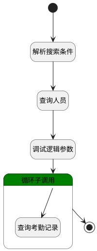

## 月度统计 <!-- {docsify-ignore-all} -->

   

### 处理过程




### 处理步骤说明

#### 开始 :id=Begin<sup class="footnote-symbol"> <font color=gray size=1>[开始]</font></sup>


*- N/A*
#### 解析搜索条件 :id=RAWSFCODE2<sup class="footnote-symbol"> <font color=gray size=1>[直接后台代码]</font></sup>


<p class="panel-title"><b>执行代码[Groovy]</b></p>

```groovy
def _default = logic.param('Default').getReal()

if (_default.get("n_member_id_in") != null && _default.get("n_member_id_in") != "") {
    def person_range = _default.get("n_member_id_in")
    def depts = []
    def persons = []
    person_range.each { item ->
        if (item.type == "dept") {
            depts.add(item.id)
        } else {
            persons.add(item.id)
        }
    }
    def deptStr = depts ? depts.join(",") : ""
    def personStr = persons ? persons.join(",") : ""
    if (deptStr != "" && personStr != "") {
        _default.and().or().in('dept_id', deptStr).in('id', personStr)
    } else if (deptStr != "" && personStr == "") {
        _default.in('dept_id', deptStr)
    } else {
        _default.in('id', personStr)
    }
}
```

#### 查询人员 :id=DEDATASET1<sup class="footnote-symbol"> <font color=gray size=1>[实体数据集]</font></sup>


调用实体 [员工信息(EMPLOYEE)](module/employee_management/employee.md) 数据集合 [员工(user)](module/employee_management/employee#数据集合) ，查询参数为`Default(传入变量)`

将执行结果返回给参数`emp_page(人员分页结果)`

#### 循环子调用 :id=LOOPSUBCALL1<sup class="footnote-symbol"> <font color=gray size=1>[循环子调用]</font></sup>


循环参数`emp_page(人员分页结果)`，子循环参数使用`emp_temp(人员-循环临时变量)`
#### 查询考勤记录 :id=RAWSFCODE1<sup class="footnote-symbol"> <font color=gray size=1>[直接后台代码]</font></sup>


<p class="panel-title"><b>执行代码[Groovy]</b></p>

```groovy
def _default = logic.param('Default').getReal()
def emp_temp = logic.param('emp_temp').getReal()

def n_checkin_date_gtandeq = _default.get('n_checkin_date_gtandeq')
def n_checkin_date_ltandeq = _default.get('n_checkin_date_ltandeq')

//获取`考勤记录`实体运行对象
def record_runtime = sys.dataentity('attendance_record')
def record_filter = record_runtime.filter()
record_filter.all()
record_filter.eq('member_id', emp_temp.get("id"))
if (n_checkin_date_gtandeq != null && n_checkin_date_ltandeq != null) {
    record_filter.gte('checkin_date', n_checkin_date_gtandeq)
    record_filter.lte('checkin_date', n_checkin_date_ltandeq)
}
// def page = record_filter.select('')

record_filter.setPageable(0,1000,0)
def page = record_filter.fetch()

// 早退分钟数 
def leave_early_minutes = 0
// 迟到时间
def late_time = 0
// 加班时间 
def overtime_time = 0
// 计薪时长
def billable_time = 0
// 工作时长
def working_time = 0
// 迟到分钟数
def late_minutes = 0
// 应出勤时长
def should_attendance_time = 0
// 加班小时数
def overtime_hours = 0
// 早退时间
def leave_early_time = 0
// 实际出勤时长（小时）
def working_hours = 0
// 实际出勤天数
def actual_attendance_days = 0
// 应出勤天数 
def should_attendance_days = 0
// 上班缺卡 
def on_missing = 0
// 下班缺卡 
def off_missing = 0
// 迟到次数 
def late_times = 0
// 早退次数 
def leave_early_times = 0
// 旷工天数 
def absent_days = 0
def map = new HashMap()

if(page != null){
    //循环汇总
    page.each { item ->
        def checkin_date = item.get('checkin_date').toString().substring(0, 10)
        map.put(checkin_date, item)
        leave_early_minutes += item.get("leave_early_minutes")?:0
        late_time += item.get("late_time")?:0
        overtime_time += item.get("overtime_time")?:0
        working_time += item.get("working_time")?:0
        late_minutes += item.get("late_minutes")?:0
        should_attendance_time += item.get("should_attendance_hours")?:0
        overtime_hours += item.get("overtime_hours")?:0
        leave_early_time += item.get("leave_early_time")?:0
        working_hours += item.get("working_hours")?:0
        actual_attendance_days += item.get("actual_attendance_days")?:0
        should_attendance_days += item.get("should_attendance_days")?:0
        def details = item.get("details")
        if (details != null) {
            details.each { it ->
                if (it.get("checkin_result") == "ON_MISSING") {
                    on_missing++
                }
                if (it.get("checkin_result") == "OFF_MISSING") {
                    off_missing++
                }
                if (it.get("checkin_result") == "LATE") {
                    late_times++
                }
                if (it.get("checkin_result") == "LEAVE_EARLY") {
                    leave_early_times++
                }
            }
        }
        if (item.get("checkin_result") == "ABSENT") {
            absent_days++
            billable_time += item.get("should_attendance_hours")?:0
        }
    }
    billable_time = should_attendance_time - billable_time
}

emp_temp.set('dept_name', emp_temp.get("department_name"))
emp_temp.set('attendance_data', map)
emp_temp.set('member_name', emp_temp.get("name"))
emp_temp.set('leave_early_minutes', leave_early_minutes)
emp_temp.set('late_time', late_time)
emp_temp.set('overtime_time', overtime_time)
emp_temp.set('billable_time', billable_time)
emp_temp.set('working_time', working_time)
emp_temp.set('late_minutes', late_minutes)
emp_temp.set('should_attendance_time', should_attendance_time)
emp_temp.set('overtime_hours', overtime_hours)
emp_temp.set('leave_early_time', leave_early_time)
emp_temp.set('working_hours', working_hours)
emp_temp.set('actual_attendance_days', actual_attendance_days)
emp_temp.set('should_attendance_days', should_attendance_days)
emp_temp.set('on_missing', on_missing)
emp_temp.set('off_missing', off_missing)
emp_temp.set('late_times', late_times)
emp_temp.set('leave_early_times', leave_early_times)
emp_temp.set('absent_days', absent_days)

//获取`申请`实体运行对象
def applicant_id = emp_temp.get("id");
def attendance_checkin_application_runtime = sys.dataentity('attendance_checkin_application');
def attendance_checkin_application_filter = attendance_checkin_application_runtime.filter();
attendance_checkin_application_filter.all();
if (n_checkin_date_gtandeq != null && n_checkin_date_ltandeq != null) {
    attendance_checkin_application_filter.gte('start_time', n_checkin_date_gtandeq);
    attendance_checkin_application_filter.lte('start_time', n_checkin_date_ltandeq);
}
attendance_checkin_application_filter.eq('status', "APPROVED");
attendance_checkin_application_filter.eq('applicant_id', applicant_id);
def attendance_checkin_application_list = attendance_checkin_application_filter.select('');

// 请假时长
def leave_duration = 0;
// 补卡次数
def reissue = 0;
// 出差天数
def business_trip = 0;
// 外出时长
def go_out_times = 0;
// 年假
def annual_leave = 0;
// 事假
def compassionate_leave = 0;
// 调休假
def vacation_leave = 0;
// 病假
def sick_leave = 0;
// 育儿假
def parental_leave = 0;
// 陪产假
def paternity_leave = 0;
// 婚假
def marriage_holiday = 0;
// 丧假
def funeral_leave = 0;
// 产假
def maternity_leave = 0;
// 申请加班时长(计加班费)
def pay_overtimes = 0
// 申请加班时长(计调休假)
def rest_overtimes = 0

if(attendance_checkin_application_list != null){
    //循环汇总
    attendance_checkin_application_list.each { item ->
        if (item.get("apply_type") == "REISSUE") {
            reissue ++;
        } else if (item.get("apply_type") == "GO_OUT") {
            go_out_times += item.get("hours") ?: 0;
        } else if (item.get("apply_type") == "BUSINESS_TRIP") {
            business_trip += item.get("days") ?: 0;
        } else if (item.get("apply_type") == "LEAVE" && item.get("leave_type") == "annual_leave") {
            annual_leave += item.get("hours") ?: 0;
            leave_duration += item.get("hours") ?: 0;
        } else if (item.get("apply_type") == "LEAVE" && item.get("leave_type") == "compassionate_leave") {
            compassionate_leave += item.get("hours") ?: 0;
            leave_duration += item.get("hours") ?: 0;
        } else if (item.get("apply_type") == "LEAVE" && item.get("leave_type") == "vacation_leave") {
            vacation_leave += item.get("hours") ?: 0;
            leave_duration += item.get("hours") ?: 0;
        } else if (item.get("apply_type") == "LEAVE" && item.get("leave_type") == "sick_leave") {
            sick_leave += item.get("hours") ?: 0;
            leave_duration += item.get("hours") ?: 0;
        } else if (item.get("apply_type") == "LEAVE" && item.get("leave_type") == "parental_leave") {
            parental_leave += item.get("hours") ?: 0;
            leave_duration += item.get("hours") ?: 0;
        } else if (item.get("apply_type") == "LEAVE" && item.get("leave_type") == "paternity_leave") {
            paternity_leave += item.get("hours") ?: 0;
            leave_duration += item.get("hours") ?: 0;
        } else if (item.get("apply_type") == "LEAVE" && item.get("leave_type") == "marriage_holiday") {
            marriage_holiday += item.get("hours") ?: 0;
            leave_duration += item.get("hours") ?: 0;
        } else if (item.get("apply_type") == "LEAVE" && item.get("leave_type") == "funeral_leave") {
            funeral_leave += item.get("hours") ?: 0;
            leave_duration += item.get("hours") ?: 0;
        } else if (item.get("apply_type") == "LEAVE" && item.get("leave_type") == "maternity_leave") {
            maternity_leave += item.get("hours") ?: 0;
            leave_duration += item.get("hours") ?: 0;
        } else if (item.get("apply_type") == "OVERTIME" && item.get("overtime_type") == "0") {
            pay_overtimes += item.get("hours") ?: 0;
        } else if (item.get("apply_type") == "OVERTIME" && item.get("overtime_type") == "1") {
            rest_overtimes += item.get("hours") ?: 0;
        }
    }
}

emp_temp.set('leave_duration', leave_duration)
emp_temp.set('out_time', go_out_times)
emp_temp.set('make_card_times', reissue)
emp_temp.set('on_business_days', business_trip)
emp_temp.set('annual_leave', annual_leave)
emp_temp.set('compassionate_leave', compassionate_leave)
emp_temp.set('vacation_leave', vacation_leave)
emp_temp.set('sick_leave', sick_leave)
emp_temp.set('parental_leave', parental_leave)
emp_temp.set('paternity_leave', paternity_leave)
emp_temp.set('marriage_holiday', marriage_holiday)
emp_temp.set('funeral_leave', funeral_leave)
emp_temp.set('maternity_leave', maternity_leave)

// 加班时长(计调休假)(小时)
def rest_overtime_time = 0;
// 加班时长(计加班费)(小时)
def pay_overtime_time = 0;

pay_overtime_time = pay_overtimes + overtime_hours
rest_overtime_time = rest_overtimes + overtime_hours

emp_temp.set('rest_overtime_time', rest_overtime_time)
emp_temp.set('pay_overtime_time', pay_overtime_time)
```

#### 调试逻辑参数 :id=DEBUGPARAM_01<sup class="footnote-symbol"> <font color=gray size=1>[调试逻辑参数]</font></sup>


> [!NOTE|label:调试信息|icon:fa fa-bug]
> 调试输出参数`emp_page(人员分页结果)`的详细信息


#### 结束 :id=END1<sup class="footnote-symbol"> <font color=gray size=1>[结束]</font></sup>


返回 `emp_page(人员分页结果)`


### 实体逻辑参数

|    中文名   |    代码名    |  数据类型    |  实体   |备注 |
| --------| --------| -------- | -------- | --------   |
|传入变量(<i class="fa fa-check"/></i>)|Default|过滤器|||
|人员分页结果|emp_page|分页查询|||
|人员-循环临时变量|emp_temp|数据对象|[员工信息(EMPLOYEE)](module/employee_management/employee.md)||
