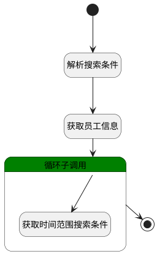

## 获取员工信息(特定搜索条件) <!-- {docsify-ignore-all} -->

   

### 处理过程




### 处理步骤说明

#### 开始 :id=Begin<sup class="footnote-symbol"> <font color=gray size=1>[开始]</font></sup>


*- N/A*
#### 解析搜索条件 :id=RAWSFCODE1<sup class="footnote-symbol"> <font color=gray size=1>[直接后台代码]</font></sup>


<p class="panel-title"><b>执行代码[Groovy]</b></p>

```groovy
def _default = logic.param('Default').getReal()
def person_range = _default.get("n_member_id_in") 
if (person_range!= null && person_range != "") {
    def depts = []
    def persons = []
    person_range.each { item ->
        if (item.type == "dept") {
            depts.add(item.id)
        } else {
            persons.add(item.id)
        }
    }
    def deptStr = depts ? depts.join(",") : ""
    def personStr = persons ? persons.join(",") : ""
    if (deptStr != "" && personStr != "") {
        _default.and().or().in('dept_id', deptStr).in('id', personStr)
    } else if (deptStr != "" && personStr == "") {
        _default.in('dept_id', deptStr)
    } else {
        _default.in('id', personStr)
    }
}
```

#### 获取员工信息 :id=DEDATASET1<sup class="footnote-symbol"> <font color=gray size=1>[实体数据集]</font></sup>


调用实体 [员工信息(EMPLOYEE)](module/employee_management/employee.md) 数据集合 [员工(user)](module/employee_management/employee#数据集合) ，查询参数为`Default(传入变量)`

将执行结果返回给参数`page(查询分页结果)`

#### 循环子调用 :id=LOOPSUBCALL1<sup class="footnote-symbol"> <font color=gray size=1>[循环子调用]</font></sup>


循环参数`page(查询分页结果)`，子循环参数使用`temp(人员临时变量)`
#### 获取时间范围搜索条件 :id=RAWSFCODE2<sup class="footnote-symbol"> <font color=gray size=1>[直接后台代码]</font></sup>


<p class="panel-title"><b>执行代码[Groovy]</b></p>

```groovy
def _default = logic.param('Default').getReal()
def temp = logic.param('temp').getReal()

def n_checkin_date_gtandeq = _default.get('n_checkin_date_gtandeq')
def n_checkin_date_ltandeq = _default.get('n_checkin_date_ltandeq')

if (n_checkin_date_gtandeq != null && n_checkin_date_ltandeq != null) {
    temp.set("n_checkin_date_gtandeq", n_checkin_date_gtandeq)
    temp.set("n_checkin_date_ltandeq", n_checkin_date_ltandeq)
}
```

#### 结束 :id=END1<sup class="footnote-symbol"> <font color=gray size=1>[结束]</font></sup>


返回 `page(查询分页结果)`


### 实体逻辑参数

|    中文名   |    代码名    |  数据类型    |  实体   |备注 |
| --------| --------| -------- | -------- | --------   |
|传入变量(<i class="fa fa-check"/></i>)|Default|过滤器|||
|查询分页结果|page|分页查询|||
|人员临时变量|temp|数据对象|[员工信息(EMPLOYEE)](module/employee_management/employee.md)||
