## 我的部门 <!-- {docsify-ignore-all} -->

   

### 处理过程

```plantuml
@startuml
hide empty description
<style>
root {
  HyperlinkColor #42b983
}
</style>

hide empty description
state "开始" as Begin <<start>> [[$./my_dept#begin {"开始"}]]
state "执行脚本代码" as RAWSFCODE1  [[$./my_dept#rawsfcode1 {"执行脚本代码"}]]
state "实体数据集" as DEDATASET1  [[$./my_dept#dedataset1 {"实体数据集"}]]
state "结束" as END1 <<end>> [[$./my_dept#end1 {"结束"}]]


Begin --> RAWSFCODE1
RAWSFCODE1 --> DEDATASET1
DEDATASET1 --> END1


@enduml
```




### 处理步骤说明

#### 开始 :id=Begin<sup class="footnote-symbol"> <font color=gray size=1>[开始]</font></sup>


*- N/A*
#### 执行脚本代码 :id=RAWSFCODE1<sup class="footnote-symbol"> <font color=gray size=1>[直接后台代码]</font></sup>


<p class="panel-title"><b>执行代码[Groovy]</b></p>

```groovy
def _default = logic.param('Default').getReal()
def filter = logic.param('filter').getReal()

filter.all()
def reserver14 = _default.get("reserver14")
def dept = _default.get("srfpdept")

if (reserver14 == 1 || dept == null || dept == "") {
    filter.nvl('parent_id')
} else {
    filter.eq('id', dept)
}
```

#### 实体数据集 :id=DEDATASET1<sup class="footnote-symbol"> <font color=gray size=1>[实体数据集]</font></sup>


调用实体 [部门信息(DEPARTMENT)](module/employee_management/department.md) 数据集合 [部门(dept)](module/employee_management/department#数据集合) ，查询参数为`filter`

将执行结果返回给参数`page`

#### 结束 :id=END1<sup class="footnote-symbol"> <font color=gray size=1>[结束]</font></sup>


返回 `page`


### 实体逻辑参数

|    中文名   |    代码名    |  数据类型    |  实体   |备注 |
| --------| --------| -------- | -------- | --------   |
|传入变量(<i class="fa fa-check"/></i>)|Default|过滤器|||
|filter|filter|过滤器|||
|page|page|分页查询|||
