## 查询部门/人员 <!-- {docsify-ignore-all} -->

   

### 处理过程

```plantuml
@startuml
hide empty description
<style>
root {
  HyperlinkColor #42b983
}
</style>

hide empty description
state "开始" as Begin <<start>> [[$./queryDeptUser#begin {"开始"}]]
state "结束" as END_01 <<end>> [[$./queryDeptUser#end_01 {"结束"}]]
state "获取人员" as DEACTION_01  [[$./queryDeptUser#deaction_01 {"获取人员"}]]
state "获取部门" as DEACTION_02  [[$./queryDeptUser#deaction_02 {"获取部门"}]]
state "结束" as END_02 <<end>> [[$./queryDeptUser#end_02 {"结束"}]]


Begin --> DEACTION_01
DEACTION_01 --> DEACTION_02 : [[$./queryDeptUser#deaction_01-deaction_02{连接名称} 连接名称]]
DEACTION_02 --> END_01
DEACTION_01 --> END_02 : [[$./queryDeptUser#deaction_01-end_02{连接名称} 连接名称]]


@enduml
```

### 处理步骤说明

#### 开始 :id=Begin [开始]

*- N/A*
#### 结束 :id=END_01 [结束]

返回 `dept`

#### 获取人员 :id=DEACTION_01 [实体行为]

调用实体 [员工信息(EMPLOYEE)](module/employee_management/employee.md) 行为 [Get](module/employee_management/employee#行为) ，行为参数为`Default(传入变量)`

将执行结果返回给参数`Default(传入变量)`

#### 获取部门 :id=DEACTION_02 [实体行为]

调用实体 [部门信息(DEPARTMENT)](module/employee_management/department.md) 行为 [Get](module/employee_management/department#行为) ，行为参数为`Default(传入变量)`

将执行结果返回给参数`dept`

#### 结束 :id=END_02 [结束]

返回 `Default(传入变量)`

### 连接条件说明
#### 连接名称 :id=DEACTION_01-DEACTION_02

`employee(employee)` ISNULL
#### 连接名称 :id=DEACTION_01-END_02

`employee(employee)` ISNOTNULL

### 实体逻辑参数

|    中文名   |    代码名    |  数据类型    |  实体   |备注 |
| --------| --------| -------- | -------- | --------   |
|传入变量(<i class="fa fa-check"/></i>)|Default|数据对象|[用户对象映射(USER_OBJECT)](module/employee_management/user_object.md)||
|dept|dept|数据对象|[部门信息(DEPARTMENT)](module/employee_management/department.md)||
|employee|employee|数据对象|[员工信息(EMPLOYEE)](module/employee_management/employee.md)||
