## 计算工作、加班时间 <!-- {docsify-ignore-all} -->

   

### 处理过程

```plantuml
@startuml
hide empty description
<style>
root {
  HyperlinkColor #42b983
}
</style>

hide empty description
state "开始" as Begin <<start>> [[$./ComputeWorkHour#begin {"开始"}]]
state "实体行为" as DEACTION_01  [[$./ComputeWorkHour#deaction_01 {"实体行为"}]]
state "结束" as END_01 <<end>> [[$./ComputeWorkHour#end_01 {"结束"}]]


Begin --> DEACTION_01
DEACTION_01 --> END_01


@enduml
```

### 处理步骤说明

#### 实体行为 :id=DEACTION_01 [实体行为]

调用实体 [出勤(HR_ATTENDANCE)](module/hr/hr_attendance.md) 行为 [计算工作时间、加班时间(ComputeWorkHour)](module/hr/hr_attendance#行为) ，行为参数为`Default(传入变量)`

#### 开始 :id=Begin [开始]

*- N/A*
#### 结束 :id=END_01 [结束]

*- N/A*

### 实体逻辑参数

|    中文名   |    代码名    |  数据类型    |  实体   |备注 |
| --------| --------| -------- | -------- | --------   |
|传入变量(<i class="fa fa-check"/></i>)|Default|数据对象|[出勤(HR_ATTENDANCE)](module/hr/hr_attendance.md)||
