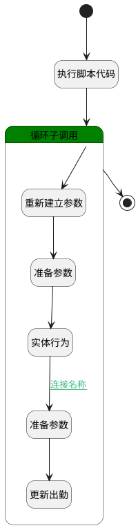

## 批量审批 <!-- {docsify-ignore-all} -->

   

### 处理过程




### 处理步骤说明

#### 执行脚本代码 :id=RAWSFCODE_01<sup class="footnote-symbol"> <font color=gray size=1>[直接后台代码]</font></sup>


<p class="panel-title"><b>执行代码[JavaScript]</b></p>

```javascript
null
```

#### 循环子调用 :id=LOOPSUBCALL_01<sup class="footnote-symbol"> <font color=gray size=1>[循环子调用]</font></sup>


循环参数`attendances`，子循环参数使用`temp`
#### 重新建立参数 :id=RENEWPARAM_01<sup class="footnote-symbol"> <font color=gray size=1>[重新建立参数]</font></sup>


重建参数```attendance(attendance)```
#### 实体行为 :id=DEACTION_01<sup class="footnote-symbol"> <font color=gray size=1>[实体行为]</font></sup>


调用实体 [出勤(HR_ATTENDANCE)](module/hr/hr_attendance.md) 行为 [Get](module/hr/hr_attendance#行为) ，行为参数为`attendance`

将执行结果返回给参数`attendance`

#### 准备参数 :id=PREPAREPARAM_02<sup class="footnote-symbol"> <font color=gray size=1>[准备参数]</font></sup>


1. 将`temp.OVERTIME_STATUS(加班状态)` 设置给  `attendance.OVERTIME_STATUS(加班状态)`

#### 更新出勤 :id=DEACTION_02<sup class="footnote-symbol"> <font color=gray size=1>[实体行为]</font></sup>


调用实体 [出勤(HR_ATTENDANCE)](module/hr/hr_attendance.md) 行为 [Update](module/hr/hr_attendance#行为) ，行为参数为`attendance`

#### 开始 :id=Begin<sup class="footnote-symbol"> <font color=gray size=1>[开始]</font></sup>


*- N/A*
#### 准备参数 :id=PREPAREPARAM_01<sup class="footnote-symbol"> <font color=gray size=1>[准备参数]</font></sup>


1. 将`temp.ID(标识)` 设置给  `attendance.ID(标识)`

#### 结束 :id=END_01<sup class="footnote-symbol"> <font color=gray size=1>[结束]</font></sup>


*- N/A*


### 连接条件说明
#### 连接名称 :id=DEACTION_01-PREPAREPARAM_02

`attendance(attendance)` ISNOTNULL AND `attendance(attendance).CHECK_OUT(签离)` ISNOTNULL AND `attendance(attendance).CHECK_IN(签到)` ISNOTNULL


### 实体逻辑参数

|    中文名   |    代码名    |  数据类型    |  实体   |备注 |
| --------| --------| -------- | -------- | --------   |
|传入变量(<i class="fa fa-check"/></i>)|Default|数据对象|[出勤(HR_ATTENDANCE)](module/hr/hr_attendance.md)||
|attendance|attendance|数据对象|[出勤(HR_ATTENDANCE)](module/hr/hr_attendance.md)||
|attendances|attendances|数据对象列表|[出勤(HR_ATTENDANCE)](module/hr/hr_attendance.md)||
|temp|temp|数据对象|[出勤(HR_ATTENDANCE)](module/hr/hr_attendance.md)||
