## 其他工时计算 <!-- {docsify-ignore-all} -->

   

### 处理过程

```plantuml
@startuml
hide empty description
<style>
root {
  HyperlinkColor #42b983
}
</style>

hide empty description
state "开始" as Begin <<start>> [[$./calcOther#begin {"开始"}]]
state "有效加班时间" as RAWSFCODE_01  [[$./calcOther#rawsfcode_01 {"有效加班时间"}]]
state "结束" as END_01 <<end>> [[$./calcOther#end_01 {"结束"}]]
state "调试逻辑参数" as DEBUGPARAM_01  [[$./calcOther#debugparam_01 {"调试逻辑参数"}]]


Begin --> DEBUGPARAM_01
DEBUGPARAM_01 --> RAWSFCODE_01
RAWSFCODE_01 --> END_01


@enduml
```




### 处理步骤说明

#### 有效加班时间 :id=RAWSFCODE_01<sup class="footnote-symbol"> <font color=gray size=1>[直接后台代码]</font></sup>


<p class="panel-title"><b>执行代码[Groovy]</b></p>

```groovy
def _default = logic.param('Default').getReal()
def overtime_status = _default.get("overtime_status")
if(_default.get("check_out")){
    if(overtime_status == "to_approve"){
        _default.set("validated_overtime_hours",_default.get("overtime_hours"))
    }
    if(overtime_status == "refused"){
        _default.set("validated_overtime_hours",0)
    }
    def expected_hours = _default.get("worked_hours")?:0 - _default.get("overtime_hours")?:0
    _default.set("expected_hours",expected_hours)
}else {
    _default.set("validated_overtime_hours",0)
    _default.set("expected_hours",0)
}

```

#### 开始 :id=Begin<sup class="footnote-symbol"> <font color=gray size=1>[开始]</font></sup>


*- N/A*
#### 结束 :id=END_01<sup class="footnote-symbol"> <font color=gray size=1>[结束]</font></sup>


返回 `Default(传入变量)`

#### 调试逻辑参数 :id=DEBUGPARAM_01<sup class="footnote-symbol"> <font color=gray size=1>[调试逻辑参数]</font></sup>


> [!NOTE|label:调试信息|icon:fa fa-bug]
> 调试输出参数`Default(传入变量)`的详细信息


### 实体逻辑参数

|    中文名   |    代码名    |  数据类型    |  实体   |备注 |
| --------| --------| -------- | -------- | --------   |
|传入变量(<i class="fa fa-check"/></i>)|Default|数据对象|[出勤(HR_ATTENDANCE)](module/hr/hr_attendance.md)||
