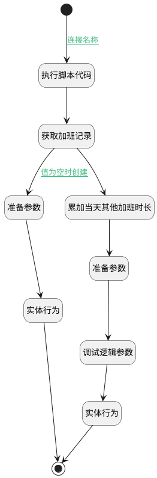

## 更新/创建加班记录 <!-- {docsify-ignore-all} -->

   

### 处理过程




### 处理步骤说明

#### 执行脚本代码 :id=RAWSFCODE_01<sup class="footnote-symbol"> <font color=gray size=1>[直接后台代码]</font></sup>


<p class="panel-title"><b>执行代码[Groovy]</b></p>

```groovy
def _default = logic.param('Default').getReal()
def check_in = _default.get("check_in")
def startOfDayFormat = new java.text.SimpleDateFormat("yyyy-MM-dd 00:00:00")
def startOfDay = startOfDayFormat.format(check_in) 
_default.set("dateOnly", startOfDay)
if(!_default.get("overtime_hours")){
    _default.set("overtime_hours", 0)
}
```

#### 开始 :id=Begin<sup class="footnote-symbol"> <font color=gray size=1>[开始]</font></sup>


*- N/A*
#### 获取加班记录 :id=RAWSQLCALL_01<sup class="footnote-symbol"> <font color=gray size=1>[直接SQL调用]</font></sup>


<p class="panel-title"><b>执行sql语句</b></p>

```sql
select
	*
from
	hr_attendance_overtime
where
	`DATE` = DATE(?) 
	and EMPLOYEE_ID = ?
LIMIT 1;
```

<p class="panel-title"><b>执行sql参数</b></p>

1. `Default(传入变量).CHECK_IN(签到)`
2. `Default(传入变量).EMPLOYEE_ID(员工)`

将执行sql结果赋值给参数`over_time(加班记录)`

#### 准备参数 :id=PREPAREPARAM_01<sup class="footnote-symbol"> <font color=gray size=1>[准备参数]</font></sup>


1. 将`Default(传入变量).OVERTIME_HOURS(随着时间的推移)` 设置给  `over_time(加班记录).DURATION(加班时间)`
2. 将`Default(传入变量).OVERTIME_HOURS(随着时间的推移)` 设置给  `over_time(加班记录).DURATION_REAL(加班时间（真实）)`
3. 将`Default(传入变量).EMPLOYEE_ID(员工)` 设置给  `over_time(加班记录).EMPLOYEE_ID(员工)`
4. 将`Default(传入变量).dateOnly` 设置给  `over_time(加班记录).DATE(天)`

#### 累加当天其他加班时长 :id=RAWSQLCALL_02<sup class="footnote-symbol"> <font color=gray size=1>[直接SQL调用]</font></sup>


<p class="panel-title"><b>执行sql语句</b></p>

```sql
SELECT COALESCE(SUM(OVERTIME_HOURS), 0)+? AS total_overtime_hours
FROM hr_attendance
WHERE employee_id = ?
  AND DATE(check_in) = DATE(?) 
  AND check_out IS NOT NULL 
  AND id != ?
  AND OVERTIME_STATUS = 'approved'
```

<p class="panel-title"><b>执行sql参数</b></p>

1. `Default(传入变量).OVERTIME_HOURS(随着时间的推移)`
2. `Default(传入变量).EMPLOYEE_ID(员工)`
3. `Default(传入变量).CHECK_IN(签到)`
4. `Default(传入变量).ID(标识)`

将执行sql结果赋值给参数`sum_over(sum_over)`

#### 准备参数 :id=PREPAREPARAM_02<sup class="footnote-symbol"> <font color=gray size=1>[准备参数]</font></sup>


1. 将`sum_over.total_overtime_hours` 设置给  `over_time(加班记录).DURATION_REAL(加班时间（真实）)`
2. 将`sum_over.total_overtime_hours` 设置给  `over_time(加班记录).DURATION(加班时间)`

#### 实体行为 :id=DEACTION_01<sup class="footnote-symbol"> <font color=gray size=1>[实体行为]</font></sup>


调用实体 [出勤 加班(HR_ATTENDANCE_OVERTIME)](module/hr/hr_attendance_overtime.md) 行为 [Create](module/hr/hr_attendance_overtime#行为) ，行为参数为`over_time(加班记录)`

#### 调试逻辑参数 :id=DEBUGPARAM_01<sup class="footnote-symbol"> <font color=gray size=1>[调试逻辑参数]</font></sup>


> [!NOTE|label:调试信息|icon:fa fa-bug]
> 调试输出参数`over_time(加班记录)`的详细信息


#### 实体行为 :id=DEACTION_02<sup class="footnote-symbol"> <font color=gray size=1>[实体行为]</font></sup>


调用实体 [出勤 加班(HR_ATTENDANCE_OVERTIME)](module/hr/hr_attendance_overtime.md) 行为 [Update](module/hr/hr_attendance_overtime#行为) ，行为参数为`over_time(加班记录)`

#### 结束 :id=END_01<sup class="footnote-symbol"> <font color=gray size=1>[结束]</font></sup>


返回 `Default(传入变量)`


### 连接条件说明
#### 连接名称 :id=Begin-RAWSFCODE_01

`Default(传入变量).CHECK_IN(签到)` ISNOTNULL AND `Default(传入变量).CHECK_OUT(签离)` ISNOTNULL
#### 值为空时创建 :id=RAWSQLCALL_01-PREPAREPARAM_01

`over_time(加班记录).ID(标识)` ISNULL


### 实体逻辑参数

|    中文名   |    代码名    |  数据类型    |  实体   |备注 |
| --------| --------| -------- | -------- | --------   |
|传入变量(<i class="fa fa-check"/></i>)|Default|数据对象|[出勤(HR_ATTENDANCE)](module/hr/hr_attendance.md)||
|加班记录|over_time|数据对象|[出勤 加班(HR_ATTENDANCE_OVERTIME)](module/hr/hr_attendance_overtime.md)||
|sum_over|sum_over|数据对象|||
