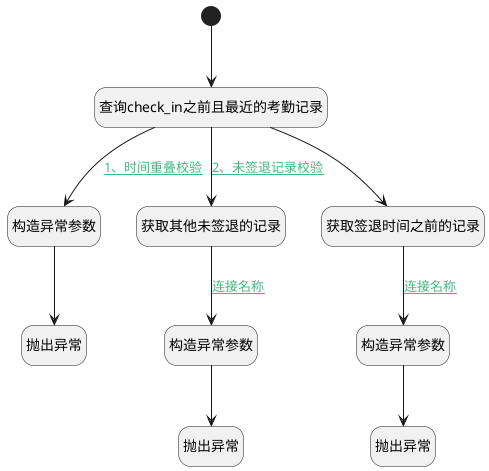

## 保存校验 <!-- {docsify-ignore-all} -->

   

### 处理过程




### 处理步骤说明

#### 开始 :id=Begin<sup class="footnote-symbol"> <font color=gray size=1>[开始]</font></sup>


*- N/A*
#### 查询check_in之前且最近的考勤记录 :id=RAWSQLCALL_01<sup class="footnote-symbol"> <font color=gray size=1>[直接SQL调用]</font></sup>


<p class="panel-title"><b>执行sql语句</b></p>

```sql
SELECT * 
FROM hr_attendance 
WHERE employee_id = ?
  AND check_in <= ?
  AND id != ?
ORDER BY check_in DESC 
LIMIT 1;
```

<p class="panel-title"><b>执行sql参数</b></p>

1. `Default(传入变量).EMPLOYEE_ID(员工)`
2. `Default(传入变量).CHECK_IN(签到)`
3. `Default(传入变量).ID(标识)`

将执行sql结果赋值给参数`before_check_in(before_check_in)`

#### 构造异常参数 :id=PREPAREPARAM_01<sup class="footnote-symbol"> <font color=gray size=1>[准备参数]</font></sup>


1. 将`Default(传入变量).EMPLOYEE_NAME(员工)` 设置给  `errorMessage(异常).employee_name`
2. 将`before_check_in.CHECK_IN(签到)` 设置给  `errorMessage(异常).check_time`

#### 获取其他未签退的记录 :id=RAWSQLCALL_02<sup class="footnote-symbol"> <font color=gray size=1>[直接SQL调用]</font></sup>


<p class="panel-title"><b>执行sql语句</b></p>

```sql
SELECT * 
FROM hr_attendance 
WHERE employee_id = ?
  AND check_out is null
  AND id != ?
ORDER BY check_in DESC 
LIMIT 1;
```

<p class="panel-title"><b>执行sql参数</b></p>

1. `Default(传入变量).EMPLOYEE_ID(员工)`
2. `Default(传入变量).ID(标识)`

重置参数`no_check_out(未签退出勤记录)`，并将执行sql结果赋值给参数`no_check_out(未签退出勤记录)`

#### 获取签退时间之前的记录 :id=RAWSQLCALL_03<sup class="footnote-symbol"> <font color=gray size=1>[直接SQL调用]</font></sup>


<p class="panel-title"><b>执行sql语句</b></p>

```sql
SELECT * 
FROM hr_attendance 
WHERE employee_id = ?
  AND check_in < ?
  AND id != ?
ORDER BY check_in DESC 
LIMIT 1;
```

<p class="panel-title"><b>执行sql参数</b></p>

1. `Default(传入变量).EMPLOYEE_ID(员工)`
2. `Default(传入变量).CHECK_OUT(签离)`
3. `Default(传入变量).ID(标识)`

将执行sql结果赋值给参数`before_check_out(before_check_out)`

#### 构造异常参数 :id=PREPAREPARAM_03<sup class="footnote-symbol"> <font color=gray size=1>[准备参数]</font></sup>


1. 将`null` 重新建立为  `errorMessage(异常)`
2. 将`before_check_out.CHECK_IN(签到)` 设置给  `errorMessage(异常).check_time`
3. 将`Default(传入变量).EMPLOYEE_NAME(员工)` 设置给  `errorMessage(异常).employee_name`

#### 构造异常参数 :id=PREPAREPARAM_02<sup class="footnote-symbol"> <font color=gray size=1>[准备参数]</font></sup>


1. 将`null` 重新建立为  `errorMessage(异常)`
2. 将`Default(传入变量).EMPLOYEE_NAME(员工)` 设置给  `errorMessage(异常).employee_name`
3. 将`no_check_out(未签退出勤记录).CHECK_IN(签到)` 设置给  `errorMessage(异常).check_time`

#### 抛出异常 :id=THROWEXCEPTION_01<sup class="footnote-symbol"> <font color=gray size=1>[抛出异常]</font></sup>


> [!ATTENTION|label:抛出异常|icon:fa fa-warning]
> 错误信息：无法为{employee_name}创建新的出勤记录, 该员工已在{check_time}中签到！

#### 抛出异常 :id=THROWEXCEPTION_03<sup class="footnote-symbol"> <font color=gray size=1>[抛出异常]</font></sup>


> [!ATTENTION|label:抛出异常|icon:fa fa-warning]
> 错误信息：无法为{employee_name}创建新的出勤记录, 该员工已在{check_time}中签到！

#### 抛出异常 :id=THROWEXCEPTION_02<sup class="footnote-symbol"> <font color=gray size=1>[抛出异常]</font></sup>


> [!ATTENTION|label:抛出异常|icon:fa fa-warning]
> 错误信息：无法为{employee_name}创建新的出勤记录, 因为{check_time}, 员工尚未签退！


### 连接条件说明
#### 1、时间重叠校验 :id=RAWSQLCALL_01-PREPAREPARAM_01

`before_check_in(before_check_in)` ISNOTNULL AND `before_check_in(before_check_in).CHECK_OUT(签离)` ISNOTNULL AND 
#### 2、未签退记录校验 :id=RAWSQLCALL_01-RAWSQLCALL_02

`Default(传入变量).CHECK_OUT(签离)` ISNULL
#### 连接名称 :id=RAWSQLCALL_02-PREPAREPARAM_02

`no_check_out(未签退出勤记录)` ISNOTNULL AND `no_check_out(未签退出勤记录).ID(标识)` ISNOTNULL
#### 连接名称 :id=RAWSQLCALL_03-PREPAREPARAM_03

`before_check_out(before_check_out)` ISNOTNULL AND `before_check_out(before_check_out).ID(标识)` ISNOTNULL AND 


### 实体逻辑参数

|    中文名   |    代码名    |  数据类型    |  实体   |备注 |
| --------| --------| -------- | -------- | --------   |
|传入变量(<i class="fa fa-check"/></i>)|Default|数据对象|[出勤(HR_ATTENDANCE)](module/hr/hr_attendance.md)||
|before_check_in|before_check_in|数据对象|[出勤(HR_ATTENDANCE)](module/hr/hr_attendance.md)||
|before_check_out|before_check_out|数据对象|[出勤(HR_ATTENDANCE)](module/hr/hr_attendance.md)||
|异常|errorMessage|数据对象|||
|未签退出勤记录|no_check_out|数据对象|[出勤(HR_ATTENDANCE)](module/hr/hr_attendance.md)||
