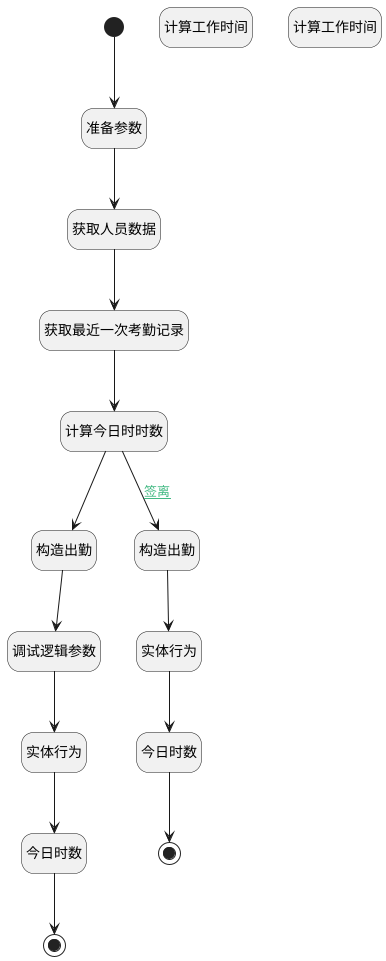

## 自助终端考勤 <!-- {docsify-ignore-all} -->

   

### 处理过程




### 处理步骤说明

#### 开始 :id=Begin<sup class="footnote-symbol"> <font color=gray size=1>[开始]</font></sup>


*- N/A*
#### 准备参数 :id=PREPAREPARAM_01<sup class="footnote-symbol"> <font color=gray size=1>[准备参数]</font></sup>


1. 将`Default(传入变量).hr_employee` 设置给  `emp.ID(标识)`

#### 获取人员数据 :id=DEACTION_05<sup class="footnote-symbol"> <font color=gray size=1>[实体行为]</font></sup>


调用实体 [员工(HR_EMPLOYEE)](module/hr/hr_employee.md) 行为 [Get](module/hr/hr_employee#行为) ，行为参数为`emp`

将执行结果返回给参数`emp`

#### 获取最近一次考勤记录 :id=RAWSQLCALL_01<sup class="footnote-symbol"> <font color=gray size=1>[直接SQL调用]</font></sup>


<p class="panel-title"><b>执行sql语句</b></p>

```sql
SELECT * 
FROM hr_attendance 
WHERE employee_id = ?
ORDER BY WRITE_DATE  DESC 
LIMIT 1;
```

<p class="panel-title"><b>执行sql参数</b></p>

1. `emp.ID(标识)`

将执行sql结果赋值给参数`last(last)`

#### 计算今日时时数 :id=RAWSQLCALL_02<sup class="footnote-symbol"> <font color=gray size=1>[直接SQL调用]</font></sup>


<p class="panel-title"><b>执行sql语句</b></p>

```sql
SELECT COALESCE(SUM(WORKED_HOURS), 0) AS hours_previously_today
FROM hr_attendance 
WHERE employee_id = ?
  AND DATE(CHECK_IN) = CURDATE();
```

<p class="panel-title"><b>执行sql参数</b></p>

1. `emp.ID(标识)`

将执行sql结果赋值给参数`hours_previously_today(今日工作时数)`

#### 调试逻辑参数 :id=DEBUGPARAM_01<sup class="footnote-symbol"> <font color=gray size=1>[调试逻辑参数]</font></sup>


> [!NOTE|label:调试信息|icon:fa fa-bug]
> 调试输出参数`new_attendance`的详细信息


#### 构造出勤 :id=RAWSFCODE_02<sup class="footnote-symbol"> <font color=gray size=1>[直接后台代码]</font></sup>


<p class="panel-title"><b>执行代码[Groovy]</b></p>

```groovy
def new_attendance = logic.param('new_attendance').getReal()
def emp = logic.param('emp').getReal()
def now = java.time.LocalDateTime.now()
def formatter = java.time.format.DateTimeFormatter.ofPattern("yyyy-MM-dd HH:mm:ss")

new_attendance.set("check_in",now.format(formatter))
new_attendance.set("in_mode","kiosk")
new_attendance.set("employee_id",emp.get("id"))
new_attendance.set("employee_name",emp.get("name"))
new_attendance.set("overtime_status","to_approve")
```

#### 构造出勤 :id=RAWSFCODE_01<sup class="footnote-symbol"> <font color=gray size=1>[直接后台代码]</font></sup>


<p class="panel-title"><b>执行代码[Groovy]</b></p>

```groovy
def last = logic.param('last').getReal()
def now = java.time.LocalDateTime.now()
def formatter = java.time.format.DateTimeFormatter.ofPattern("yyyy-MM-dd HH:mm:ss")

last.set("check_out", now.format(formatter))
last.set("out_mode", "kiosk")
last.set("overtime_status", "to_approve")
```

#### 计算工作时间 :id=DEACTION_01<sup class="footnote-symbol"> <font color=gray size=1>[实体行为]</font></sup>


调用实体 [出勤(HR_ATTENDANCE)](module/hr/hr_attendance.md) 行为 [计算工作时间、加班时间(ComputeWorkHour)](module/hr/hr_attendance#行为) ，行为参数为`last`

将执行结果返回给参数`last`

#### 实体行为 :id=DEACTION_04<sup class="footnote-symbol"> <font color=gray size=1>[实体行为]</font></sup>


调用实体 [出勤(HR_ATTENDANCE)](module/hr/hr_attendance.md) 行为 [Create](module/hr/hr_attendance#行为) ，行为参数为`new_attendance`

将执行结果返回给参数`new_attendance`

#### 计算工作时间 :id=DEACTION_03<sup class="footnote-symbol"> <font color=gray size=1>[实体行为]</font></sup>


调用实体 [出勤(HR_ATTENDANCE)](module/hr/hr_attendance.md) 行为 [计算工作时间、加班时间(ComputeWorkHour)](module/hr/hr_attendance#行为) ，行为参数为`new_attendance`

将执行结果返回给参数`new_attendance`

#### 实体行为 :id=DEACTION_02<sup class="footnote-symbol"> <font color=gray size=1>[实体行为]</font></sup>


调用实体 [出勤(HR_ATTENDANCE)](module/hr/hr_attendance.md) 行为 [Update](module/hr/hr_attendance#行为) ，行为参数为`last`

将执行结果返回给参数`last`

#### 今日时数 :id=RAWSFCODE_04<sup class="footnote-symbol"> <font color=gray size=1>[直接后台代码]</font></sup>


<p class="panel-title"><b>执行代码[Groovy]</b></p>

```groovy
def new_attendance = logic.param('new_attendance').getReal()
def res = logic.param('hours_previously_today').getReal()
def hours_previously_today = res.get("hours_previously_today") as BigDecimal

new_attendance.set("hours_previously_today",hours_previously_today.setScale(2, BigDecimal.ROUND_HALF_UP))
new_attendance.set("hours_today",hours_previously_today.setScale(2, BigDecimal.ROUND_HALF_UP))
new_attendance.set("attendance_state","checked_in")

// 签到时间处理
def check_in = new_attendance.get("check_in")
def inputFormat = new java.text.SimpleDateFormat("yyyy-MM-dd HH:mm:ss")
def outputFormat = new java.text.SimpleDateFormat("yyyy年MM月dd日 HH时mm分ss秒")
outputFormat.setTimeZone(TimeZone.getTimeZone("Asia/Shanghai"))

// 转换并存储结果
def formattedCheckOut = outputFormat.format(inputFormat.parse(check_in.toString()))
new_attendance.set("check_in_display", formattedCheckOut)
```

#### 今日时数 :id=RAWSFCODE_03<sup class="footnote-symbol"> <font color=gray size=1>[直接后台代码]</font></sup>


<p class="panel-title"><b>执行代码[Groovy]</b></p>

```groovy
def last = logic.param('last').getReal()
def res = logic.param('hours_previously_today').getReal()
def hours_previously_today = res.get("hours_previously_today") as BigDecimal

def worked_hours = last.get("worked_hours") as BigDecimal

// 计算并保留两位小数
def hours_today = (hours_previously_today + worked_hours).setScale(2, BigDecimal.ROUND_HALF_UP)

last.set("hours_today", hours_today)
last.set("hours_previously_today", hours_previously_today.setScale(2, BigDecimal.ROUND_HALF_UP))
last.set("attendance_state", "checked_out")

// 签退时间处理
def check_out = last.get("check_out")
def inputFormat = new java.text.SimpleDateFormat("yyyy-MM-dd HH:mm:ss")
def outputFormat = new java.text.SimpleDateFormat("yyyy年MM月dd日 HH时mm分ss秒")
outputFormat.setTimeZone(TimeZone.getTimeZone("Asia/Shanghai"))

// 转换并存储结果
def formattedCheckOut = outputFormat.format(inputFormat.parse(check_out.toString()))
last.set("check_out_display", formattedCheckOut)
```

#### 结束 :id=END_02<sup class="footnote-symbol"> <font color=gray size=1>[结束]</font></sup>


返回 `new_attendance`

#### 结束 :id=END_01<sup class="footnote-symbol"> <font color=gray size=1>[结束]</font></sup>


返回 `last`


### 连接条件说明
#### 签离 :id=RAWSQLCALL_02-RAWSFCODE_01

`last(last)` ISNOTNULL AND `last(last).CHECK_IN(签到)` ISNOTNULL AND `last(last).CHECK_OUT(签离)` ISNULL


### 实体逻辑参数

|    中文名   |    代码名    |  数据类型    |  实体   |备注 |
| --------| --------| -------- | -------- | --------   |
|传入变量(<i class="fa fa-check"/></i>)|Default|数据对象|[出勤(HR_ATTENDANCE)](module/hr/hr_attendance.md)||
|emp|emp|数据对象|[员工(HR_EMPLOYEE)](module/hr/hr_employee.md)||
|今日工作时数|hours_previously_today|数据对象|||
|last|last|数据对象|[出勤(HR_ATTENDANCE)](module/hr/hr_attendance.md)||
|new_attendance|new_attendance|数据对象|[出勤(HR_ATTENDANCE)](module/hr/hr_attendance.md)||
