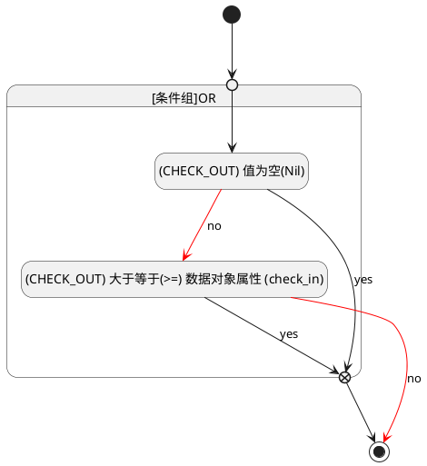

## 签离(CHECK_OUT) <!-- {docsify-ignore-all} -->

   

### 变更校验 :id=check_validity

#### 条件说明

##### (CHECK_OUT) 值为空(Nil) :id=aa1fa92f440931d83a9aa96e8886ff0a1

`CHECK_OUT(签离)` ISNULL 

##### (CHECK_OUT) 大于等于(>=) 数据对象属性 (check_in) :id=a1726990a4b9c3bc7f3071c8deffad216

`CHECK_OUT(签离)` GTANDEQ  `check_in`

> [!ATTENTION|label:规则信息|icon:fa fa-warning]
> "签离"时间不能早于"签到"时间。

