## 补充草稿 <!-- {docsify-ignore-all} -->

   

### 处理过程

```plantuml
@startuml
hide empty description
<style>
root {
  HyperlinkColor #42b983
}
</style>

hide empty description
state "开始" as Begin <<start>> [[$./fillDraft#begin {"开始"}]]
state "执行脚本代码" as RAWSFCODE_01  [[$./fillDraft#rawsfcode_01 {"执行脚本代码"}]]
state "结束" as END_01 <<end>> [[$./fillDraft#end_01 {"结束"}]]


Begin --> RAWSFCODE_01
RAWSFCODE_01 --> END_01


@enduml
```




### 处理步骤说明

#### 执行脚本代码 :id=RAWSFCODE_01<sup class="footnote-symbol"> <font color=gray size=1>[直接后台代码]</font></sup>


<p class="panel-title"><b>执行代码[Groovy]</b></p>

```groovy
def _default = logic.param('Default').getReal()

// 基础字段默认值
_default.set("name", "Default Working Hours")
_default.set("active", 1)
// _default.set("company_id", logic.param('Current Company').getReal().id)
_default.set("tz", java.util.TimeZone.getDefault().ID)
_default.set("flexible_hours", 1)
_default.set("full_time_required_hours", 8.0)

// 处理工作时间段
def company = _default.get("company")
if (company && company.resource_calendar_id &&
    !company.resource_calendar_id.two_weeks_calendar) {

    _default.set("attendance_ids", company.resource_calendar_id.attendance_ids.collect { att ->
        Map entry = new LinkedHashMap<String, Object>();
        entry.put("name", att.name)
        entry.put("dayofweek", att.dayofweek)
        entry.put("hour_from", att.hour_from)
        entry.put("hour_to", att.hour_to)
        entry.put("day_period", att.day_period)
        entry.put("date_from", att.date_from)
        entry.put("date_to", att.date_to)
        return entry
    })
} else {
    // 生成默认工作时间（周一到周五 8-17点）
    _default.set("attendance_ids", (0..4).collect { day ->
        [
            ["Mon","Tue","Wed","Thu","Fri"][day] + " Morning",
            ["Mon","Tue","Wed","Thu","Fri"][day] + " Lunch",
            ["Mon","Tue","Wed","Thu","Fri"][day] + " Afternoon"
        ].collect { name ->
            Map entry = new LinkedHashMap<String, Object>();
            entry.put("name", name)
            entry.put("dayofweek", day.toString())
            entry.put("hour_from", name.contains("Morning") ? 8 : name.contains("Lunch") ? 12 : 13)
            entry.put("hour_to", name.contains("Morning") ? 12 : name.contains("Lunch") ? 13 : 17)
            entry.put("day_period", name.contains("Morning") ? "morning" : name.contains("Lunch") ? "lunch" : "afternoon")
            return entry
    }
    }.flatten())
}
// 处理假期字段
_default.set("leave_ids", [])
_default.set("global_leave_ids", [])

// 时区偏移计算
def tz = java.time.ZoneId.of(_default.get("tz"))
_default.set("tz_offset", tz.rules.getOffset(java.time.Instant.now()).toString())
```

#### 开始 :id=Begin<sup class="footnote-symbol"> <font color=gray size=1>[开始]</font></sup>


*- N/A*
#### 结束 :id=END_01<sup class="footnote-symbol"> <font color=gray size=1>[结束]</font></sup>


返回 `Default(传入变量)`


### 实体逻辑参数

|    中文名   |    代码名    |  数据类型    |  实体   |备注 |
| --------| --------| -------- | -------- | --------   |
|传入变量(<i class="fa fa-check"/></i>)|Default|数据对象|[资源工作时间(RESOURCE_CALENDAR)](module/resource/resource_calendar.md)||
