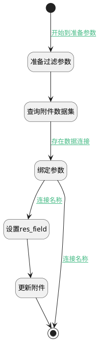

## 图片属性存储至附件 <!-- {docsify-ignore-all} -->

   暂不使用

### 处理过程

### 处理步骤说明

#### 开始 :id=Begin [开始]

*- N/A*
#### 准备过滤参数 :id=PREPAREFILTER [准备参数]

1. 将`Default(传入变量).image(图片)` 设置给  `filterparam(附件过滤器参数).n_field_id_eq`

#### 查询附件数据集 :id=DEDATASET_01 [实体数据集]

调用实体 [附件(IR_ATTACHMENT)](module/base/ir_attachment.md) 数据集合 [DEFAULT](module/base/ir_attachment#数据集合) ，查询参数为`filterparam(附件过滤器参数)`

将执行结果返回给参数`attachmentList`

#### 绑定参数 :id=BINDPARAM_01 [绑定参数]

绑定参数`attachmentList` 到 `ir_attachment(附件)`
#### 设置res_field :id=PREPAREPARAM_01 [准备参数]

1. 将`image` 设置给  `ir_attachment(附件).RES_FIELD(资源字段)`

#### 结束 :id=END_01 [结束]

*- N/A*

#### 更新附件 :id=CREATEATTACHMENT [实体行为]

调用实体 [附件(IR_ATTACHMENT)](module/base/ir_attachment.md) 行为 [Update](module/base/ir_attachment#行为) ，行为参数为`Default(传入变量)`

将执行结果返回给参数`ir_attachment(附件)`

### 连接条件说明
#### 开始到准备参数 :id=Begin-PREPAREFILTER

`Default(传入变量).IMAGE(图片)` ISNOTNULL
#### 存在数据连接 :id=DEDATASET_01-BINDPARAM_01

`attachmentList(attachmentList).size` GTANDEQ `1`
#### 连接名称 :id=BINDPARAM_01-END_01

`ir_attachment(附件).RES_FIELD(资源字段)` ISNOTNULL
#### 连接名称 :id=BINDPARAM_01-PREPAREPARAM_01

`ir_attachment(附件).RES_FIELD(资源字段)` ISNULL

### 实体逻辑参数

|    中文名   |    代码名    |  数据类型    |  实体   |备注 |
| --------| --------| -------- | -------- | --------   |
|传入变量(<i class="fa fa-check"/></i>)|Default|数据对象|[图片混合(IMAGE_MIXIN)](module/base/image_mixin.md)||
|attachmentList|attachmentList|数据对象列表|[附件(IR_ATTACHMENT)](module/base/ir_attachment.md)||
|附件过滤器参数|filterparam|过滤器|||
|附件|ir_attachment|数据对象|[附件(IR_ATTACHMENT)](module/base/ir_attachment.md)||
