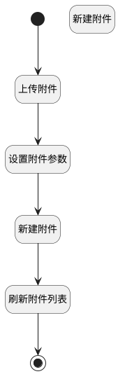

## 添加附件数据 <!-- {docsify-ignore-all} -->

   调用附件上传行为，添加附件数据

### 处理过程




### 处理步骤说明

#### 新建附件 :id=DEACTION_01<sup class="footnote-symbol"> <font color=gray size=1>[实体行为]</font></sup>


调用实体 [附件(IR_ATTACHMENT)](module/base/ir_attachment.md) 行为 [Create](module/base/ir_attachment#行为) ，行为参数为`attach(附件)`

#### 上传附件 :id=DEUIACTION1<sup class="footnote-symbol"> <font color=gray size=1>[实体界面行为调用]</font></sup>


调用实体 [附件(IR_ATTACHMENT)](module/base/ir_attachment.md) 界面行为 [上传附件](module/base/ir_attachment#界面行为) ，行为参数为`files(上传文件)`

#### 开始 :id=Begin<sup class="footnote-symbol"> <font color=gray size=1>[开始]</font></sup>


#### 设置附件参数 :id=RAWJSCODE4<sup class="footnote-symbol"> <font color=gray size=1>[直接前台代码]</font></sup>


<p class="panel-title"><b>执行代码</b></p>

```javascript
// 计算新建默认值
const _viewparam = uiLogic.view.params;
console.log("");
const mimeTypeMap = {
  ".txt": "text/plain",
  ".html": "text/html",
  ".htm": "text/html",
  ".css": "text/css",
  ".js": "application/javascript",
  ".json": "application/json",
  ".xml": "application/xml",
  ".csv": "text/csv",
  ".jpg": "image/jpeg",
  ".jpeg": "image/jpeg",
  ".png": "image/png",
  ".gif": "image/gif",
  ".bmp": "image/bmp",
  ".svg": "image/svg+xml",
  ".webp": "image/webp",
  ".ico": "image/x-icon",
  ".mp4": "video/mp4",
  ".webm": "video/webm",
  ".ogg": "video/ogg",
  ".mp3": "audio/mpeg",
  ".wav": "audio/wav",
  ".flac": "audio/flac",
  ".aac": "audio/aac",
  ".pdf": "application/pdf",
  ".doc": "application/msword",
  ".docx": "application/vnd.openxmlformats-officedocument.wordprocessingml.document",
  ".xls": "application/vnd.ms-excel",
  ".xlsx": "application/vnd.openxmlformats-officedocument.spreadsheetml.sheet",
  ".ppt": "application/vnd.ms-powerpoint",
  ".pptx": "application/vnd.openxmlformats-officedocument.presentationml.presentation",
  ".zip": "application/zip",
  ".rar": "application/x-rar-compressed",
  ".7z": "application/x-7z-compressed",
  ".tar": "application/x-tar",
  ".gz": "application/gzip",
  ".exe": "application/octet-stream",
  ".woff": "font/woff",
  ".woff2": "font/woff2",
  ".ttf": "font/ttf",
  ".otf": "font/opentype"
};
uiLogic.attach = uiLogic.files.map(item => 
    {
        const defaultMimeType = "application/octet-stream";
        var _mimeType = defaultMimeType;
        const match = item.filename.match(/\.([^.]+)$/);
        if (match){
            const ext = match[0].toLowerCase();
            _mimeType = mimeTypeMap[ext] || defaultMimeType;
        }
    
        return {
            name: item.name,
            file_id: item.id,
            id: item.uuid,
            res_id: _viewparam.mail_thread,
            res_model: _viewparam.srfmodelname,
            type: "binary",
            store_fname: item.filename,
            file_size: item.filesize,
            mimeType: _mimeType,
        }
    }
)

```

#### 新建附件 :id=RAWJSCODE_02<sup class="footnote-symbol"> <font color=gray size=1>[直接前台代码]</font></sup>


<p class="panel-title"><b>执行代码</b></p>

```javascript
// 创建新上下文对象并拷贝原始context内容
const newcontext = { ...context };
newcontext.srfsessionid="attachment_session";
// 获取ir_attachment实体服务
const _app = ibiz.hub.getApp(context.srfappid);
const appName = context.srfappid.split('__').pop(); // 取最后一段
// 调用实体服务新建行为
if (uiLogic.attach) {
  await _app.deService.exec( appName+'.ir_attachment', 'create', newcontext, uiLogic.attach ); 
};

```

#### 刷新附件列表 :id=RAWJSCODE_01<sup class="footnote-symbol"> <font color=gray size=1>[直接前台代码]</font></sup>


<p class="panel-title"><b>执行代码</b></p>

```javascript
ibiz.mc.command.create.send({ srfdecodename: 'ir_attachment'});
```

#### 结束 :id=END1<sup class="footnote-symbol"> <font color=gray size=1>[结束]</font></sup>


### 实体逻辑参数

|    中文名   |    代码名    |  数据类型      |备注 |
| --------| --------| --------  | --------   |
|当前视图对象|view|当前视图对象||
|传入变量(<i class="fa fa-check"/></i>)|Default|数据对象||
|上传文件|files|数据对象列表||
|附件|attach|数据对象列表||
