## 删除附件数据 <!-- {docsify-ignore-all} -->

   调用附件删除行为，删除附件数据

### 处理过程

```plantuml
@startuml
hide footbox
<style>
root {
  HyperlinkColor #42b983
}
</style>

hide empty description
state "开始" as Begin <<start>> [[$./delete_attachment#begin {开始}]]
state "消息弹窗" as MSGBOX_01  [[$./delete_attachment#msgbox_01 {消息弹窗}]]
state "删除附件" as RAWJSCODE_02  [[$./delete_attachment#rawjscode_02 {删除附件}]]
state "结束" as END1 <<end>> [[$./delete_attachment#end1 {结束}]]
state "刷新附件列表" as RAWJSCODE_01  [[$./delete_attachment#rawjscode_01 {刷新附件列表}]]


Begin --> MSGBOX_01
MSGBOX_01 --> RAWJSCODE_02 : [[$./delete_attachment#msgbox_01-rawjscode_02{连接名称} 连接名称]]
RAWJSCODE_02 --> RAWJSCODE_01
RAWJSCODE_01 --> END1


@enduml
```




### 处理步骤说明

#### 消息弹窗 :id=MSGBOX_01<sup class="footnote-symbol"> <font color=gray size=1>[消息弹窗]</font></sup>


#### 删除附件 :id=RAWJSCODE_02<sup class="footnote-symbol"> <font color=gray size=1>[直接前台代码]</font></sup>


<p class="panel-title"><b>执行代码</b></p>

```javascript
// 创建新上下文对象并拷贝原始context内容
const newcontext = { ir_attachment: uiLogic.default.id ,...context };
newcontext.srfsessionid="attachment_session";
// 获取ir_attachment实体服务
const _app = ibiz.hub.getApp(context.srfappid);
const appName = context.srfappid.split('__').pop(); // 取最后一段
// 调用实体服务删除行为
if (uiLogic.attach) {
  await _app.deService.exec( appName+'.ir_attachment', 'remove', newcontext, uiLogic.default ); 
};

```

#### 刷新附件列表 :id=RAWJSCODE_01<sup class="footnote-symbol"> <font color=gray size=1>[直接前台代码]</font></sup>


<p class="panel-title"><b>执行代码</b></p>

```javascript
ibiz.mc.command.remove.send({ srfdecodename: 'ir_attachment',srfkey: uiLogic.default.id});
```

#### 结束 :id=END1<sup class="footnote-symbol"> <font color=gray size=1>[结束]</font></sup>


#### 开始 :id=Begin<sup class="footnote-symbol"> <font color=gray size=1>[开始]</font></sup>


### 连接条件说明
#### 连接名称 :id=MSGBOX_01-RAWJSCODE_02

```last(last)``` EQ ```ok```


### 实体逻辑参数

|    中文名   |    代码名    |  数据类型      |备注 |
| --------| --------| --------  | --------   |
|上传文件|files|数据对象列表||
|当前视图对象|view|当前视图对象||
|传入变量(<i class="fa fa-check"/></i>)|Default|数据对象||
|last|last|上一次调用返回||
|附件|attach|数据对象列表||
