## 计算显示名称 <!-- {docsify-ignore-all} -->

   

### 处理过程

```plantuml
@startuml
hide empty description
<style>
root {
  HyperlinkColor #42b983
}
</style>

hide empty description
state "开始" as Begin <<start>> [[$./compute_display_name#begin {"开始"}]]
state "获取全名" as DELOGIC_01  [[$./compute_display_name#delogic_01 {"获取全名"}]]
state "赋值显示名称" as PREPAREPARAM_01  [[$./compute_display_name#prepareparam_01 {"赋值显示名称"}]]
state "结束" as END_01 <<end>> [[$./compute_display_name#end_01 {"结束"}]]


Begin --> DELOGIC_01
DELOGIC_01 --> PREPAREPARAM_01
PREPAREPARAM_01 --> END_01


@enduml
```

### 处理步骤说明

#### 获取全名 :id=DELOGIC_01 [实体逻辑]

调用实体 [联系人(RES_PARTNER)](module/base/res_partner.md) 处理逻辑 [获取全名]((module/base/res_partner/logic/get_complete_name.md)) ，行为参数为`Default(传入变量)`

#### 开始 :id=Begin [开始]

*- N/A*
#### 赋值显示名称 :id=PREPAREPARAM_01 [准备参数]

1. 将`compute_partner(计算后的联系人).NAME(名称)` 设置给  `Default(传入变量).DISPLAY_NAME(显示名称)`

#### 结束 :id=END_01 [结束]

返回 `Default(传入变量).DISPLAY_NAME`

### 实体逻辑参数

|    中文名   |    代码名    |  数据类型    |  实体   |备注 |
| --------| --------| -------- | -------- | --------   |
|传入变量(<i class="fa fa-check"/></i>)|Default|数据对象|[联系人(RES_PARTNER)](module/base/res_partner.md)||
|计算后的联系人|compute_partner|会话变量|||
